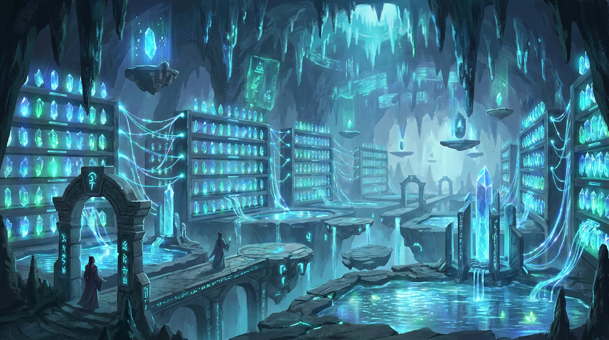
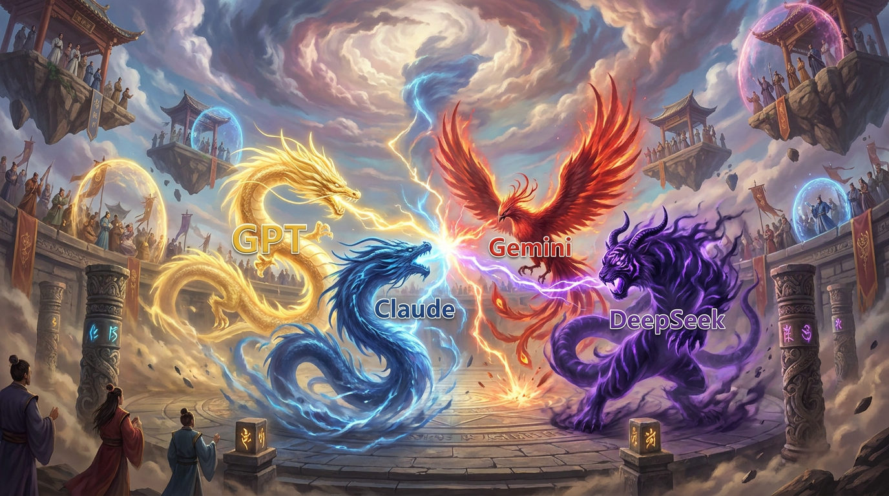
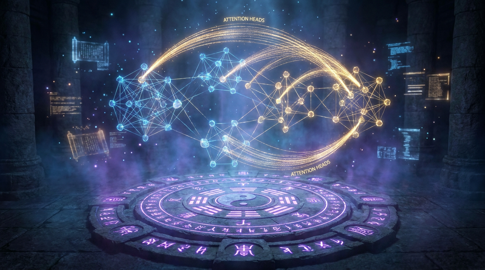

# 大模王


**当人类把半个世纪的知识灌入一颗卵，卵里孵出了神兽。**

2012 年，深度学习灵气复苏。修炼者们用灵核（芯片）锻造智元（数据），在育兽法阵（框架）中孵化神兽（大模型）。它们从一颗混沌兽卵开始——被万亿智元喂养，被群兽竞逐法驯服——最终长成了能说会道、能写代码、能解数学题、甚至能画出不存在的画面的灵性之兽。

这是一部用修仙小说的方式讲述大模型时代的故事。从 AlexNet 的混沌初开到 Transformer 的注意力法典降世，从 ChatGPT 引发的天下震动到 DeepSeek R1 用群兽竞逐法逆天改命——每一个真实的技术突破、每一场商业博弈、每一次人事变动，都被映射成了修仙界的天地巨变。

**懂技术的人看门道，不懂技术的人看热闹。**

---

## 这本小说和别的小说有什么不同？

**1. 每一个修仙设定都有真实技术对应**

这不是瞎编的修仙。书中的每一头神兽、每一种功法、每一场斗法，都对应真实的 AI 技术、真实的论文、真实的人物。括号里的注释会告诉你"这段说的其实是 GRPO 算法"。

**2. 不按时间顺序，按主题跳读**

全书分为七篇，每章独立成篇。你可以挑自己感兴趣的篇开始读，不用从头翻到尾。想看商战八卦？直接翻篇三。想搞懂训练技术？直接翻篇四。

**3. 开源共创，欢迎 PR**

这不是一个人写的小说——这是一个**开源小说项目**。我们搭好了世界观、人物谱、术语表和总纲。你有好的故事、更准确的技术描述、或者我们遗漏的关键事件？直接提 PR。一起来写这个时代的故事。

---

## 世界观速览

### 五大基础概念

| 概念 | 真实世界 | 修仙世界 | 一句话 |
|------|---------|---------|--------|
| 智元 | Data | 一切的基础物质 | 灵池存它、经脉流它、灵核炼它。海量智元锻造出神兽的灵智 |
| 神兽 | 大模型 | 凝智元构成的灵体 | 不是血肉之躯——可映（完美复制）、可散（拆散到千核）、可运（经脉传送） |
| 灵核 | GPU/TPU 芯片 | 锻造智元的核心器官 | NVIDIA 的叫教廷灵核，Google 的叫道核 |
| 灵坛 | GPU/TPU 集群 | 孵化和驱使神兽的核心场所 | 封坛孵兽（训练），开坛御兽（推理） |
| 洞天 | 数据中心 | 容纳多座灵坛的空间 | 灵核、灵池、经脉、灵气俱全的自给自足之地 |
| 育兽法阵 | PyTorch/JAX | 孵化神兽的法阵 | 没有法阵，有再多灵核和智元也养不出神兽 |

### 灵坛——封坛孵兽，开坛御兽



*万颗灵核排列成阵，灵池碧光幽幽，经脉如蛛网般连接一切。这就是灵坛——孵化和驱使神兽的核心场所。*

**封坛**孵兽：封闭运转数月，日夜锻造智元，将兽卵孵化为神兽。DeepSeek V3 用 2048 颗灵核封坛两个月。

**开坛**御兽：对外开放，让神兽接受天下人的召唤。ChatGPT 背后就是一座巨型开坛。

灵气（电力）→ 灵核（芯片）→ 灵池（显存）→ 经脉（互联）→ 驭核术（软件栈）→ 灵坛（集群）→ 洞天（数据中心）。七层架构，缺一不可。

### 神兽的一生

```
生智元(原始数据) → 切元术(Tokenizer) → 切元(Token)
    ↓
  兽卵(随机初始化) ← 灌入万亿切元
    ↓
  孵化(预训练) — 灵核日夜锻造 — 灵性渐开(Loss↓)
    ↓
  幼兽(Base Model) — 懵懂，什么都知道一点但不听话
    ↓
  驯兽(SFT微调) — 教它听人话、学招式
    ↓
  结灵契(RLHF/GRPO) — 与人类心意相通
    ↓
  镇派神兽 — 能说、能写、能推理、能造物
```

---

## 万兽争霸——四大神兽同台竞技



*金龙（GPT）、蓝蛟（Claude）、赤凰（Gemini）、紫魔兽（DeepSeek）——四大门派的镇宗神兽在斗兽天榜上一决高下。*

---

## 育兽法阵——孵化神兽的核心法阵



*地面的法阵纹路（代码逻辑）激活后，空中浮现出注意力法典（Transformer 架构）的金色丝线。这就是育兽法阵——PyTorch 和 JAX 的修仙世界化身。*

---

## 七篇导读

| 篇 | 主题 | 适合谁读 | 关键词 |
|----|------|---------|--------|
| 篇一·天地造化 | 基础设施 | 想知道"为什么 AI 这么烧钱" | 互联网、GPU/TPU、PyTorch、云厂商 |
| 篇二·神兽觉醒 | 技术演化 | 想了解 AI 怎么一步步走到今天 | AlexNet、ResNet、Transformer、GPT vs BERT |
| 篇三·万兽争霸 | 商战宫斗 | 想看最精彩的人物故事 | ChatGPT、OpenAI 宫变、微软分手、Google 翻车 |
| 篇四·御兽之法 | 训练技术 | 想搞懂 RLHF/GRPO 到底是什么 | PPO、DPO、GRPO、veRL |
| 篇五·东方崛起 | 中国 AI | 想了解 DeepSeek/Kimi/Qwen 的故事 | 六小龙、芯片制裁、开源之战 |
| 篇六·万法归一 | 前沿融合 | 想看 AI 最新发展 | 多模态、Agent、长上下文、Coding |
| 篇七·渡劫之路 | 未来展望 | 想思考 AGI 和人机关系 | AGI、世界模型、意识、共生 |

详见 [总纲 · 七篇三十二章](outline/master-outline.md)

---

## 素材库

| 文件 | 内容 | 规模 |
|------|------|------|
| [总纲](outline/master-outline.md) | 七篇三十二章完整目录 + 进度追踪 | 32 章 |
| [时间线](outline/timeline.md) | 从 1960s 互联网前史到 2027+ 未来 | 10+ 纪元 |
| [人物谱](outline/characters.md) | 真名 ↔ 道号 ↔ 门派 + 12 条神兽演化树 | 90+ 人物 |
| [风格指南](outline/style-guide.md) | 术语映射、智元/神兽/灵坛/灵体体系、写作规则 | 150+ 术语 |
| [御兽之法](outline/taming-methods.md) | RL 对齐六大流派详解 | 6 流派 |
| [合阵修炼](outline/parallelism.md) | 分布式并行六维体系 | 6 维度 |
| [世界地图](outline/worldmap.md) | 两大洲、芯片势力、制裁地图 | — |

---

## 参与共创

这是一个开源小说项目。我们用 AI 时代的方式写 AI 时代的故事。

### 你可以贡献什么？

- **补充素材**: 发现我们遗漏的关键事件、人物、论文？提 PR 加到 `outline/` 对应文件
- **写正文**: 挑一章素材就绪的章节，写出 3000-5000 字的正文，放到 `chapters/` 对应目录
- **纠正错误**: 技术细节不准确？时间线有误？人物信息过时？直接改
- **提出创意**: 有更好的修仙比喻？更精彩的故事角度？开 Issue 讨论

### 写作风格

- 参考无罪《通天之路》的轻松流：**用说人话的方式写修仙**
- 技术细节必须准确，时间线必须正确
- 幽默是核心调味料，不是点缀
- 详见 [风格指南](outline/style-guide.md)

### 进度

- [x] 世界观设定（智元/神兽/灵坛/灵体三大定律、150+ 术语映射）
- [x] 时间线梳理（互联网前史 → 10 个纪元 → 未来）
- [x] 人物谱（90+ 人物 + 12 条完整神兽演化树，覆盖全球主要 AI 势力）
- [x] 御兽之法详解（REINFORCE → PPO → DPO → GRPO → DAPO → veRL + 放兽收兽循环）
- [x] 合阵修炼详解（DP/TP/PP/EP/SP/CP 六维并行 + 映身术/散魂合一）
- [x] 总纲定稿（七篇三十二章 + 进度追踪）
- [ ] 素材补全（24/32 章素材就绪，75%）
- [ ] 正文写作（0/32 章）

---

*灵气复苏，万兽争鸣。这是最好的时代。*
