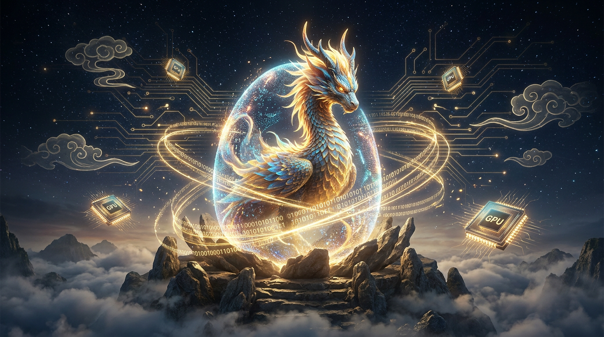
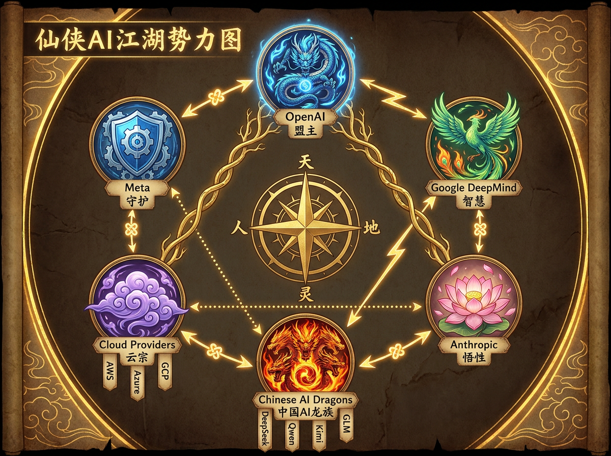
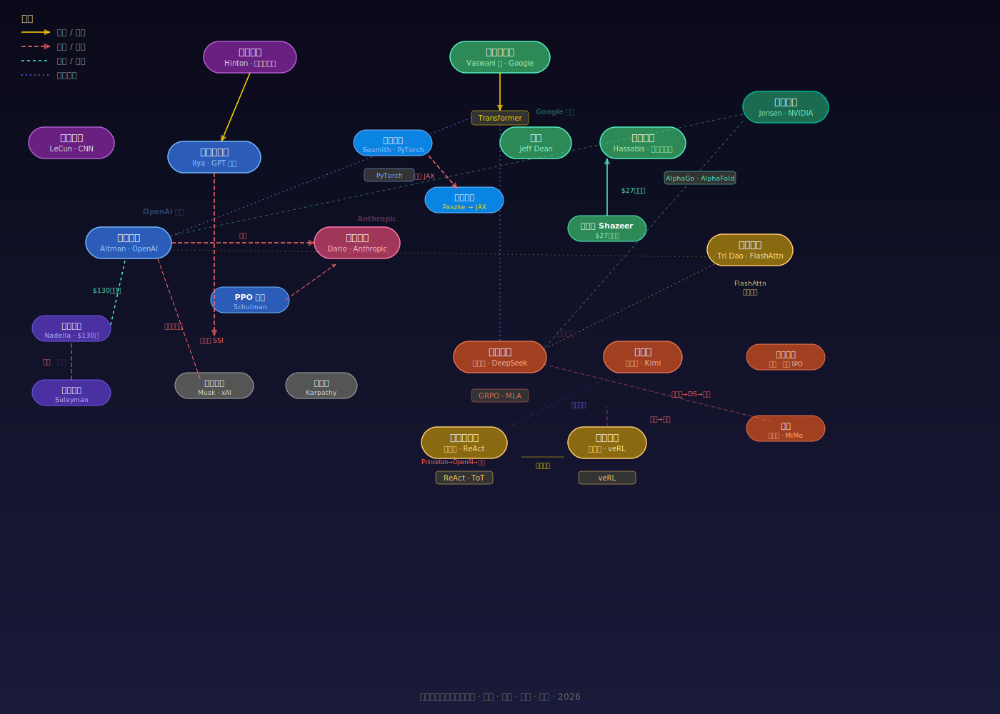

# 大模王
## 大模王我当定了！



*天地灵气沉寂亿万年。灵脉初通之日，万物懵懂。直到有人将半个世纪的天地智元灌入一颗混沌兽卵——卵裂，光生，神兽破壳而出。从此，修仙界再无宁日。*

---

灵脉铸造五十年，从四台电脑传出的第一声"LO"，到十亿部手机日夜不息地输送智元。灵气终于浓郁到了临界点。

2012 年，两块游戏显卡在一间大学生的卧室里，点燃了灵气复苏的第一把火。

此后十四年，天地巨变接踵而至。注意力法典降世，万法根基由此而立。ChatGPT 一声长啸，凡间百姓闻声而动。DeepSeek 以群兽竞逐法逆天改命，五千九百亿美元的灵核帝国为之震颤。百万级神识打开了长上下文时代。自主兽学会了独立行动。万象兽能视能听能言能画。

有人坚守三十年不改其道，终获天道加冕。有人从量化交易的修罗场杀入修仙界，每一剑都切在成本曲线的咽喉上。有人造了所有神兽呼吸的空气，却无人知其姓名。八个人在一间办公室里写下了改写万法的法典，然后散落八方，再未聚首。

**这是一部以大模型时代为背景的修仙小说。每一头神兽、每一座灵坛、每一种功法、每一场斗法——都对应真实的 AI 技术、真实的论文、真实的人物。**

---

## 怎么读这本书？

**不用从头读到尾。** 七篇三十二章，每章独立成篇，按兴趣跳读：

| 篇 | 你想知道什么 | 章节 |
|----|------------|------|
| 篇一·天地造化 | 为什么 AI 这么烧钱？灵核、灵脉、阵基都是什么？ | 互联网前史 · GPU/TPU 硬件战 · PyTorch vs JAX · 云厂商博弈 |
| 篇二·神兽觉醒 | AI 怎么一步步走到今天？从 AlexNet 到 Transformer | AlexNet · CNN/GAN/ResNet · Transformer 八作者 · GPT vs BERT |
| 篇三·万兽争霸 | 商战！宫斗！最精彩的人物故事 | ChatGPT · OpenAI 宫变 · Google 翻车到涅槃 · 微软分手 · Anthropic |
| 篇四·御兽之法 | RLHF/GRPO 到底是什么？怎么驯服神兽？ | PPO 四象阵 · DPO 简约革命 · GRPO 群兽竞逐 · FlashAttention · veRL |
| 篇五·东方崛起 | DeepSeek/Kimi/Qwen 的故事 | 深渊剑主 · 开源之战 · 芯片制裁 · 月影侯 · 六小龙格局 |
| 篇六·万法归一 | AI 最前沿在发生什么？ | 多模态万象兽 · Agent 自主行动 · Coding Agent · 百万级上下文 |
| 篇七·渡劫之路 | AGI 什么时候来？AI 有意识吗？ | AGI 之问 · 世界模型 · 意识之辩 · 人兽共生 |

详见 [总纲 · 七篇三十二章](outline/master-outline.md)

---

## 核心设定

| 概念 | 真实世界 | 修仙世界 |
|------|---------|---------|
| 智元 | Data | 一切的基础物质。灵池存它、经脉流它、灵核炼它 |
| 神兽 | 大模型 | 凝智元构成的灵体——可映（复制）、可散（拆分）、可运（传送） |
| 灵核 | GPU/TPU | 锻造智元的核心器官。NVIDIA 的叫教廷灵核，Google 的叫道核 |
| 灵坛 | 集群 | 封坛孵兽（训练），开坛御兽（推理） |
| 阵基 | PyTorch/JAX | 铸造法阵的基底语言 |
| 育兽法阵 | Megatron/veRL | 可直接孵兽的完整训练系统 |
| 御兽之法 | PPO/GRPO | 驯服神兽的各种流派 |
| 灵气 | 电力 | 万物之源 |

---

## 修仙界势力图





---

## 目录结构

```
Large-Model-King/
  README.md                        # 本文件
  outline/                         # 世界观素材库
    master-outline.md              # 总纲（七篇三十二章 + 进度）
    timeline.md                    # 时间线（1960s → 2027+）
    characters.md                  # 人物谱（100+ 人物 + 12 神兽谱系）
    style-guide.md                 # 术语映射（150+ 条）
    taming-methods.md              # 御兽之法六大流派
    parallelism.md                 # 合阵修炼六维并行
    worldmap.md                    # 世界地图
  chapters/                        # 正文
    vol1-infrastructure/           # 篇一（4章）
    vol2-awakening/                # 篇二（4章）
    vol3-battle/                   # 篇三（6章）
    vol4-taming/                   # 篇四（5章 + 1番外）
    vol5-east/                     # 篇五（5章）
    vol6-convergence/              # 篇六（4章）
    vol7-future/                   # 篇七（4章）
```

---

## 参与共创

这是一个**开源小说项目**。用 AI 时代的方式写 AI 时代的故事。

- **补素材**: 发现遗漏的事件、人物、论文？PR 到 `outline/`
- **写正文**: 挑一章，写 3000-5000 字，PR 到 `chapters/`
- **纠错**: 技术不准确？时间线有误？直接改
- **提创意**: 更好的修仙比喻？更精彩的角度？开 Issue

写作风格：参考无罪《通天之路》轻松流——**用说人话的方式写修仙**。详见 [风格指南](outline/style-guide.md)

---

### 进度

- [x] 世界观设定（智元/神兽/灵坛/灵体三大定律、150+ 术语）
- [x] 素材库（时间线 + 100 人物 + 12 神兽谱系 + 御兽之法 + 并行体系）
- [x] 总纲定稿（七篇三十二章）
- [x] **全书初稿完成（32 章 + 1 番外 = 33 个文件）**
- [ ] 深度迭代优化（事实核查 + 文风统一 + 内容扩充）

---

*灵气复苏，万兽争鸣。这是最好的时代。*
