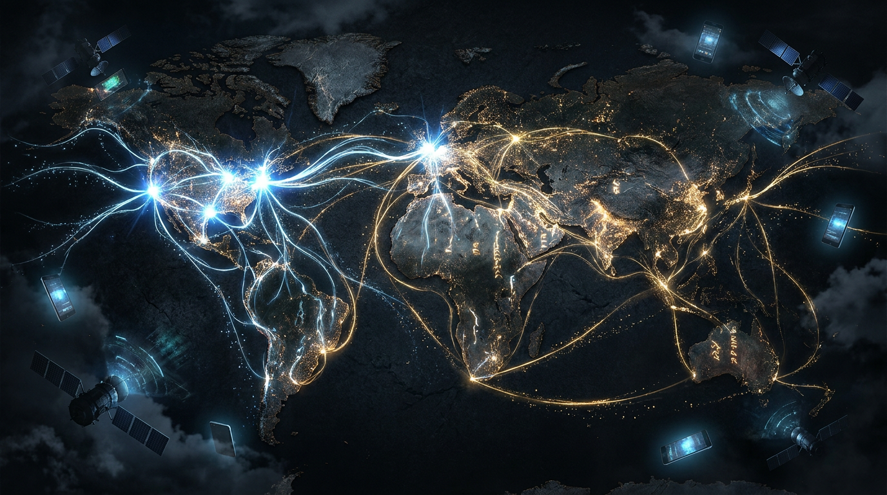

# 第一章：灵脉铸造

*在神兽出现之前的半个世纪，人类干了一件自己都没意识到有多重要的事——把全世界连在了一起。*

---

## 一

话说天地混沌之际，凡间有一种东西叫"电脑"，块头比冰箱还大，算力还不如你现在手上的计算器。

这些电脑各自为政，互不相连，像一个个闭关修炼的散修——法力不高，脾气不小，谁也不搭理谁。

美国国防部有个高级研究计划局，简称ARPA，里面的人整天琢磨一个问题：万一苏联扔颗核弹把五角大楼炸了，咱们的通信网不就全断了？能不能搞一个怎么炸都炸不断的网？

这群人琢磨了大半个六十年代，终于在**1969年10月29日晚上十点半**，在UCLA的Boelter Hall三楼3420号房间里，搞出了一个叫**ARPANET**的东西。

说是"网"，其实寒酸得很——一共就**四台电脑**，分别在UCLA、斯坦福研究院、加州大学圣塔芭芭拉分校和犹他大学。四个节点，四根线，连成一个歪歪扭扭的四边形。

那天晚上负责敲键盘的是一个叫**Charley Kline**的研究生。他的导师**Leonard Kleinrock**——后来被称为"互联网之父"之一——站在旁边盯着。

Kline的任务是往斯坦福研究院的电脑上登录。他开始输入"LOGIN"。

敲了"L"，对面收到了。

敲了"O"，对面也收到了。

敲"G"——

系统崩了。

人类历史上第一条网络消息，就是**"LO"**。

有人说这是"Lo and behold"的缩写——"你看！"Kleinrock后来也喜欢这么讲，说这两个字母"比任何剧作家写的台词都更有诗意"。

我倒觉得更像是"LOL"没打完。

大约一个小时后，他们重启系统又试了一次，这回完整的"LOGIN"终于传过去了。但历史只记住了那声崩溃——**"LO"**。

**灵脉的第一缕灵气，就此流动。**

这灵脉细得可怜，窄得寒碜，比后来56Kbps的毛细灵脉还不如。但它证明了一件事：电脑和电脑之间，是可以说话的。

散修们，可以结盟了。

---

## 二

接下来二十年，灵脉慢慢生长。

**TCP/IP协议**在1983年成为标准，相当于给灵脉定了规矩——灵气怎么流、走哪条经脉、到了岔路口往哪拐，都有了说法。这套规矩妙在一个设计：**分组交换**。数据被切成一个个小包裹，各走各的路，到了终点再拼回来。这意味着任何一条灵脉被切断，灵气都能绕道走——ARPA当初"怎么炸都炸不断"的需求，TCP/IP实现了。

**DNS域名系统**上线，相当于给每个修仙洞府挂了门牌号。以前你找人得记一串数字（IP地址），现在只要记名字就行。

电子邮件出现了，修士们终于不用飞剑传书了。Ray Tomlinson在1971年发明了现代电子邮件，顺手选了**@**这个符号连接用户名和主机名——因为它在键盘上"显然不是人名的一部分"。就这么随手一挑，"@"成了互联网时代最著名的符号。

但这一切，对凡人来说，完全无感。灵脉深埋地下，只有大学和军方的修士能感应到灵气。普通人连"互联网"这三个字都没听过。

你家隔壁王大爷在看《新闻联播》，完全不知道大洋彼岸有群人在铺设改变世界的灵脉。

---

## 三

**1989年3月12日**，一个叫**Tim Berners-Lee**的英国人，在欧洲核子研究中心（CERN）干活。

CERN是干嘛的？对撞粒子的。一群物理学家天天产生海量数据，但数据散落在各种电脑里，找起来跟大海捞针一样。不同实验室用不同的操作系统，不同的文件格式，想共享一篇论文都得先问对方"你用什么电脑"。

Tim就想：能不能搞一个系统，把所有文档用超链接串起来，点一下就能从这篇跳到那篇？不管你用什么电脑、什么系统，只要有一个浏览器就能看。

他写了一份提案，标题很学术——"Information Management: A Proposal"。然后交给上司**Mike Sendall**。

Sendall看了看，在封面批了四个字：

> **"Vague, but exciting."**
>
> （模糊，但令人兴奋。）

这大概是人类历史上最被低估的批语。这份"模糊但令人兴奋"的提案，就是**万维网（World Wide Web）**的诞生证明。Sendall本人后来被追认为"万维网的教父"——不是因为他发明了什么，而是因为他没有把这份提案扔进废纸篓。

**1991年8月6日**，万维网正式向公众开放。历史上第一个网站至今还在线——info.cern.ch。

Tim没有给万维网申请专利。他说，这东西应该属于所有人。

CERN后来估算，如果Tim当年申请了专利，他个人的身价可能超过Elon Musk。他选择了不要。

就这一个决定，让灵脉从地下涌到了地表。

从此，**凡人也能感应灵气了。**

如果Tim收了过路费，万维网可能就变成了"万维局域网"，灵脉的灵气只流在几条收费公路里。今天的互联网长什么样？大模型还能不能出现？

不敢想。

---

## 四

万维网公开后，灵脉开始野蛮生长。

**1994年4月20日**，中国通过一条**64K**的线路正式接入互联网。六十四K——你现在发一张微信表情包都不止这个大小。但就是这根比头发丝还细的灵脉，把中国接上了全球灵脉网络。中国成为第77个接入互联网的国家。

接下来几年，事情开始加速。

**1995年**，两个斯坦福研究生**杨致远**和**大卫·费罗**创办了**Yahoo**。他们干的事很朴素——手动给网站分类，编了个目录。相当于给灵脉画了第一张地图。有了地图，凡人就不会在灵脉里迷路了。

**1997年**，中国的ChinaNet骨干网铺开，灵脉终于接进了千家万户。虽然接的是56Kbps的拨号——那个"滋——嘟嘟嘟——嘎——"的调制解调器声音，是一代人的集体记忆。灵脉初通，就是这个声音。

紧接着，**网易**（1997年，丁磊）、**搜狐**（1998年，张朝阳）、**新浪**（1998年）相继成立。三大门户网站像三个灵材市场，把新闻、邮箱、聊天室一股脑塞给用户。中国的灵脉生态，从那几年开始疯长。

**1998年**，两个斯坦福博士生**Larry Page**和**Sergey Brin**觉得Yahoo那套手动分类太笨了。他们搞了一个算法叫**PageRank**——灵感来自学术论文的引用机制：被引用越多的论文越权威。同理，被越多网页链接的网页越重要，被越"权威"的网页引用的，排名越靠前。

这个算法催生了**Google**。

如果说Yahoo是灵材市场的目录册，Google就是**灵材探测术**——你不需要知道灵材在哪，告诉它你要什么，它帮你找。

同一年，深圳一个叫**马化腾**的年轻人，和四个合伙人创办了腾讯，做了一个叫**OICQ**的即时通讯软件，后来改名**QQ**。

QQ这个东西，一开始没人觉得能赚钱。马化腾自己都差点把它卖掉，开价100万，没人要。

但QQ做了一件极其重要的事——**它把人和人连上了。**

灵脉连的不只是电脑和电脑，更是人和人。人一旦连上了，就会开始说话、分享、争论、八卦、表白、吵架、发表情包。这些东西有个统一的名字：

**数据。**

修仙界叫它**智元**。

---

## 五

灵脉疯长了几年，泡沫也疯长了几年。

1999年，随便注册个域名、做个网页，投资人就追着你塞钱。什么商业模式？不需要！有流量就行！先烧钱抢地盘，赚钱的事以后再说！

最魔幻的是一家叫**Pets.com**的公司——在网上卖宠物用品。它花了几千万美元做广告，超级碗上投了黄金时段广告位，吉祥物是一只袜子手偶狗。IPO融了**8250万美元**。

九个月后，破产了。

因为一袋狗粮的物流成本比狗粮本身还贵。

Pets.com成了泡沫时代最著名的笑话。但这样的笑话有成百上千个——Webvan（在线杂货配送，烧了12亿美元倒闭）、Kozmo.com（一小时送货上门，从没盈利过）……

**2000年3月10日**，纳斯达克指数冲到了**5048点**的历史高位。然后开始崩塌。一路跌，跌了两年半。到2002年10月，只剩**1114点**。

**超过5万亿美元的纸面财富蒸发了。**

硅谷的停车场空了一半。前一天还在谈融资的创始人，第二天就在LinkedIn上改了状态——"Open to work"。

灵脉突然灵气稀薄，一大批低阶修士被打回凡人。

但灵脉本身并没有消失。TCP/IP还在，光纤还在，Google的服务器还在转。泡沫冲走的是投机者，留下来的才是真正的灵脉根基。

**2001年**，泡沫废墟中，一个叫**Wikipedia**的东西上线了。

这是一个谁都能编辑的百科全书。你觉得某个词条写得不对？改！你觉得缺了什么内容？加！

一开始所有人都嘲笑它——"让网民写百科全书？那不得满篇胡说八道？"

大英百科全书的编辑们尤其不屑。三百年的品牌，每个词条都由顶级专家撰写。让网民来写？滑天下之大稽。

结果Wikipedia活了下来，而大英百科全书在2012年停止了纸质版印刷。截至2026年，Wikipedia有超过6000万篇文章，覆盖300多种语言。

Wikipedia证明了一件令人震惊的事：**凡人也能产出高品质灵材。**

千万个普通人贡献的知识，叠加起来比任何一个专家都全面。这种"凡人灵材"，后来成了训练大模型最重要的数据来源之一。

GPT系列的训练数据里，Wikipedia占了相当大的比重。每一个编辑Wikipedia的志愿者，都在不知不觉中给未来的神兽投喂了灵食。

他们不知道自己在做什么。但神兽记住了。

---

## 六

泡沫破了，但灵脉在废墟上重建得更结实了。宽带取代了拨号——**灵脉扩张**，56K的毛细灵脉变成了数兆的经脉，再变成数十兆的主脉。

灵气充沛了，凡人开始干一件前所未有的事：**自己生产内容。**

**2004年**，哈佛宿舍里，一个叫**Mark Zuckerberg**的大二学生搞了个给同学打分看谁更好看的网站，然后演变成了**Facebook**。用户在上面发状态、传照片、加好友、怼熟人。

**2005年**，三个前PayPal员工——Chad Hurley、Steve Chen、Jawed Karim——创办了**YouTube**。他们说：你拍的视频，传上来，全世界都能看。

第一条YouTube视频叫"Me at the zoo"——Karim本人站在圣迭戈动物园大象面前，说了19秒废话。"好酷的长鼻子。"他说。就这。

就这19秒，开启了视频智元的洪流。

**2006年**，**Twitter**上线。140个字符一条推文。短、快、碎片化。

从Facebook到YouTube到Twitter，一个模式越来越清晰：**凡人不只是灵脉的使用者，他们本身就是灵材的生产者。**

每一条状态更新、每一张照片、每一段视频、每一条推文，都是智元。

用户生成内容——**凡人灵材**——开始以指数级增长。

灵脉里流动的灵气，不再只是精英修士的著作，而是亿万凡人的喜怒哀乐、吃喝拉撒、深度思考和脑残发言的混合物。

这混合物有个特点：它足够大、足够杂、足够真实。

后来的大模型发现，这恰恰是它们最需要的东西。

---

## 七

**2007年1月9日**，Steve Jobs站在旧金山Moscone Center的舞台上，穿着他标志性的黑色高领毛衣和牛仔裤，从口袋里掏出了一个东西。

**iPhone。**

"An iPod, a phone, and an Internet communicator."他说了三遍，每次台下都欢呼。等了几秒，他笑了——"Are you getting it? These are not three separate devices. This is one device."

iPhone不是第一台智能手机。在它之前有Palm、有BlackBerry、有Windows Mobile——全是键盘加触控笔，用起来像在惩罚自己。iPhone是第一台**让普通人真正想用**的智能手机。触摸屏、App Store、移动浏览器——灵脉从此不再需要坐在电脑前才能接入。

**灵脉遍布天地。**

**2008年**，Google发布了**Android**操作系统。如果说iPhone把移动灵脉卖给了买得起的人，Android就把它送给了所有人。几百块钱的手机也能上网了。

从此，灵脉不在书房里，不在办公室里。灵脉在口袋里，在被窝里，在公交车上，在厕所里。

人类历史上第一次，**随时随地、所有人**都在生产智元。

你睡前刷的那十分钟微博，你排队时拍的那张照片，你等公交时回的那条消息——全是灵气。

智元产量，彻底起飞。

---

## 八

**2007年**，斯坦福大学一位叫**李飞飞**的年轻华裔教授，决定干一件所有人都觉得疯了的事。

她要给互联网上的图片做一个**完整的分类标注**——不是几千张，不是几万张，是**上千万张**。

为什么？因为她看到了一个别人没看到的问题：当时的计算机视觉研究者都在改进算法，但大家用的数据集小得可怜——PASCAL VOC只有几千张图、Caltech-101只有九千张。算法越来越精妙，但数据量就像用茶杯舀海水。

李飞飞的直觉是：**也许问题不在算法，在数据。**

她花了三年。前两年几乎是绝望的——用研究生一张一张标注，速度慢到令人发指。1400万张图片，按每张一分钟算，一个人要标27年。

转机出现在**2007年**。她的一个研究生**孙民**问她："飞飞，你听说过Amazon Mechanical Turk吗？"

这是一个众包平台——你发布小任务，全世界的人在网上领任务做，按件计酬。标一张图片几美分。

李飞飞眼前一亮。她立刻把标注工作搬到了Mechanical Turk上。来自167个国家的近五万名标注者参与了这个项目。

但众包也有坑——有人为了快速赚钱乱标。"这是猫。""这也是猫。""这还是猫。"——其实是一架飞机。李飞飞团队设计了多重质量控制机制：每张图片让多人标注，取共识；加入已知答案的"暗桩"题，用来检测作弊者。

**2009年**，**ImageNet**正式发布。**1400万张图片**，按照**2万多个类别**标注。

在此之前没人做过这种规模的事。李飞飞第一次把ImageNet论文投给顶级会议的时候，被拒了。审稿人的态度大概是："做个大数据集？这有什么技术含量？"

学术界低估了它。工业界根本没注意。

但李飞飞知道自己在做什么。她用ImageNet办了一个比赛：**ILSVRC**——全世界的研究者都来参加，比谁的算法识别图片更准。

2010年的冠军错误率大概28%。一年比一年低几个百分点。

然后到了2012年，一个叫Alex Krizhevsky的学生带着两块游戏显卡和一个叫**AlexNet**的深度卷积神经网络参赛——错误率一脚从26%踩到了**15.3%**。

修仙界炸了锅。

但那是下一章的故事了。

---

## 九

让我们停下来，回头看看这半个世纪干了什么。

1969年，四台电脑，一个叫Charley Kline的研究生敲了两个字母。
2011年，十亿部手机，每分钟有48小时的视频被上传到YouTube。

1969年，传两个字母就崩溃。
2011年，每秒有几十TB的数据在全球灵脉中流转。

1969年，灵脉是实验室里的毛细血管。
2011年，灵脉是覆盖全球的经脉网络，灵气无处不在。

**灵脉铸造完成了。**

但灵气虽然充沛，还没有人知道怎么用它孵化神兽。智元堆积如山，但没有足够强的灵核来锻造它们，也没有正确的功法来驾驭它们。

ImageNet的1400万张图片安静地躺在服务器上，等待一个叫深度学习的功法来唤醒它们。

Wikipedia的几百万篇文章静静地积累着人类知识，等待一个叫Transformer的架构来消化它们。

Facebook、YouTube、Twitter、微信上每天产生的数十亿条数据，在暗处涌动，等待一头足够贪婪、足够聪明的神兽来吞噬它们。

灵脉已铸，天材地宝已聚。

只差一把火。

---

> **旁白（Chris 视角）**
>
> 我1994年出生——巧了，刚好是中国接入互联网那年。
>
> 所以严格来说，我和中国互联网同岁。它56K拨号的时候，我在学走路。它宽带的时候，我在上小学。它移动化的时候，我在念中学。
>
> 现在我在Google Cloud做AI Infra，天天跟TPU和GPU打交道——这些灵核的唯一使命就是锻造智元。但每次看到数据管道里流过的那些文本、图片、视频，我都会想起一个问题：
>
> 这些数据从哪来的？
>
> 答案是：从这半个世纪的灵脉铸造来的。从Charley Kline在3420号房间敲下的那两个字母来的。从Tim Berners-Lee那份"vague, but exciting"的提案来的。从李飞飞发动五万个众包标注者一张一张标注的1400万张图片来的。从你我每天发的朋友圈、刷的短视频、回的消息来的。
>
> 没有灵脉，就没有智元。没有智元，就没有大模型。
>
> 我们都是灵脉的受益者。更准确地说，**我们都是灵脉的一部分。**
>
> 你以为你在刷手机？不，你在给灵脉输送灵气。

---

📖 **相关章节**
- 想了解灵核（GPU/TPU）如何从游戏显卡变成 AI 的核心 → [第02章·灵核之争](ch02-chips.md)
- 想了解灵气复苏的那一刻——AlexNet 横空出世 → [第05章·混沌初开](../vol2-awakening/ch05-alexnet.md)
- 想了解互联网智元如何被用来训练神兽 → [第09章·大道至简](../vol3-battle/ch09-scaling-law.md)
