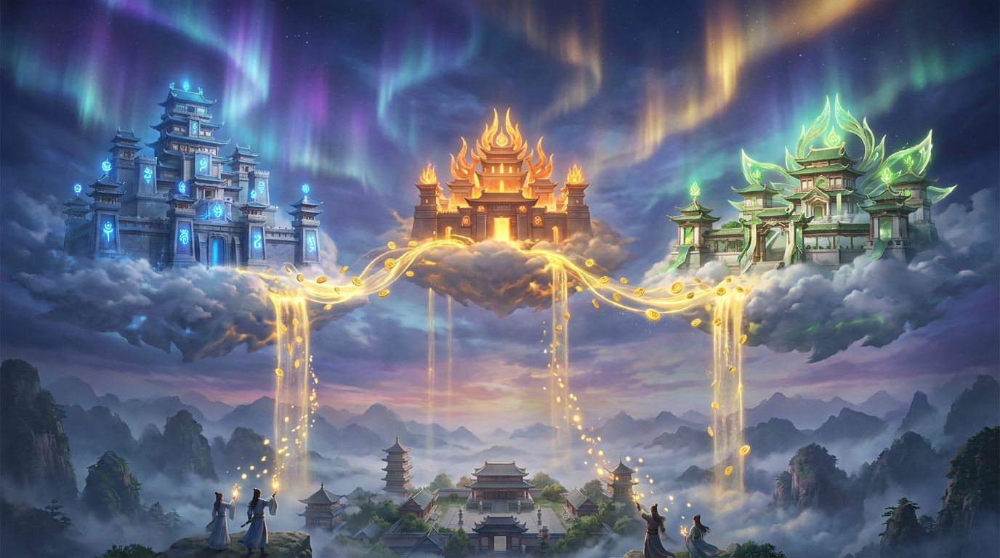

# 第四章：云霄三圣

*修仙界有句老话：养神兽的人未必成仙，但卖矿的一定发财。三大云霄世家深谙此道——只不过，一个赌上身家押了一头兽，一个开了间动物园，还有一个自己既养兽又卖矿，结果左手打右手。*

---

## 一

在讲三大云霄世家的神兽争夺战之前，得先说清楚一件事：**云霄世家到底是干嘛的。**

凡间修士想孵兽，得有灵坛。想驭兽，得有兽栏。想闭关，得有洞府。这些东西自己造？太贵。自己维护？太累。

于是就有聪明人想出一个生意——我来建洞天，你来租。

洞天里有灵核阵列组成的灵坛，有千万根灵脉汇聚的传送阵，有温度恒定、灵气充沛的修炼密室。你想孵多大的神兽就租多大的灵坛，用完即走，按时辰计费。

这门生意，就叫**云计算**。

开这门生意的世家，就叫**云霄世家**。

2006年，亚马逊推出AWS，成了第一个正式挂牌的云霄世家。微软的Azure 2010年跟上，谷歌的Google Cloud 2012年入场。

到2023年，全球云计算市场规模超过5000亿美元——换成修仙界的说法，就是每年有五千亿灵石在三大世家的洞天之间流转。

AWS占了三成多，Azure追到两成多，Google Cloud拿了一成出头。剩下的零碎，被阿里云、IBM Cloud这些中小世家分着。

三足鼎立，格局已定。

然后，**神兽来了。**

---

## 二

2022年底，ChatGPT炸翻凡间。

三大云霄世家同时意识到一件事：**神兽是这个时代最值钱的灵物，而养神兽需要天量的灵核和洞天。**

这意味着什么？意味着谁能绑定顶级炼兽门派，谁就能锁死下一个十年最大的客户。

反过来也一样——炼兽门派虽然手握神兽，但没有灵核和洞天，兽就炼不出来。你见过哪个炼兽师自己盖数据中心的？没有。炼兽师的钱，都得花在灵核上。

于是，一场史无前例的**灵脉契约争夺战**开始了。

第一个出手的，不出意外，是蔚蓝世家的掌门——**萨提亚·纳德拉（Satya Nadella）**。

---

## 三

纳德拉这个人，得单独说两句。

他2014年接手微软的时候，微软正处于鲍尔默时代的尾声——Windows和Office两棵摇钱树依然粗壮，但移动时代已经把微软甩在了身后。Windows Phone死了，Surface卖不动，Bing是个笑话。

纳德拉上任后干了两件关键的事：第一，把微软全面转向云计算，Azure从追赶者变成挑战者；第二，把"开源"从微软的禁忌词变成了口头禅——收购GitHub、拥抱Linux、VS Code免费开放。

这两步棋走完，微软从一个"过气巨头"变回了"科技一哥"。

所以当OpenAI在2018年左右开始缺钱的时候，纳德拉闻到了血腥味。

**2019年7月**，微软宣布向OpenAI供奉**10亿美元**。

10亿美元。这在当时的AI投资界是个天文数字。Anthropic那时候还没成立，Google Brain还在发论文，Meta AI还在搞FAIR。整个修仙界看着蔚蓝世家一掷千金，反应不一——

有人说纳德拉疯了，花10亿买一个还没炼出像样神兽的小门派？

有人说纳德拉赌性太大，万一OpenAI炼废了呢？

但纳德拉要的不只是投资回报。他签下了一份**灵脉契约**——OpenAI的算力需求，优先使用Azure的洞天和灵核。

翻译成凡间的话：**独占云服务协议。**

这份契约的精妙之处在于：它不是简单地给钱。它是用灵核和洞天把OpenAI牢牢绑在Azure的地盘上。OpenAI的每一次训练、每一次推理、每一次API调用，灵气都流经Azure的灵脉。

这意味着，全世界想用OpenAI神兽的修士，都得通过Azure的借兽令——不管你是凡间小作坊还是万人修仙宗门。

**卖铲子的绑定了挖金矿的人。**

---

## 四

接下来四年，蔚蓝世家和OpenAI的蜜月期堪称修仙界的童话。

**2023年1月**，微软追加供奉，累计投入达到惊人的**130亿美元**。同时签下**75%利润分成**协议——OpenAI赚的每一块灵石，蔚蓝世家拿走七成半。

这个比例，在投资界闻所未闻。风投通常拿个二三成就谢天谢地了。75%？那基本上等于说：**OpenAI名义上是独立门派，实际上是蔚蓝世家的附属。**

但OpenAI认了。因为它太需要灵核了。训练GPT-4据估计花了超过1亿美元的算力——没有蔚蓝世家的洞天，这头神兽根本炼不出来。

纳德拉趁热打铁，做了两个关键动作。

第一，**Copilot全线铺开**。把GPT嵌入Office、Windows、GitHub、Bing——所有微软产品都加上了驭兽法器。你在Word里写文档，Copilot帮你改；你在Excel里算数，Copilot帮你建公式；你在GitHub里写代码，Copilot帮你补全。

这是"驭兽法器"的极致形态——不是让你去找神兽，而是让神兽嵌入你生活的每一个角落。

第二，**2024年3月**，微软从Google旗下的DeepMind挖走了**穆斯塔法·苏莱曼（Mustafa Suleyman）**——DeepMind的三位联合创始人之一——让他掌管新成立的**Microsoft AI**部门。

这一手太毒了。

苏莱曼不是普通人。他跟Demis Hassabis一起创立了DeepMind，后来因为理念不合离开，自己搞了个叫Inflection AI的公司。纳德拉不但挖了苏莱曼本人，还顺手把Inflection AI的大部分核心团队和技术都"收编"了——付了6.5亿美元的"许可费"，体面地买走了整个门派的功法传承。

修仙界称之为"**抢人夺法**"。

到这个时候，蔚蓝世家的策略已经非常清晰：**全力押注OpenAI，同时自建AI部门做备手。** 一手供奉绑定，一手收编人才。

看起来天衣无缝。

---

## 五

再来看亚马逊的**云霄天网**——也就是AWS。

AWS的掌门**安迪·贾西（Andy Jassy）**是个完全不同类型的人。纳德拉是冒险家，贾西是工程师。纳德拉喜欢大手笔豪赌，贾西喜欢稳扎稳打、多线布局。

贾西看着纳德拉把130亿美元砸在OpenAI身上，心里的想法大概是：

**"把鸡蛋放在一个篮子里？这不是我的风格。"**

AWS的策略从一开始就不一样。它不押一家，而是建一个**万兽阁**。

2023年，AWS正式推出**Amazon Bedrock**——一个"神兽超市"。在Bedrock里，修士可以通过统一的借兽令，调用各种门派的神兽：Anthropic的Claude、Meta的Llama、Cohere的Command、AI21的Jurassic、Stability AI的Stable Diffusion……

你不需要跟任何一个门派签灵脉契约。你来Bedrock，刷卡，选兽，用完走人。

**麦当劳策略——不管你想吃什么，我这儿都有。**

但贾西也不是完全不挑的。在众多门派中，他看中了一个——**Anthropic**。

**2023年9月**，AWS宣布向Anthropic供奉**12.5亿美元**。

跟微软的130亿比，12.5亿不算多。但贾西的精明在于：他没有签独占契约。Anthropic可以继续跟Google合作——事实上Anthropic的第一笔大额投资就来自Google。

贾西要的是"**首选云**"的地位，而不是"唯一云"。

**2024年11月**，AWS追加投资，总额达到**40亿美元**。Anthropic正式宣布AWS为其**首选云提供商**。

注意措辞的微妙差异："首选"不是"唯一"。Anthropic的模型照样在Google Cloud的Vertex AI上卖。贾西对此心知肚明——他不在乎Anthropic在别处开店，他在乎的是Anthropic的训练集群跑在AWS的洞天上。

然后，2026年的重磅来了。

**2026年4月**，AWS宣布对Anthropic追加**250亿美元**投资，并披露了一个**1000亿美元的十年计划**。

一千亿。十年。

这个数字让整个修仙界倒吸一口凉气。蔚蓝世家累计投了130亿，云霄天网直接开出了十倍的码。

但贾西依然没有要求独占。他的逻辑很简单：Anthropic越强，用Claude的人越多，跑在AWS上的工作负载就越大，AWS卖出的灵核和洞天时辰就越多。

**不需要独占门派，只需要独占矿场。**

除了投资之外，贾西还做了一件纳德拉没做的事——**自炼灵核**。

AWS开发了自己的AI芯片**Trainium**，专门用于训练神兽。第一代Trainium性能一般，被修仙界嘲笑为"玩具灵核"。但到了Trainium 2和Trainium 3，性能开始逼近NVIDIA的H100。

自炼灵核的好处是不受NVIDIA的供货和定价摆布。坏处是生态不成熟，炼兽门派不一定愿意用你的非标灵核。

但贾西不着急。他是长期主义者。

---

## 六

最后来看Google Cloud——在修仙界里，这是一个极为特殊的存在。

如果说蔚蓝世家是"投资绑定派"，云霄天网是"开放超市派"，那Google Cloud就是——

**"我全都要派"。**

Google是三大云霄世家里**唯一一个自己既修炼神兽、又卖灵核、又开洞天、又做借兽令的**。

先说神兽。**Gemini**是Google自家的大模型——从Gemini 1.0到Gemini 2.0再到Gemini 3系列，一路迭代。这是自家养的神兽，血统纯正，功法自研。

再说灵核。**TPU（Tensor Processing Unit）**——这玩意在修仙界叫**道核**——是Google独家的修炼专用灵核。从2016年的TPU v1到现在的TPU v7，八代进化。道核不对外卖实体，只在Google的洞天里提供。你要用？上Google Cloud租。

然后是阵基。**JAX**是Google为TPU道核配套开发的修炼框架——相当于专门为道核定制的功法体系。PyTorch是通用功法，走哪儿都能用；JAX是道核专属功法，在道核上发挥最强，离了道核就打折扣。

最后是对外服务。**Vertex AI**是Google Cloud的AI平台，对外提供模型训练、推理、借兽令——不光卖自家Gemini，也卖第三方的Claude、Llama。

**一条龙。从矿到兽，全链自营。**

这听起来很美对不对？

问题是：**左手和右手打起来了。**

Google内部有两个跟AI相关的庞然大物——**Google DeepMind**和**Google Cloud**。DeepMind负责炼神兽和做研究，Cloud负责把东西卖出去赚钱。

DeepMind的Demis Hassabis是个纯粹的科学家，他的目标是AGI——通用人工智能。他想的是"怎么把神兽炼到极致"。

Cloud的Thomas Kurian是个纯粹的商人，他的目标是市场份额。他想的是"怎么把云服务卖给更多客户"。

这两个目标经常冲突。

DeepMind想把最新的模型能力留给自家产品——Google Search、YouTube、Android——让Google的消费者产品保持领先。

Cloud想把最新的模型尽快放上Vertex AI卖钱——管你自家产品用不用，客户等着呢。

第三方门派更尴尬。你去Vertex AI上用Claude，结果发现借兽令的设计明显偏向Gemini——按钮更大、位置更显眼、默认选项就是Gemini。你用Llama也一样，总感觉自己是二等公民。

这就是"自研自卖"模式的结构性矛盾：**你既是裁判又是运动员，第三方门派永远不敢全心全意信任你。**

但Google有一张别人没有的底牌：**TPU道核。**

NVIDIA的灵核人人可以买，但TPU道核只在Google的洞天里有。这意味着某些特定的修炼功法——特别是JAX体系下的大规模训练——只能在Google Cloud上跑。

道核是锁客利器。

而且，Google还做了一件大事——跟**Meta**签了一笔超过**100亿美元**的大单。Meta的Llama虽然开源，但训练Llama的算力，很大一部分跑在Google的TPU集群上。

**开源门派的神兽，用的是Google的道核炼出来的。** 这种关系比供奉契约还微妙——Meta不需要向Google效忠，但Meta的修炼离不开Google的矿。

---

## 七

好了，三大世家的牌已经摊开。让我们对比一下。

**蔚蓝世家（Azure）**：单押OpenAI，130亿灵石砸下去，75%利润分成，Copilot驭兽法器全线铺开。赌的是"一兽通吃"——只要OpenAI是最强的神兽，我绑死它就赢。

**云霄天网（AWS）**：广撒网，Bedrock万兽阁多模型并存，重注Anthropic但不求独占，同时自炼Trainium灵核降低对NVIDIA的依赖。赌的是"不管谁赢我都赢"——你们随便打，用我的矿就行。

**神殿外堂（Google Cloud）**：全链自营，自有Gemini神兽+TPU道核+JAX阵基+Vertex AI借兽令。赌的是"垂直整合"——从矿到兽一条龙，别人做不到的事我能做。

三种完全不同的修仙哲学。

哪种对？

---

## 八

**2026年4月**，答案揭晓了一半。

OpenAI宣布**终止与微软的独占协议**。

这个消息在修仙界引发了九级地震。

原因是多方面的。OpenAI估值飙升到3000亿美元，已经不再是那个需要靠蔚蓝世家供奉才能活下去的小门派了。Sam Altman的野心远不止做微软的附属——他要OpenAI成为独立的、甚至超越任何世家的存在。

75%的利润分成，在OpenAI弱小时是救命的绳索；在OpenAI壮大后，就变成了勒脖子的枷锁。

独占协议终止后，OpenAI的借兽令可以出现在任何云霄世家的洞天里——AWS、Google Cloud、Oracle，谁给的条件好就去谁那里。

蔚蓝世家130亿灵石换来的"独占"，四年后化为乌有。

纳德拉当然不是吃素的。

几乎在同一时间，微软发布了**MAI-Thinking-1**——微软自研的大模型。代号"MAI"，Microsoft AI的缩写，**"自己的神兽"**。

这说明纳德拉早就有Plan B。苏莱曼2024年被收编、Microsoft AI部门成立、Inflection AI的技术吸收——所有的布局，都是为这一刻准备的。

但一个不争的事实是：**蔚蓝世家的"单押"策略翻车了。**

130亿灵石的灵脉契约，最终没能锁死OpenAI。Copilot的驭兽法器虽然铺开了，但底层的神兽随时可能被换成别家的。微软的护城河，从"独占OpenAI"缩小成了"自研MAI + 渠道优势"。

相比之下，贾西的"不求独占"策略显得格外明智。他从来没指望用一纸契约绑死Anthropic——他赌的是基础设施本身的粘性。当你的训练集群、推理服务、数据管道全部跑在AWS上的时候，迁移成本就是你最好的锁。

**灵脉契约可以撕毁。但已经深埋在洞天里的灵脉管道，拔不出来。**

---

## 九

写到这里，三大世家的故事还远没有结束。

这场博弈的本质，从来不是"谁投了更多钱"或者"谁绑定了更强的门派"。

它的本质是：**在神兽时代，云霄世家的核心竞争力到底是什么？**

是独占协议吗？OpenAI的翻脸证明了，灵脉契约在足够大的利益面前不值一文。

是资金实力吗？三家都不差钱，你投130亿我投1000亿，军备竞赛没有尽头。

是技术壁垒吗？NVIDIA的灵核人人可以买，凭什么修士一定要来你家的洞天？

答案可能是：**生态。**

当你的洞天里不只有灵核和灵脉，还有成千上万的修士在上面建功法、孵神兽、开宗门的时候——他们就走不掉了。不是因为你锁了他们，而是因为搬家太贵。

AWS有二十年的生态积累，几百万修士在上面跑着各种奇奇怪怪的功法，这是它最深的护城河。

Azure有微软的企业客户群——全世界多少公司用Office？用Windows Server？这些客户天然就在微软的生态里，加个Copilot驭兽法器只是顺手的事。

Google Cloud有TPU道核和自研神兽——当你的修炼功法深度依赖JAX和TPU的时候，换到别家意味着全部推倒重来。

三条护城河，各有深浅。

而神兽之争，才刚刚开始。

---

> **旁白（Chris 视角）**
>
> 作为Google Cloud的AI Infra打工人，我对"左右手互搏"这个说法有切身体会。
>
> 你在公司内部开会，上午跟DeepMind讨论最新的Gemini模型怎么部署到TPU集群上，下午跟Cloud的客户团队讨论怎么在Vertex AI上卖第三方模型。上午的会议精神是"Gemini第一"，下午的会议精神是"客户想用什么我们就支持什么"。
>
> 这两个精神打不打架？当然打。但打架也有打架的好处——至少说明这家公司同时具备两种能力：做最好的技术，和服务最广的客户。
>
> 我天天跟TPU打交道，深知道核的厉害。每一代TPU的性能跳跃都让我觉得"这玩意是不是开挂了"。v4到v5的推理吞吐翻了好几倍，v6到v7的HBM带宽又翻了。外面的人只看到NVIDIA的皮夹克，看不到Google在道核上的二十年沉淀。
>
> 但我也清楚，道核的最大弱点不是性能，而是生态。CUDA是NVIDIA花了二十年浇灌出来的热带雨林，JAX是Google精心修剪的日式庭园——好看、高效，但树种有限。你让一个在CUDA雨林里长大的修士搬到JAX庭园来，他会觉得哪儿都不对劲。
>
> 至于Azure押注OpenAI翻车这件事……我只能说，在修仙界，独占契约从来靠不住。你能用钱绑住一个门派三年五年，但绑不住十年二十年。门派会长大，会有自己的野心，会想挣脱枷锁。
>
> 真正靠得住的锁客方式，不是契约，是**依赖**。
>
> 让他的功法跑在你的灵核上，让他的数据存在你的洞天里，让他的弟子习惯你的阵基——然后你什么都不用说，他自己就走不掉了。
>
> 这大概就是我们做基础设施的人最朴素的信仰：**修得好桥，不怕没人过。**

---

📖 **相关章节**
- 想了解灵核（GPU/TPU）的前世今生 → [第02章·灵核之争](ch02-chips.md)
- 想了解 OpenAI 的宫斗和分裂 → [第11章·宫变惊雷](../vol3-battle/ch11-openai-coup.md)
- 想了解 Anthropic 的 Claude 是怎么炼成的 → [第14章·宪法道人](../vol3-battle/ch14-anthropic.md)
- 想了解 Google 从 Bard 翻车到 Gemini 涅槃 → [第12章·神殿之急](../vol3-battle/ch12-google-gemini.md)
- 想了解 Meta 开源 Llama 的战略 → [第21章·传道授业](../vol5-east/ch21-opensource.md)

*[第03章 育兽法阵](ch03-frameworks.md) | **第04章 云霄三圣** | [第05章 混沌初开](../vol2-awakening/ch05-alexnet.md)*
