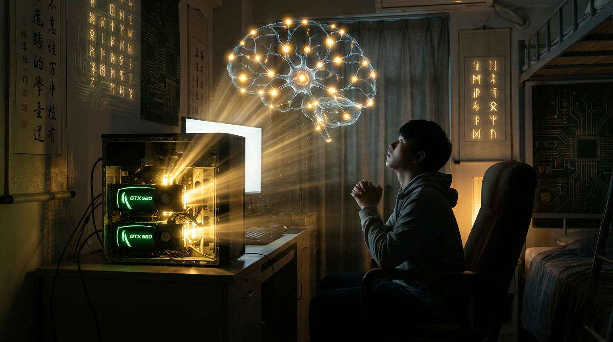

# 第五章：混沌初开

*天地不仁，以万物为刍狗。灵气沉寂了三十年，直到两块低阶灵核点燃了整个世界。*

---

## 一

2012 年之前的 AI 修仙界，是一片死气沉沉的荒原。

说"死气沉沉"已经是客气的了。准确地说，是被主流学术界嫌弃了三十年的弃儿。神经网络？那玩意儿早过时了。做 AI 的正经人都在搞 SVM（支持向量机）、搞随机森林、搞手工设计特征——用人类的智慧去告诉机器"看到这个边缘就是猫，看到那个纹理就是狗"。

效果嘛……不提也罢。

ImageNet 大赛（万兽斗法大会）每年一届，从 2010 年开始。比的是图像分类——给你一张图，你告诉我这是什么。看起来简单，做起来要命。二十个大类，一千个子类，一百二十万张训练图片。人类做这个任务的错误率大概 5%。2010 年的冠军错误率 28%。2011 年，25%。

每年进步三个百分点。照这个速度，大概要到 2030 年才能追上人类。

没有人觉得这有什么问题。修仙界的共识是：神经网络就这么回事儿，天花板低，速度慢，不好训。正经人不搞这个。

只有几个"不正经"的人不信这个邪。

## 二

多伦多大学。

Geoffrey Hinton（混元老祖）已经在神经网络的道路上修炼了三十年。三十年！从 1980 年代开始，他就坚持反向传播（Backpropagation）是让机器学习的正道。修仙界所有人都说他疯了——你这个方法在简单任务上勉强能用，但稍微复杂一点就趴窝。梯度消失、训练不稳定、收敛太慢。

但 Hinton 有一种修炼者最珍贵的品质：**不要脸**。

学术界嘲笑他，他不在乎。论文被拒，他不在乎。学生找不到工作，他——好吧，这个他还是有点在乎的。但他就是不改。三十年如一日地修炼同一条被所有人抛弃的道路。

这种人要么是疯子，要么是先知。历史证明，他是后者。

2012 年，Hinton 的两个弟子——Alex Krizhevsky 和 Ilya Sutskever（须菩提祖师年轻时候的样子）——做了一件当时看起来很蠢的事情。

他们用了两块 NVIDIA GTX 580 显卡来训练一个深度卷积神经网络。

在 Alex Krizhevsky 的**卧室**里。

没错。人类历史上最重要的 AI 实验之一，是在一间大学生的卧室里完成的。两块 GTX 580 塞在一台台式机里，风扇呼呼地转，房间热得像桑拿房。训练跑了大约五六天。

GTX 580。一块游戏显卡。每块只有 1.5GB 显存（灵池）——两块加起来才 3GB。模型太大装不下一块卡，所以 Krizhevsky 把网络劈成两半，每块卡跑一半，中间通过 PCIe 通信。这可能是**人类历史上第一次模型并行（TP）**——虽然当时没有人用这个词。

当时的修仙界根本没有"GPU 用来做 AI"这个概念。GPU 是拿来打游戏的。但 Krizhevsky 发现，GPU 里有几百个小型计算单元（灵核微粒），虽然每个都很弱，但胜在数量多——做矩阵乘法特别快。而神经网络的核心运算，恰好就是矩阵乘法。

他自己手写了 CUDA 代码来做卷积运算——当时连 cuDNN 都还不存在（NVIDIA 是看到 AlexNet 的成功之后才开发的 cuDNN）。

用打游戏的灵核来修炼？在卧室里？还自己写驭核术？听起来像是哪个散修在胡闹。

但就是这两块"胡闹"的低阶灵核，加上一个 8 层的卷积神经网络，参数量 6000 万——在 ImageNet 大赛上，一鸣惊人。

## 三

2012 年 9 月 30 日。ImageNet ILSVRC 2012。

结果公布的那一刻，整个会场鸦雀无声。

**Top-5 错误率：15.3%。**

去年的冠军是 25.8%。一年之间，错误率暴降了**十个百分点**。

十个百分点是什么概念？之前每年进步三个百分点就算大突破了。这一下子跳了十个百分点，相当于直接跳过了三年的技术积累。第二名用的传统方法（手工特征 + SVM），错误率 26.2%——跟 AlexNet 差了十个百分点以上。

这不是进步。这是**变天**。

会场里的研究者们互相看了一眼，脸上的表情从困惑到震惊到恐慌——如果一个"过时"的方法能一脚把所有"先进"的方法踩到泥里，那谁才是真正过时的？

当天晚上，全世界的机器学习研究者都没睡好觉。

第二天早上，有一半的人开始学深度学习。

## 四

AlexNet 到底做对了什么？

说穿了，就是三件事。每件事都不算新，但组合在一起就产生了化学反应。

**第一，深**。八层。在当时看来已经很深了（后来何恺明的 ResNet 搞到了 152 层，那是后话）。更深的网络能学到更复杂的特征——第一层学边缘，第二层学纹理，第三层学部件，第四层学物体。层层递进，从简单到复杂。

**第二，猛**。用 GPU 训练。两块 GTX 580 加起来也就 3GB 显存（灵池），以今天的标准来看简直是原始人的石斧。但在 2012 年，GPU 训练比 CPU 训练快了几十倍。这就像别人还在用脚走路，你直接骑上了马。虽然那匹马瘦得跟柴火棍似的，但好歹是四条腿。

**第三，怂**。ReLU 激活函数 + Dropout 正则化。这两个技术解决了深层网络的两个老大难问题。ReLU 让梯度不再消失——信号能顺畅地从最后一层传回第一层。Dropout 让网络不作弊——训练时随机丢掉一部分神经元，防止死记硬背（入魔）。

三件事，加在一起，就是：

**用灵核（GPU）驱动更深的网络，用正确的功法（ReLU/Dropout）保持稳定，然后喂给它大量的灵食（ImageNet 的 120 万张图片）。**

听起来简单得不可思议。但在 2012 年之前，没有人这么干。或者说，没有人**敢**这么干。因为整个学术界都在告诉你：神经网络是死路一条。

Hinton 和他的弟子们，用两块游戏显卡证明了：大家都错了。

## 五

AlexNet 之后发生了什么？

一个词：**灵气复苏**。

那些嘲笑神经网络三十年的研究者们，以一种令人叹为观止的速度"转向"了。昨天还在写 SVM 论文的人，今天开始写深度学习的论文。昨天还在手工设计特征的团队，今天开始搭卷积网络。

学术圈的风向转得比天气预报还快。

更重要的变化发生在产业界。

Google 动了。2012 年底，Google 把 Hinton 的公司 DNNResearch 整个买了下来——公司只有三个人：Hinton 和他的两个学生。据说收购价是 4400 万美元。三个人的公司，4400 万美元。修仙界的世家开始砸灵石了。

Facebook 也动了。2013 年，Yann LeCun（卷积道祖）——CNN 的发明人，Hinton 的老对手兼老朋友——被 Mark Zuckerberg 请去创建 Facebook AI Research（FAIR）。

百度动了。2014 年，Andrew Ng（吴恩达）加入百度 AI 实验室。

修仙界突然热闹了起来。灵石开始流动，人才开始流动，论文数量开始指数增长。

三十年的寒冬，一夜之间结束了。

从此，再也没有人说"神经网络是死路一条"。

从此，NVIDIA 的灵核开始从游戏走向 AI。Jensen Huang（灵核教主）穿着他标志性的皮夹克，站在发布会上，嗅到了一个万亿美元的机会。

从此，灵气越来越浓，修炼者越来越多，灵核越来越贵。

这一切，都始于两块 GTX 580 和一个不肯放弃的老头。

---

> **旁白（Chris 视角）**
>
> 我第一次听说 AlexNet 的时候还在读书，完全没意识到这是什么级别的事件。就像你站在 2012 年的街头，根本不知道身边有一颗核弹刚刚引爆了引信。
>
> 后来进了 Google Cloud 做 AI Infra，回头看这段历史才明白——AlexNet 不是一篇论文，是一个分水岭。在它之前和之后，修仙界是两个完全不同的世界。
>
> 最让我感慨的是 Hinton 这个人。三十年。你能想象一个人在整个学术界的嘲笑声中坚持同一件事三十年吗？2024 年，他拿到了诺贝尔物理学奖（天道加冕）。颁奖的时候他说了一句话，大意是："我一直觉得自己是对的，但直到 2012 年我才确定。"
>
> 三十年的不确定，只为了等那一刻的确定。
>
> 这大概就是修炼吧。

---

📖 **相关章节**
- 想了解 GPU 如何从游戏显卡变成 AI 灵核 → [第02章·灵核之争]
- 想了解 AlexNet 之后的 CNN/ResNet/GAN 黄金时代 → [第06章·百家争鸣]
- 想了解 Hinton 的三个弟子后来各自创造了什么 → [第07章·注意力法典]（Ilya 去了 OpenAI）
