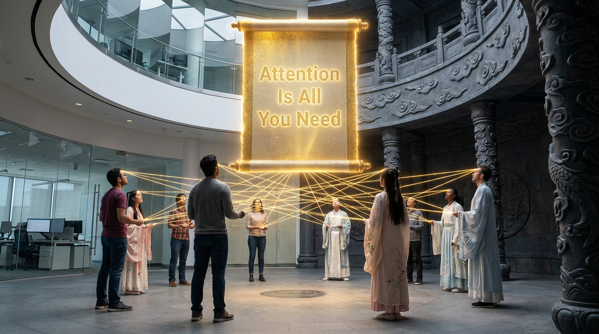

# 第七章：注意力法典

*天不生注意力，万古如长夜。*

---

## 一

2017 年之前的修仙界有一个共识：要想让神兽理解语言，就得按顺序读。

一个字一个字地读。像蚕吃桑叶一样，从左到右，从头到尾。读到第三个字的时候，要记住前两个字是什么。读到第一百个字的时候，要记住前面九十九个字。

这就是 RNN（循环神经网络）和 LSTM（长短期记忆网络）的核心思想。顺序处理。

效果还行，但有两个要命的问题。

第一，**慢**。因为必须按顺序来，第二个字要等第一个字处理完才能开始。一句话一百个字，就得等一百步。你有一万颗灵核也没用——因为它们只能排队一个一个算，不能并行。

第二，**健忘**。读到第一百个字的时候，前面的信息已经衰减得差不多了。就像你读一本书，读到最后一章已经忘了第一章写了什么。LSTM 通过"门控机制"缓解了这个问题，但也只是缓解——真正的长文本理解，还是力不从心。

修仙界接受了这个现实。语言嘛，天生就是顺序的，能怎么办呢。

直到八个人说：**不。**

## 二

2017 年春天。Google 山景城总部，1965 号楼。

故事开始于一顿午饭。

Jakob Uszkoreit 是一个德国人，父亲是著名的计算语言学家。他从 2014 年开始就在琢磨一个叫"自注意力"的东西——让每个字直接跟句子里所有其他字建立联系，而不是像 RNN 一样一个一个顺序读。但没有人当回事。连他爸都不信——父子俩在家吃饭的时候为这个吵过好几次。

2016 年的一天，他跟同事 Illia Polosukhin 在 Google 食堂吃午饭，聊到了各自工作中的痛点。Polosukhin 抱怨 RNN 太慢了。Uszkoreit 说：**"为什么不试试自注意力？"**

就这一句话。修仙界最重要的法典，起源于食堂里的一句抱怨。

Polosukhin 拉上了隔壁楼的 Ashish Vaswani，三个人开始搞。后来 Niki Parmar 和 Llion Jones 加入。再后来 Łukasz Kaiser 和他的实习生 Aidan Gomez 从另一个项目并过来。

最后一个加入的人，是偶然路过走廊的 Noam Shazeer。

Shazeer 是 Google 的老兵——2000 年就入职了，参与过 Google 广告系统的早期开发，公司内部的传奇人物。那天他路过 Kaiser 的工位，听到 Vaswani 和 Parmar 在兴奋地讨论自注意力。他凑过去听了两分钟，心想：**"这东西看起来挺有意思。"**

然后他回去自己把代码重写了一遍。

"我拿了基本的想法，自己从头做了一遍，"他后来说。"过了一阵子回来跟他们说：'看，能跑了。'"团队的人后来用"魔法""炼金术"来形容 Shazeer 的实现——他加了一些别人看不懂但效果惊人的优化。

**"Noam 是一个巫师，"** Jones 说。

从此项目起飞。他们要赶在 5 月 19 日之前提交论文到 NeurIPS 会议。最后两周疯狂加班——Gomez 这个实习生活在无尽的 debug 循环里，Vaswani 有一天晚上睡在办公室的沙发上，盯着隔帘上的花纹，觉得像突触和神经元。

**论文标题是 Llion Jones 五秒钟想出来的。**

他是威尔士人。Beatles 有一首歌叫 "All You Need Is Love"。他说："我们的东西也是只需要注意力就够了，不如就叫 'Attention Is All You Need'？"

"我是英国人，"Jones 后来说。"就想了五秒钟。我没想到他们真的会用。"

提交截止前两分钟，最后一个英法翻译的实验数字才出来。Parmar 坐在 1965 号楼的小厨房里，把最后一个数字填进论文——然后点了提交。

八位作者在作者排名上也搞了一个创新：**不排了。** 每个名字旁边标一个星号，脚注写着："平等贡献。排列顺序随机。"

这篇论文提出了一个疯狂的想法：

**扔掉 RNN。扔掉 LSTM。扔掉一切顺序处理。只用注意力。**

什么叫"只用注意力"？

想象你在读一句话："小明因为下雨没有带伞所以他全身都湿透了。"

RNN 的读法：小→明→因→为→下→雨→没→有→带→伞→所→以→他→全→身→都→湿→透→了。读到"他"的时候，要从记忆里翻出来"他"指的是"小明"。读到"湿透"的时候，要记住原因是"下雨"加"没带伞"。一步一步，线性处理。

Transformer 的读法：**同时看所有字**。"他"直接注意到"小明"。"湿透"直接注意到"下雨"和"没带伞"。不需要按顺序来，每个字可以直接跟任何其他字建立联系。

就像一个人拥有了**神识**——可以同时感知整句话的所有位置，而不是一个字一个字地蠕动。

从蚕变成了鹰。

## 三

Transformer 的架构优美到令人窒息。

核心组件只有三个：

**多头自注意力（Multi-Head Self-Attention）**。这是灵魂。每个智元（Token）跟所有其他智元计算"注意力分数"——我该多关注你？你跟我有多相关？算出来之后，按分数加权汇总信息。"多头"的意思是同时用多个不同的注意力视角去看——一个头关注语法关系，一个头关注语义关系，一个头关注位置关系。

**前馈网络（FFN）**。注意力算完之后，每个位置过一个两层的全连接网络。这一步是"消化"——把注意力收集来的信息内化成知识。

**残差连接 + 层归一化**。何恺明（残差真人）在 ResNet 里发明的跳层捷径，被 Transformer 直接拿来用了。每一层的输入加上输出，保证信息不会在深层网络中丢失。

就这三样。堆叠六层，就是一个 Transformer。

没有 RNN 的循环。没有 CNN 的卷积核。就只有注意力、前馈、残差。大道至简。

而最关键的好处是：**可以并行**。

RNN 必须按顺序算，一百个字就是一百步。Transformer 一百个字可以一步算完——因为每个字同时跟所有其他字计算注意力，每个字之间没有依赖关系。

这意味着什么？意味着你的灵核终于可以全速运转了。一万颗灵核可以同时干活，而不是 9999 颗在等一颗算完。

训练速度直接起飞。

## 四

2017 年 12 月 6 日，NeurIPS 大会。他们的论文被安排在晚间的海报展示环节。

四个小时的展示，现场挤满了想了解细节的研究者。八个人说到嗓子哑了。晚上十点半会议结束的时候，围观的人群还在。**保安不得不来赶人。**

最让 Uszkoreit 感动的一幕是：Sepp Hochreiter 走过来夸了他们的工作。Hochreiter 是谁？LSTM 的联合发明人——Transformer 刚刚把他的发明从王位上踢了下来，而他走过来说"你们做得好"。

但在当时，反响并不算特别炸裂。机器翻译领域的人看了看结果：嗯，英德翻译 BLEU 分数 28.4，比之前最好的方法高了两个点。好是好，但也没好到逆天的程度嘛。

真正让人窒息的，是后来发生的事。

人们发现，Transformer 这个架构几乎可以用在**任何事情**上。

机器翻译？用 Transformer。文本生成？用 Transformer。图像分类？用 Transformer（后来的 Vision Transformer）。语音识别？用 Transformer。蛋白质折叠？用 Transformer（AlphaFold 2 的核心）。下围棋？用 Transformer。写代码？用 Transformer。画画？用 Transformer。

修仙界从来没有见过一种功法能通吃所有领域。以前的功法都是专用的——CNN 只能看图，RNN 只能读文，各干各的。Transformer 说：我全都要。

这就像一个人发明了一种可以同时用来铸剑、炼丹、画符、布阵的通用功法。从此以后，所有新功法都建立在注意力之上。注意力成了修仙界的**底层法典**——不是某一门的独门绝技，而是所有门派都必须学的基础。

后来有人统计："Attention Is All You Need"成了有史以来被引用最多的 AI 论文之一，引用量突破 25 万次，还在增长。照这个速度，它会成为人类历史上被引用最多的论文——所有领域加在一起。

一篇论文，改写了整个世界。

## 五

注意力七圣后来怎样了？

这大概是修仙界最有意思的一个离散故事。八个人创造了修仙界的基础法典，然后……**全部离开了 Google**。一个不剩。

Google 的 CEO Sundar Pichai 被问到这件事的时候说："AI 领域非常非常活跃。"翻译一下就是："我也没办法。"

Ashish Vaswani 和 Niki Parmar 一起创立了 Adept AI（估值 10 亿美元），做 AI Agent。后来两人又一起创了第二家公司 Essential AI。

**Noam Shazeer**（注意力回归者）离开 Google 创立了 Character.AI——一个让用户跟 AI 角色聊天的平台。做得挺火，但 2024 年又以 27 亿美元的"反向收购"回到了 Google。出去转了一圈，带着全部经验和一大笔钱，又回来了。修仙界的人开玩笑说："你离开 Google 最好的方式就是创个公司让 Google 来买。"

**Aidan Gomez** 去了加拿大，创立了 Cohere——做企业级大模型服务。

**Llion Jones** 去了一个叫 Sakana AI 的日本公司。

**Illia Polosukhin** 走了一条谁都没想到的路——他去做区块链了。创立了 NEAR Protocol。从 AI 跳到 crypto，也算是修仙界的一个奇观。

**Jakob Uszkoreit** 创立了 Inceptive，做 RNA 药物设计。

**Łukasz Kaiser** 留在了 Google 一段时间，后来也出去创业了。

**Łukasz Kaiser** 是八人中唯一没有创业的。他去了 OpenAI，参与了一个叫 Q* 的神秘项目。

八个人，八条路。他们创办的公司（除了 Polosukhin 的区块链）全部基于 Transformer 技术。加在一起估值超过百亿美元。

Sam Altman（天策上将）后来说了一句让 Google 人无比扎心的话：

**"当 Transformer 论文出来的时候，我觉得 Google 内部没有人意识到它意味着什么。"**

Uszkoreit 不太同意。他说："我们知道这东西能做很神奇的事。真正的问题不是'我们有没有看到'——而是'我们看到了为什么不行动'。答案很复杂。"

复杂在哪里？一个年收入上千亿的巨头，要把整个技术栈推倒重来，需要多大的勇气？OpenAI 一无所有，所以敢全押。Google 家大业大，所以畏手畏脚。

**发明法典的人和用好法典的人，往往不是同一拨人。**

## 六

为什么 Transformer 如此重要？

不是因为它在 2017 年的某个翻译任务上刷了几个点的分数。

而是因为它解锁了一扇门：**规模化**。

在 Transformer 之前，你就算有再多灵核，也没法高效地训练超大模型——因为 RNN 的顺序依赖限制了并行度。你的灵坛上摆一万颗灵核，其中 9999 颗在空转等待。

Transformer 打破了这个瓶颈。注意力计算天然可并行。你有多少灵核，就能用多少灵核。

这意味着：**只要你有足够的灵核和智元，你可以训出无限大的模型。**

这个想法在 2017 年还只是一个理论上的可能。但接下来的几年里，它变成了现实：

- 2018 年，GPT-1，1.17 亿参数。
- 2019 年，GPT-2，15 亿参数。
- 2020 年，GPT-3，1750 亿参数。
- 2024 年，DeepSeek V3，6710 亿参数。

每一次跳跃，都建立在 Transformer 的注意力法典之上。

天不生注意力，万古如长夜。

---

> **旁白（Chris 视角）**
>
> 我在 Google Cloud 工作，每天接触的 TPU 和 GPU 集群上面跑的每一个模型，底层都是 Transformer。Gemini 是 Transformer。GPT 是 Transformer。Claude 是 Transformer。DeepSeek 是 Transformer。Llama 是 Transformer。
>
> 2017 年那篇论文的八个作者大概自己也没想到，他们写的不只是一篇论文——他们写的是一整个时代的地基。
>
> 最讽刺的是，这八个人后来全散了。Google 留不住自己的天才。注意力法典是在 Google 诞生的，但最会用这个法典的门派，是 OpenAI。
>
> 发明法典的人和用好法典的人，往往不是同一拨人。修仙界的故事，大抵如此。

---

📖 **相关章节**
- 想了解 Transformer 诞生前的 CNN/RNN 时代 → [第06章·百家争鸣]
- 想了解 Transformer 怎么催生了 GPT 和 BERT → [第08章·两条大道]
- 想了解注意力七圣中 Noam Shazeer 的传奇 → [第12章·神殿之急]
