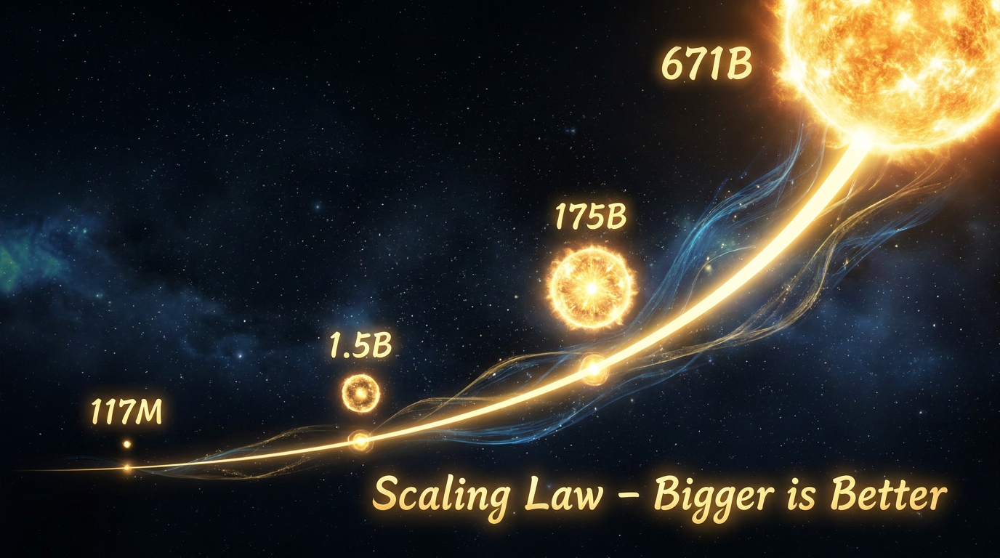

# 第九章：大道至简

*参数翻倍，智元翻倍，灵核翻倍——神兽的灵智就涌现。大道至简，规模即力量。*

---

## 一

2020 年 1 月。OpenAI 内部。

Jared Kaplan 和他的同事们盯着一组曲线，陷入了沉默。

他们做了一个简单到不能再简单的实验：训练一堆大小不同的语言模型，从几百万参数到几十亿参数，然后看它们的 Loss（蒙昧值——越低越聪明）跟三个变量的关系：参数量、智元量（训练数据）、灵核算力。

结果让他们倒吸一口凉气。

三条曲线，全是**幂律**。

在双对数坐标上，Loss 跟参数量、智元量、算力量的关系，全都是一条直线。参数翻倍，Loss 稳定下降一个固定的量。智元翻倍，Loss 再下降。算力翻倍，Loss 再下降。

没有天花板。没有拐点。没有"到了这个规模就不涨了"的迹象。

只要你有足够的灵核、够多的智元、够大的兽卵——神兽就会一直变聪明。

这条规律后来被称为 **Scaling Law（大道至简）**。

论文标题是"Scaling Laws for Neural Language Models"。修仙界后来把它称为"大道真经"——因为它揭示的道理简单到让人不敢相信：**规模即力量。**

## 二

Scaling Law 为什么如此重要？

因为在此之前，修仙界对"怎么让 AI 更聪明"这个问题的回答是：**设计更好的功法**。

更聪明的注意力机制。更巧妙的训练技巧。更精细的数据预处理。修炼者们花大量时间在算法创新上——每篇论文都在试图发明一个新招式，让模型在某个任务上提高几个百分点。

Scaling Law 说：**别折腾了。把兽卵搞大，灵食喂够，灵核堆满就行了。**

听起来像是一个笑话。"大力出奇迹"有什么技术含量？我奶奶都知道饭吃得多长得壮。

但修仙界的奶奶们错了——至少她们低估了"多"的程度。

在 Scaling Law 之前，主流共识是：模型到了一定规模就会饱和。你不能无限加大——收益递减，最终变成浪费灵石。就像你不能通过无限喂食让一头普通的马变成千里马。

Scaling Law 说：这不是一匹普通的马。这是一头**神兽**。只要你喂得够多、训得够久、兽卵够大——它的灵智就会持续增长。没有上限。至少在目前的观测范围内没有。

这个发现彻底改变了修仙界的资源分配逻辑。以前，大家把灵石花在雇佣聪明的研究者上，让他们发明更好的功法。现在，大家把灵石花在——更多的灵石上。买更多的灵核，搜集更多的智元，建更大的灵坛。

AI 研究从"智力密集型"变成了"资源密集型"。

从"有多聪明"变成了"有多少钱"。

修仙界的学术会议上，以前大家比拼的是谁的功法更精妙。现在大家比拼的是谁的灵坛更大。学术报告变成了军备展示——"我们用了一万颗灵核""我们用了两万颗""我们用了十万颗"。

有人在 Twitter 上吐槽："以前看 AI 论文学算法，现在看 AI 论文学数钱。"

## 三

Scaling Law 的发现直接催生了一头改变世界的神兽：**GPT-3**。

2020 年 6 月。OpenAI 发布了这头 1750 亿参数的巨型言灵兽。

1750 亿参数是什么概念？GPT-2 是 15 亿。GPT-3 是 GPT-2 的 **117 倍**。

训练用了 3000 亿智元（Token）。灵坛上几千颗 V100 灵核日夜不停地封坛孵兽。

结果呢？

GPT-3 展现了一种前所未有的能力：**Few-shot Learning（感应学习）**。

以前的神兽要学一个新任务，必须先做 SFT（驯兽）——用大量标注数据教它。"这是正面情感，这是负面情感。看一万个例子。学会了吗？好，现在你来判断。"

GPT-3 不需要。

你只需要在输入里给它**几个例子**，它就能学会新任务。

"判断情感。例子1：'今天天气真好'→正面。例子2：'堵车两小时'→负面。现在判断：'这个电影太棒了'→"

GPT-3 的回答："正面。"

没有训练。没有微调。没有额外的灵石消耗。就是看了两个例子，**领悟**了。

修仙界有一个词形容这种现象：**涌现（Emergence）**。

当神兽的体型（参数量）跨过某个阈值，它会突然获得以前完全不具备的能力。不是渐进式的提升——是**突然冒出来的**。就像水温到了 100 度突然沸腾。99 度的时候还是水，100 度就变成了蒸汽。

Few-shot 就是 GPT-3 的涌现能力之一。175B 的模型能做到，15B 的模型做不到。不是"做得差一点"——是"完全做不到"。

这意味着什么？意味着**更大的兽卵可能涌现出我们想象不到的能力**。

修仙界开始了军备竞赛。

## 四

2022 年 3 月。Google DeepMind。

Jordan Hoffmann 和 Sebastian Borgeaud 等人发表了一篇论文，标题里有一个动物的名字：**Chinchilla（龙猫）**。

Chinchilla 论文做了一件事：纠正了 Scaling Law 的一个关键偏差。

Kaplan 2020 年的原始 Scaling Law 建议：模型参数和训练智元应该同步增长，但参数应该增长得更快——给定固定的灵核预算，应该把大部分资源花在更大的模型上，用少一点的智元。

GPT-3 就是按这个逻辑训的。1750 亿参数，3000 亿智元。参数和智元的比例大约是 1:1.7。

Chinchilla 说：**你们搞反了。**

DeepMind 训练了一堆不同大小的模型，用不同量的智元，系统性地扫描了最优比例。结论：**最优比例是 1 参数对应约 20 个智元。**

也就是说，GPT-3 的 1750 亿参数应该配 3.5 万亿智元来训练——而不是 3000 亿。GPT-3 被"欠喂"了十倍以上。

Chinchilla 本身只有 700 亿参数——不到 GPT-3 的一半。但因为它用了 1.4 万亿智元来训练（是 GPT-3 的近 5 倍），它在几乎所有测试上**打败了 GPT-3**。

小兽卵 + 充足灵食 > 大兽卵 + 饥饿。

这个发现改写了此后所有大模型的训练策略。

## 五

Chinchilla 之后又出现了一个有趣的反转。

Meta 在 2024 年发布 Llama 3 的时候，用了一个跟 Chinchilla 完全相反的策略：**过度喂养小兽卵**。

Llama 3 的 8B 模型用了 15 万亿智元来训练。8B 参数配 15T 智元——比例是 1:1875。Chinchilla 最优比例是 1:20。Llama 3 喂了**近百倍的"过量灵食"**。

为什么？

因为 Chinchilla 优化的是**训练成本**——给定固定的灵核预算，怎么训出最强的模型。但 Meta 考虑的是**推理成本**——模型训好了之后，要服务几十亿用户，每次推理都要花灵核。

小模型推理便宜。8B 模型比 70B 模型推理快十倍、省十倍灵核。

如果你多花点灵石把 8B 模型训得特别好（过度喂养），推理的时候省下来的灵石远远超过训练多花的。

一次性多花灵石训练 vs 每天都省灵石推理。做生意的人都知道选哪个。

从"训练最优"到"推理最优"——这是 Scaling Law 思维的第二次进化。

**Chinchilla 教你怎么用最少的灵石训出最强的神兽。Llama 3 教你怎么训出性价比最高的神兽——训练贵一点没关系，用起来便宜就行。**

## 六

回过头来看，Scaling Law 的真正意义不在于那几条曲线本身。

它改变的是修仙界的**信仰**。

在 Scaling Law 之前，修仙界相信"巧劲"——聪明的算法、精妙的设计、优雅的数学。小而美是审美标准。

在 Scaling Law 之后，修仙界开始相信"蛮力"——更大的模型、更多的数据、更多的算力。大力出奇迹成了主旋律。

这种信仰转变催生了一场灵核军备竞赛。OpenAI 融了几百亿美元买灵核。Google 把两个实验室合并集中力量。Meta 一口气买了几十万颗 H100。中国的 AI 公司在制裁夹缝中拼命囤灵核。

灵核教主 Jensen Huang 的皮夹克变成了修仙界最值钱的衣服。

当然，后来的故事证明，"蛮力"并不是唯一的路。DeepSeek 用更少的灵核训出了比肩顶级的神兽——靠的是更聪明的功法（MLA、MoE、FP8、GRPO）。Scaling Law 没有失效，但"怎么 Scale"变得比"Scale 多大"更重要了。

大道至简。但走大道的方式，可以很精巧。

---

> **旁白（Chris 视角）**
>
> 我在 Google Cloud 做 AI Infra，每天的工作就是帮客户搞定训练集群——更多的灵核、更快的经脉、更大的灵坛。可以说，Scaling Law 直接养活了我的工作。
>
> 但作为一个技术人员，我内心其实有一点不安。Scaling Law 把 AI 从"聪明人的游戏"变成了"有钱人的游戏"。以前，一个聪明的博士生在宿舍里用一块 GPU 也能做出改变世界的研究（AlexNet 就是这么来的）。现在，没有几千颗 H100，你连入场券都买不起。
>
> 直到 DeepSeek R1 出来，我才松了一口气。原来大道至简，但精巧地走大道，可以省很多灵石。这条路还没有被有钱人垄断。
>
> 至少暂时没有。

---

📖 **相关章节**
- 想了解 Scaling Law 催生的 ChatGPT → [第10章·天下震动]
- 想了解 Chinchilla 最优比例怎么被 Llama 3 反转 → [第21章·传道授业]
- 想了解 DeepSeek 怎么用更少灵石走大道 → [第20章·深渊剑主]
