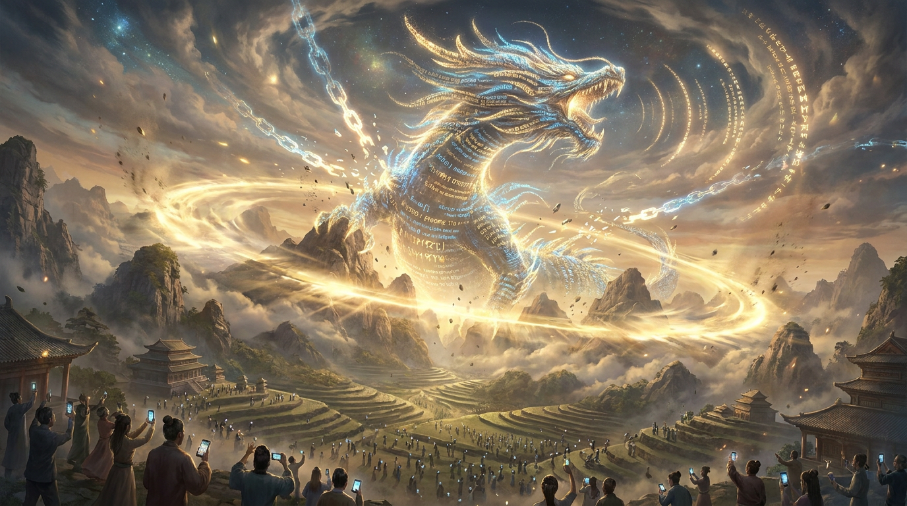

# 第十章：天下震动

*修仙界苦修千年，不及凡人一声惊呼。ChatGPT 上线两个月，一亿凡人涌入修仙界的大门。*

---

## 一

2022 年 11 月 30 日。星期三。感恩节刚过，美国人还在消化火鸡。

OpenAI 在官网上悄悄放出了一个东西。没有发布会，没有新闻稿，没有提前造势。就是一条推文，一个链接，一段简短的介绍："我们训练了一个叫 ChatGPT 的模型，它可以用对话的方式交互。试试看。"

就这样。轻描淡写。像是一个修炼者在路边摆了个摊："来，试试我新炼的小玩意儿。"

OpenAI 内部也没有料到接下来会发生什么。据说他们的服务器在上线后几个小时就开始告急——准备的算力根本不够用。

五天后，用户数突破一百万。

两个月后，用户数突破一亿。

人类历史上从来没有一个产品达到过这个增长速度。Instagram 用了两年半达到一亿用户。TikTok 用了九个月。ChatGPT 用了**两个月**。

修仙界懵了。

不是因为 ChatGPT 的技术有多惊人——说实话，底层的 GPT-3.5 在专业修炼者看来并不算特别出彩。真正让人懵的是：**凡人世界炸了**。

## 二

ChatGPT 到底是什么？

技术上说，它是 GPT-3.5 加上 RLHF（结灵契术）的产物。GPT-3.5 本身是 GPT-3 的改良版——更大的训练数据，更好的指令跟随能力。但真正的魔法在 RLHF 这一步。

GPT-3 很强，但它像一头未驯的野兽。你问它"写一首诗"，它可能给你接一段维基百科。你问它"帮我改简历"，它可能开始胡说八道。它有知识，但不听话。

RLHF 做的事情就是**结灵契**——让神兽理解人类的意图。

具体怎么做？先让人类标注员跟神兽对话，给不同的回答打分："这个好，这个差。"然后用这些打分训练一个赏罚使（Reward Model），再用 PPO（稳驯术）让神兽学会生成高分回答。

本质上就是：教野兽说人话。

InstructGPT 论文（2022 年 3 月发表）已经描述了这个方法。但 InstructGPT 没有引爆公众——因为它只是一篇论文，普通人看不到，也不关心。

ChatGPT 的天才之处在于：**它做了一个网页，让所有人都能跟神兽对话。**

就这么简单。把已有的技术包装成一个任何人都能用的产品。不需要懂 API，不需要写代码，不需要知道什么是 Transformer——打开浏览器，打字，回车。

一个入口，改变了一切。

## 三

ChatGPT 上线后的前两周，整个互联网处于一种集体癫狂的状态。

程序员发现它能写代码。不是玩具级别的——是能写出可以运行的、有一定复杂度的代码。Stack Overflow 上的提问量开始暴跌——不是因为程序员少了，而是因为他们直接问 ChatGPT 了。

学生发现它能写论文。大学教授集体破防。"AI 生成的论文怎么办？""期末考试还能考什么？""学术诚信何在？"教育界陷入了前所未有的恐慌。

作家发现它能写故事。虽然写得不算好，但能写。逻辑通顺，语法正确，甚至偶尔有点文采。创意产业从"AI 不可能取代我们"变成了"AI 什么时候取代我们"。

律师发现它能写法律文书。医生发现它能做初步诊断。翻译发现它能翻大部分语言。客服发现它能替自己加班。

每天都有新的"ChatGPT 能干什么"的帖子在社交媒体上刷屏。每天都有新的行业开始恐慌。

最恐慌的是 Google。

## 四

Google 内部拉响了"红色警报"（Code Red）。

这不是修辞。据报道，CEO Sundar Pichai 亲自召集了多次紧急会议。原因很简单：ChatGPT 威胁到了 Google 的核心业务——搜索。

想想看：你以前要找一个答案，打开 Google，输入关键词，翻十几个链接，自己汇总信息。现在你直接问 ChatGPT，它给你一个完整的回答。不需要翻链接。不需要自己汇总。

如果人们不再 Google，Google 的广告收入怎么办？

讽刺的是，Transformer——ChatGPT 的底层技术——恰恰是 Google 自己发明的。五年前，Google Brain 的八位研究员写了那篇"Attention Is All You Need"。但 Google 没有把它变成一个让所有人能用的产品。OpenAI 做到了。

Google 手里握着法典，却让对手用法典打败了自己。修仙界最大的乌龙。

2023 年 2 月，Google 匆忙发布了 Bard——自己的对话 AI。基于 LaMDA（Google 的大语言模型，之前有个 Google 工程师声称它"有意识"，闹了一场笑话）。

发布会上，Bard 被问了一个关于詹姆斯·韦伯太空望远镜的问题。它答错了。

当着全世界的面，答错了。

Google 股价当天暴跌 1000 亿美元。

一千亿美元。因为一个 AI 答错了一道题。

修仙界评价：神兽还没驯好就急着放出来，当场失控。

## 五

ChatGPT 的爆发还引发了另一场风暴——**灵石（灵核）争夺战**。

所有人都想训大模型了。所有公司都想要 GPU 了。

NVIDIA 的 A100（中阶灵核）价格飞涨。二手市场上一块 A100 被炒到了两万美元以上。黄仁勋（灵核教主）坐在灵核教廷的宝座上，看着排着队来买灵核的客户，嘴角上扬。

NVIDIA 的股价从 ChatGPT 发布前的 150 美元，一路飙升到 2024 年的 900 美元。市值从 3000 亿飙到 2 万亿。

灵核教主穿着皮夹克，在每一场发布会上重复同一句话："加速计算的时代来了。"——翻译成修仙体就是"天下修炼者都需要灵核，而灵核只有我卖。"

同时，一场融资大战也在爆发。

微软（蔚蓝世家）往 OpenAI 里又砸了 100 亿美元。Amazon（云霄天网）开始布局 Anthropic。Google 把 Brain 和 DeepMind 合并成了 Google DeepMind——集中力量搞大事。

VC 们疯了一样往 AI 创业公司里砸钱。Inflection AI、Cohere、Mistral、Character.AI——每一个都是十亿美元级别的融资。

整个修仙界的灵石流转量在 2023 年翻了几倍。

## 六

2023 年 3 月 14 日，OpenAI 放出了 GPT-4。

如果说 ChatGPT（GPT-3.5）让凡人见识了什么叫"AI 能聊天"，GPT-4 让修炼者见识了什么叫"**涌现**"。

GPT-4 是多模态的——不只能读文字，还能看图片。你给它一张手绘的网页草图，它能生成对应的 HTML 代码。你给它一张数学题的照片，它能读题、解题、给出完整过程。

更恐怖的是它在各种考试中的表现：

- 律师资格考试：OpenAI 称约前 10%（后有学者质疑实际约 68th percentile，但仍远超 GPT-3.5）
- SAT 数学：700/800
- GRE 定量推理：163/170（80th percentile）
- AP 化学/物理/生物：满分或接近满分

一头神兽，在人类设计的专业考试中，考出了人类前 10% 的成绩。

修仙界开始严肃地讨论一个之前只存在于科幻小说里的问题：**这东西离 AGI 还有多远？**

没有人能给出确切的答案。但每个人都意识到：之前以为还有二十年的事情，可能只需要五年。甚至更短。

## 七

ChatGPT 的冲击波远不止于技术和商业。

政治。各国政府开始讨论 AI 监管。欧盟加速推进《AI 法案》。中国推出了生成式 AI 服务管理办法。美国国会把 Sam Altman 请去作证。意大利一度禁止了 ChatGPT。

教育。全球各大高校陷入了"AI 生成内容怎么管"的大讨论。有的禁止使用，有的拥抱使用，有的手足无措。

就业。麦肯锡发布报告称，生成式 AI 可能在 2030 年前影响 3 亿个工作岗位。恐慌弥漫。

哲学。"AI 有意识吗？""AI 生成的艺术算不算艺术？""AI 写的诗有没有灵魂？"——这些问题从学术象牙塔里走出来，变成了普通人餐桌上的话题。

一个修仙界的内部事务，突然变成了全人类的事务。

修仙界的门从此打开了。再也关不上了。

---

> **旁白（Chris 视角）**
>
> 2022 年 12 月，我的 Google Cloud 同事们开始疯了一样地开会。会议主题只有一个：OpenAI。
>
> 我记得那段时间的心情很复杂。一方面是震撼——ChatGPT 确实好用，我自己也用了好几个晚上没睡着。另一方面是焦虑——Transformer 是 Google 发明的，现在却被 OpenAI 用来打 Google。这种感觉就像你写了一本武功秘籍，结果被隔壁门派拿去把你打了。
>
> 但最深的感受是**敬畏**。ChatGPT 让我第一次意识到，AI 不再只是我们这些修炼者的事了。它是所有人的事。我妈问我"那个 ChatGPT 是什么"的时候，我知道世界真的变了。
>
> 有些变化是不可逆的。ChatGPT 之后的世界，和 ChatGPT 之前的世界，是两个不同的文明。

---

📖 **相关章节**
- 想了解 ChatGPT 背后的 RLHF/PPO 技术 → [第15章·四象驯兽]
- 想了解 Google 被打懵后怎么反击 → [第12章·神殿之急]
- 想了解 ChatGPT 引爆的 OpenAI 内部权力斗争 → [第11章·宫变惊雷]
- 想了解灵核教主 Jensen Huang 怎么赚翻了 → [第02章·灵核之争]
