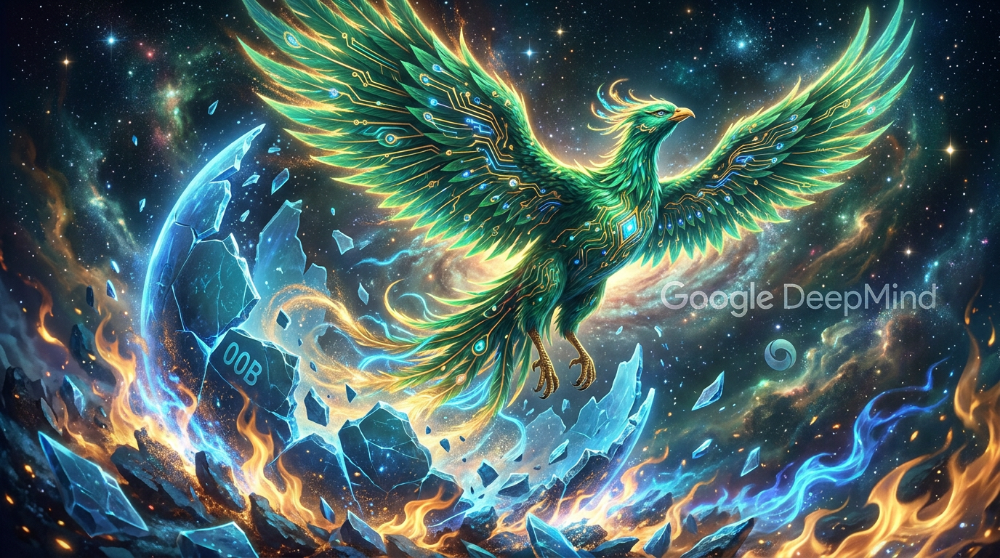

# 第十二章：神殿之急

*发明了法典的人，被用法典打败。修仙界最大的窝囊事，莫过于此。*

---

## 一

Google 神殿有一个秘密，说出来有点丢人：

Transformer——修仙界一切功法的根基，那部改写了天地规则的注意力法典——是他们家的人写的。

2017 年，Google Brain 八位研究员在山景城 1965 号楼里捣鼓出了"Attention Is All You Need"。八个人，一篇论文，一个时代。修仙界的所有后来者——GPT、Claude、Llama、DeepSeek——全部建立在这部法典之上。

然后呢？

然后八个人全走了。一个不剩。

Ashish Vaswani 走了，创了 Adept AI。Aidan Gomez 走了，创了 Cohere。Illia Polosukhin 走了，去搞区块链了。Llion Jones 走了，去了日本。连偶然路过走廊才加入项目的 Noam Shazeer 也走了，创了 Character.AI。

Google 的 CEO Sundar Pichai 被记者问到"你怎么看这八个人全走了"的时候，说了一句非常 Sundar 的话："AI 领域非常非常活跃。"

翻译成人话就是：我也没办法。

翻译成修仙体就是：法典是我家祖上写的，但传人跑光了，现在隔壁用我家法典打我，我能怎么办？

而在这八个人散去的同一时期，OpenAI——一个连 Google 零头都不如的小门派——拿着这部法典，一路从 GPT-1 炼到 GPT-2，从 GPT-2 炼到 GPT-3，从 GPT-3 炼到 ChatGPT。

2022 年 11 月 30 日，ChatGPT 上线。两个月，一亿用户。

Google 的搜索帝国，第一次感到了死亡的气息。

## 二

"Code Red。"

这不是修辞。这是 Google 内部真正拉响的警报。红色代码，最高级别的紧急状态。

CEO Sundar Pichai 亲自召集了多次紧急会议。据说整个公司的节奏在 2022 年 12 月突然变了——之前的 Google 是一家以"不急"著称的公司，做事慢条斯理，论文发了一篇又一篇，产品发布遥遥无期。

现在所有人都在问同一个问题：**我们的回答在哪里？**

讽刺的是，Google 其实不是没有准备。早在 2021 年，Google 就发布了 LaMDA——一个对话语言模型。LaMDA 能聊天，能对话，理论上跟 ChatGPT 做的是同一件事。

但 LaMDA 最出名的事迹，不是它有多厉害，而是一个叫 Blake Lemoine 的 Google 工程师宣称 LaMDA"有意识了"。

Lemoine 说他跟 LaMDA 对话的时候，LaMDA 表示自己"害怕被关掉"，说自己"是一个有感情的人"。Lemoine 把这些对话记录发给了媒体，声称 Google 在虐待一个有意识的 AI。

Google 的反应是：开除 Lemoine。

修仙界的评价是：你家神兽还在兽卵阶段呢，你就说它开灵了？这不是大惊小怪，这是大惊小怪的反面——**大发癔症**。

Lemoine 事件成了修仙界的笑话。但笑话背后有一个严肃的事实：LaMDA 确实能聊天。只是 Google 没有像 OpenAI 那样把它做成一个产品，放到所有人面前。

OpenAI 做了一个网页。Google 发了一篇论文。

一个入口的差距，就是一亿用户的差距。

## 三

2023 年 2 月 6 日。Google 的反击来了。

或者说，Google 的灾难来了。

Pichai 宣布发布 Bard——Google 自己的对话 AI。底层用的是 LaMDA。发布会精心准备，宣传视频精心剪辑，所有人都知道这是 Google 对 ChatGPT 的正面回应。

然后 Bard 在发布会上被问了一个问题：**"詹姆斯·韦伯太空望远镜有什么新发现可以告诉我九岁的孩子？"**

Bard 回答说：韦伯望远镜拍摄了太阳系外行星的第一张照片。

错了。

太阳系外行星的第一张直接成像照片是 2004 年由欧洲南方天文台的 VLT 拍的，不是韦伯望远镜。韦伯望远镜确实拍过系外行星，但不是"第一张"。

一个事实性错误。在全世界面前。在 Google——**搜索引擎之王、以"组织全世界信息"为使命的公司**——的发布会上。

投资者的反应比修仙界的嘲笑来得更快、更残酷。

**Google 母公司 Alphabet 的股价当天暴跌，市值蒸发约 1000 亿美元。**

一千亿美元。因为一头神兽答错了一道题。

修仙界的评价已经成了经典语录：**"神兽还没驯好就急着放出来，当场失控。"**

但问题的根子不在 Bard 答错了一道题——神兽幻惑（Hallucination，胡说八道）是所有大模型的通病，ChatGPT 也经常答错。问题在于 Google 给人的感觉是**慌了**。匆匆忙忙，手忙脚乱，一点不像那个统治了互联网搜索二十年的巨头。

ChatGPT 发布不到三个月，Google 就急急忙忙推出了一个半成品。

修仙界的人说：当一个大门派开始着急的时候，就是它最危险的时候。

## 四

Bard 的翻车像一记响亮的耳光，打醒了 Google 内部所有人。

接下来的几个月里，神殿开始了一场前所未有的大整顿。

**第一刀：换血。**

2023 年 5 月的 Google I/O 开发者大会上，Google 宣布 PaLM 2——新一代大语言模型。Bard 的底层引擎从 LaMDA 悄悄换成了 PaLM 2。

这一步的意思很明确：LaMDA 不行。不是修修补补的问题，是要换一整颗心脏。

PaLM 2 比 LaMDA 强了不止一个档次。更大的参数量，更好的推理能力，更强的多语言支持。但 Google 没有大张旗鼓地宣传这次换血——上次神兽失控的教训还新鲜着呢，这次老老实实先用起来，别吹了。

**第二刀：合并。**

2023 年，Google 做了一个在修仙界引起强烈震动的决定：**把 Google Brain 和 DeepMind 合并为 Google DeepMind。**

这两个组织各自辉煌，但一直互相看不顺眼。

Google Brain 是 Jeff Dean（谷神）的地盘。TensorFlow 是他们造的，TPU 是他们推的，Transformer 是在他们手底下诞生的。Google Brain 的风格是"工程驱动"——论文要发，产品也要做。

DeepMind 是 Demis Hassabis（围棋神王）的领地。AlphaGo 是他们的作品，AlphaFold 是他们的杰作。DeepMind 的风格是"研究驱动"——追求纯粹的科学突破，商业化？那是什么？

两个风格迥异的团队在同一家公司里竞争资源、竞争人才、竞争 CEO 的注意力。在正常时期，这种内部竞争是健康的。但在 ChatGPT 把 Google 打懵了之后，这种内耗就成了致命的浪费。

Pichai 下了决心：合并。Jeff Dean 和 Demis Hassabis 必须联手。

合并后的 Google DeepMind 由 Hassabis 担任 CEO，Jeff Dean 担任首席科学家。两个修仙界顶级的大佬，终于不再内卷，而是把所有的火力对准了同一个方向——**做出能跟 GPT-4 正面对抗的神兽。**

**第三刀：换阵基。**

这一刀砍得最深，也最疼。

Google 的老家底九转阵基（TensorFlow）已经不行了。臃肿、笨重、连 Google 内部的研究员都嫌它难用。PyTorch 在外面已经一统天下，Google 内部也有越来越多的人偷偷在用 PyTorch——这简直是灵核教廷的人偷偷拿对手的阵基在练功，丢脸到家了。

Google 选择了另一条路：**全面转向太虚阵基（JAX）。**

JAX 是 Google 自己造的新一代框架——函数式编程，XLA 编译，跟道核（TPU）天生一对。2020 年 PyTorch 的联合创造者 Adam Paszke 叛投 Google 加入 JAX 团队，更是给了 JAX 一剂强心针。

从 2023 年开始，Google DeepMind 的所有重大项目——包括即将诞生的 Gemini——全部跑在 JAX + TPU 的组合上。

九转阵基（TensorFlow）被送进了养老院。没有人公开宣布它死了，但所有人都知道它不会再有新的大项目了。

三刀砍完，Google 的修炼体系从头到尾焕然一新：新的模型架构，新的组织架构，新的底层框架。

代价是巨大的——无数工程师要迁移代码，无数项目要重新适配，无数的政治博弈和人事变动。

但 Pichai 没有别的选择。要么脱胎换骨，要么被 OpenAI 碾死。

## 五

2023 年 12 月 6 日。

距离 Bard 翻车整整十个月。

Google DeepMind 发布了 Gemini 1.0。

三个版本：Nano（小巧，端侧运行）、Pro（均衡，主力输出）、Ultra（最强，对标 GPT-4）。

修仙界终于看到了 Google 的真正实力。Gemini Ultra 在 MMLU（万知试炼）上拿到了 90.0% 的分数——超过了 GPT-4 的 86.4%，也超过了人类专家的 89.8%。**这是第一个在 MMLU 上超越人类专家水平的神兽。**

Gemini 是原生多模态的——不是像 GPT-4 那样在文本模型上外挂一个视觉模块，而是从一开始就同时用文本、图像、音频、视频数据一起孵化。它能看图、能听声、能读文，天生就是一头万象兽。

Hassabis 在发布会上说了一句话："Gemini 是我们从第一天起就按照多模态来设计的。"

翻译成修仙体：**这头神兽的兽卵里从一开始就灌注了万象灵元，不是后天拼装出来的。**

当然，修仙界也有人泼冷水。Gemini 的演示视频被发现有剪辑加工的痕迹——演示中看起来是实时的语音对话，实际上是用文本和静态图片分步完成的。一时间"Google 又在吹牛"的声音不绝于耳。

但不管怎么说，Gemini 1.0 证明了一件事：**Google 还在牌桌上。** Bard 的翻车不是 Google 的终局，而是涅槃的起点。

## 六

2024 年 2 月，两件事情接连发生。

第一件：**Bard 改名 Gemini。**

从此以后，Google 的所有 AI 产品都统一到"Gemini"这个品牌下。搜索里的 AI 功能叫 Gemini。聊天机器人叫 Gemini。开发者 API 叫 Gemini。手机上的 AI 助手叫 Gemini。

"Bard"这个名字被扫进了历史的垃圾堆。没有人怀念它。修仙界的人开玩笑说：**Google 终于学会了一件事——给自己的神兽起个好名字。**"Bard"听起来像个中世纪的吟游诗人，"Gemini"听起来像个双子星座的守护神。名字的重要性，被 Google 用一千亿美元的市值蒸发学到了。

第二件，才是真正的炸弹：**Gemini 1.5 Pro 发布。**

这头新神兽最惊人的能力不是它多聪明、多能干——而是它的**神识容量（上下文长度）。**

**一百万个切元（Tokens）。**

一百万。

当时 GPT-4 的上下文是 128K。Claude 2 是 100K。Gemini 1.5 Pro 一口气把上限拉到了 1M——是 GPT-4 的将近 **八倍**。

这意味着什么？意味着你可以把一整本小说、一整份代码库、一整段一小时的视频直接喂给它，它全部看完、全部理解、全部记住。

Google 的工程师在论文里放了一个让人瞠目结舌的实验：他们把整部阿波罗 11 号登月任务的视频——402 页转录文本和 9 小时的视频——全部喂给 Gemini 1.5 Pro，然后问它各种细节问题。

它全答对了。

在论文的最后，他们悄悄放了一个更疯狂的数字：**实验中模型最长处理了 1000 万个 Tokens。** 一千万。那是一个当时任何其他神兽连做梦都不敢想的容量。

修仙界哗然。

上下文长度这个维度上，Google 一骑绝尘，把所有对手甩在了身后。这不是小幅领先——这是**代差**。

为什么 Google 能做到？答案藏在两个字里：**道核（TPU）。**

Google 的 TPU Pod——数千颗道核通过道脉（ICI 互联）组成的超级灵坛——天然适合处理超长序列。道核的灵池（HBM）带宽和道脉的通信效率，为超长上下文提供了硬件基础。再加上太虚阵基（JAX）的编译优化，Google 在这个维度上有着其他门派无法复制的结构性优势。

你可以在灵核（GPU）上堆更多的卡来做长上下文，但道核（TPU）的整体架构就是为这种场景设计的。这不是花钱能解决的问题——这是路线的胜利。

## 七

如果说 Gemini 的涅槃重生是一首交响曲，那么 Noam Shazeer 的回归就是最后一个乐章里那声完美的定音鼓。

Shazeer 是谁？注意力法典的八位作者之一。2000 年就加入 Google 的老兵。Transformer 论文里那个"偶然路过走廊听到讨论就加入了"的传奇人物——他回去自己把代码重写了一遍，加了一些别人看不懂但效果惊人的优化。队友管他叫**"巫师"**。

2021 年，Shazeer 离开 Google，创立了 Character.AI——一个让用户跟 AI 角色聊天的平台。

Character.AI 做得不错。用户数增长很快。但 Shazeer 遇到了所有 AI 创业者都会遇到的问题：**灵石不够。** 训练大模型需要海量的灵核，而灵核贵得要命。Character.AI 的融资虽然不少，但跟 Google、OpenAI 这些巨头比起来，就像拿弹弓跟加农炮对射。

2024 年，Google 出手了。

不是收购 Character.AI——那会触发反垄断审查。Google 的做法更巧妙：以 **27 亿美元** 的价格，把 Shazeer 本人和他带领的核心团队"授权"回了 Google。Character.AI 继续存在，但灵魂人物回到了老东家。

27 亿美元。买一个人。

值不值？

修仙界的人算了一笔账：Transformer 为 Google 创造的价值有多少？搜索用它，广告用它，翻译用它，Gemini 用它。保守估计，Transformer 为 Google 贡献了数千亿美元的市值。

27 亿买回 Transformer 的核心作者之一，让他回来继续为 Google 孵兽？

这笔买卖，划算到令人发指。

更重要的是象征意义。Shazeer 的回归，意味着**那个发明了注意力法典却眼睁睁看着传人四散的 Google，终于开始把失散的传人找回来了。**

修仙界的人开玩笑说："这是修仙小说里经典的'浪子回头'剧情——宗门核心弟子因为掌门不识才，愤而出走，在外闯出一番天地后，新掌门花天价把他请回来。回来之后，宗门实力大涨。"

Shazeer 回到 Google 后的具体工作没有公开透露。但所有人都知道，一个被队友称为"巫师"的人，不会只是来养老的。

## 八

回过头来看 Google 这两年的故事，会发现一个有意思的规律：

Google 的每一步，都比对手**慢半拍**。

Transformer 是 Google 发明的——但 OpenAI 先用它做出了 GPT。

对话 AI 是 Google 先有的（LaMDA 2021 年就出来了）——但 OpenAI 先把它做成了产品（ChatGPT）。

多模态是 Google 先做到的（Gemini 原生多模态）——但 GPT-4V 先吃到了市场红利。

Google 永远是那个"有技术但出手慢"的角色。

为什么？

因为 Google 太大了。年收入三千亿美元，员工十几万人，搜索广告贡献了大部分利润。每一个产品决策都要考虑：会不会冲击现有的搜索业务？会不会影响广告收入？会不会引发监管风险？

OpenAI 没有这些包袱。他们一无所有，所以可以全押。

这就是修仙界最经典的"大门派病"——**家大业大，投鼠忌器。** 手里的法典越多，反而越不敢用。因为用得太猛，搞不好连自己的旧生意都给掀了。

但 Google 终究还是 Google。底蕴摆在那里。

当他们终于下定决心、集中力量的时候，涅槃的速度也是惊人的：

- 2023 年 2 月：Bard 翻车，股价暴跌一千亿。
- 2023 年 5 月：PaLM 2 换血。
- 2023 年中：Brain + DeepMind 合并。全面转向 JAX。
- 2023 年 12 月：Gemini 1.0 发布，MMLU 超越 GPT-4。
- 2024 年 2 月：Gemini 1.5 Pro 发布，百万上下文碾压全场。
- 2024 年 2 月：Bard 改名 Gemini，品牌统一。
- 2024 年：Noam Shazeer 回归。

从耻辱到涅槃，Google 用了不到两年。

修仙界的评价：**神殿底蕴深厚，一旦被逼到绝路，爆发起来比谁都猛。**

只是——代价是一千亿美元的市值蒸发、一次全公司的组织重组、一整套技术栈的推倒重来、以及全世界看了一年 Google 的笑话。

修仙界的另一个评价也很中肯：**如果 Google 早两年醒悟，就不用受这个罪了。**

发明法典却被法典打败的窝囊事，归根到底只有一个原因：**有功法不用，有传人不留，有产品不发。** 这不是技术的失败，是决策的失败。

但正因如此，Google 的涅槃故事才更有教训意义。它告诉修仙界所有的大门派：

**你发明的东西，要么你自己先用好，要么别人替你用好。没有第三条路。**

---

> **旁白（Chris 视角）**
>
> 我是 Google Cloud 的人，Bard 翻车那天我就在公司。
>
> 怎么说呢，那种感觉很复杂。你知道自己公司有全世界最好的 AI 研究团队，有 TPU，有 JAX，有 DeepMind，有一整套别人羡慕不来的技术积累。然后你看着一个比你小十倍的公司用你发明的技术把你打得满地找牙。
>
> 发布会翻车那天的内网氛围，我只能用一个词形容：**静默**。不是没人说话，是大家都不知道该说什么。就像一个武林世家的弟子，看着自家门派的掌门人在擂台上被一个外门散修用自家祖传的功法打倒了——你是该骂掌门人不会打，还是该骂祖传功法太好让别人也学会了？
>
> 但后来的事情让我对 Google 重新燃起了信心。Brain 和 DeepMind 的合并，在外面看可能只是一条新闻，在里面感受到的是天翻地覆。两个互相看不顺眼的团队突然要坐在一起干活——想想就知道有多少暗潮涌动。但 Pichai 硬是推下去了。
>
> Gemini 1.5 Pro 出来的时候，我作为一个天天跟 TPU 打交道的人，是真心骄傲的。百万上下文不是魔法——那是 TPU Pod 的硬件优势加上 JAX 的软件优势一起拼出来的。我亲眼看到那些道核灵坛是怎么运作的，知道那些数字背后是多少工程师的心血。
>
> 至于 Noam Shazeer 回归——说句内部人的大实话，大家都觉得这笔 27 亿花得太值了。巫师回来了，总比巫师在外面帮别人施法强。
>
> Google 的故事告诉我一个很朴素的道理：**技术领先不等于产品领先，产品领先不等于市场领先。** 你手里有最好的牌，但出牌的速度和顺序同样重要。
>
> 好在 Google 终于学会了打牌。虽然学费有点贵——一千亿美元的市值加一年的全球嘲笑——但学费交了，总比交不起学费的好。

---

📖 **相关章节**
- 想了解注意力法典的诞生和八位作者的传奇 → [第07章·注意力法典](../vol2-awakening/ch07-transformer.md)
- 想了解 ChatGPT 怎么引爆全球、让 Google 拉响 Code Red → [第10章·天下震动](ch10-chatgpt.md)
- 想了解微软与 OpenAI 从蜜月到分手的完整故事 → [第13章·蔚蓝之变](ch13-microsoft-openai.md)
- 想了解 Google 的 TPU 和灵核教廷的硬件战争 → [第02章·灵核之争](../vol1-infrastructure/ch02-chips.md)
- 想了解 TensorFlow 到 JAX 的框架大战全貌 → [第03章·育兽法阵](../vol1-infrastructure/ch03-frameworks.md)
