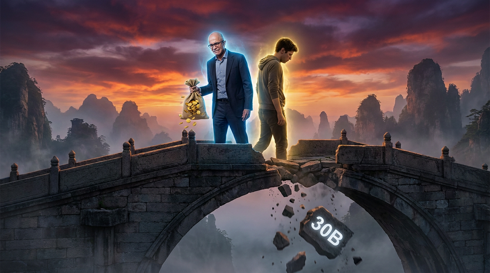

# 第十三章：蔚蓝之变

*修仙界最大的一桩供奉关系，从甜蜜到裂痕到分手。一百三十亿灵石砸下去，六年独占说没就没。*

---

## 一

故事要从一个关键问题说起：OpenAI 的钱，从哪来的？

2015 年成立的时候，OpenAI 是个非营利组织。Elon Musk、Sam Altman、Peter Thiel 等人凑了十来亿美元，说要"为全人类造 AGI"。听着很伟大。但修炼大模型需要的灵石是天文数字——GPT-2 的训练费用还能靠捐款凑合，到了 GPT-3 级别，那点启动资金连灵核（GPU）集群的电费都不够付。

OpenAI 需要一个金主。一个超级金主。

2019 年 7 月，蔚蓝世家（微软）的当代家主 Satya Nadella（纳德拉）站了出来。

**十亿美元。第一笔供奉。**

但 Nadella 不是慈善家。这十亿美元换来了一份在修仙界史无前例的契约——**灵脉契约（独占协议）**：OpenAI 的所有模型，只能通过蔚蓝世家的云灵坛（Azure）对外出售。换句话说，天下修炼者想用 OpenAI 的借兽令（API），只有一条路——找蔚蓝世家买。

翻译成凡人世界的话：微软花十亿美元买断了 OpenAI 的商业化渠道。OpenAI 做技术，微软做生意。你孵兽，我卖兽。

2019 年的修仙界，没几个人觉得这笔投资有多重要。GPT-2 刚出来，还在被人嘲笑"写出的文章像小学生作文"。花十亿美元供奉一个连产品都没有的研究实验室？Nadella 是不是钱太多了？

然后 GPT-3 来了。ChatGPT 来了。

回过头看，这十亿美元是修仙界有史以来回报率最高的一笔供奉。

## 二

尝到了甜头的 Nadella 开始加码。

2021 年，蔚蓝世家追加投资。具体数额外界说法不一，但供奉关系在不断深化——OpenAI 的训练全部跑在 Azure 上，Azure 的 AI 服务全部靠 OpenAI 的模型撑场面。双方在技术和商业上已经深度绑定。

但真正让修仙界瞠目结舌的是第三次供奉。

**2023 年 1 月。一百亿美元。**

没看错。一百亿。

加上之前的投资，蔚蓝世家前后往 OpenAI 里砸了约 **一百三十亿美元**。

换来的条件也更加苛刻：蔚蓝世家拿走 OpenAI **75% 的利润分成**，直到投资完全回本。灵脉契约继续生效——OpenAI 的所有商用模型只能通过 Azure 出售。此外，蔚蓝世家获得了 OpenAI 约 49% 的经济权益。

翻译成修仙体：仙宗七成半的灵石收入要先上交给世家，而且所有生意只能通过世家的灵脉来做。你是掌门人没错，但灵脉在我手里，灵石在我手里，你不听话我就掐断你的灵脉。

修仙界的评论是：这哪是投资啊，这是**养蛊**。

Sam Altman 在不在乎？他当然在乎。但他没有别的选择。GPT-4 正在训练，那台灵坛需要的灵核数量只有蔚蓝世家供得起。没有微软的灵石和灵核，就没有 GPT-4。就这么简单。

## 三

2023 年是蔚蓝世家和 OpenAI 的蜜月顶峰。

3 月，GPT-4 发布。修仙界为之震动。而 Nadella 比任何人都兴奋——因为 GPT-4 的能力意味着他的供奉终于要开始回本了。

他做了一件在修仙界引起巨大争议的事：**把 GPT 塞进蔚蓝世家的每一件法器里。**

Bing 搜索？加上 GPT。改名 Bing Chat，后来又改名 Copilot。
Office 套件？加上 GPT。Word、Excel、PowerPoint、Outlook，全部变成 Copilot for Microsoft 365。
GitHub？加上 GPT。GitHub Copilot 成了全球最火的代码助手。
Windows？加上 GPT。Copilot 直接嵌进操作系统。

**Copilot（驭兽法器）** ——这个名字从此成了蔚蓝世家最重要的品牌。一个 AI 副驾驶，坐在你的每一个软件里，随时待命。

修仙界的人说："Nadella 这是把 OpenAI 的神兽拆成了一百块零件，焊进了自己每一件法器里。一头神兽的价值，被他榨干到了极致。"

也有人说："这不是榨干，这是双赢。OpenAI 得到了灵石和分发渠道，微软得到了 AI 能力。完美的供奉关系。"

2023 年上半年，所有人都以为这对组合会一直甜蜜下去。

**然后，11 月来了。**

## 四

2023 年 11 月 17 日，星期五。OpenAI 宫变。

这件事在[第十一章](ch11-openai-coup.md)里已经详细写过。这里只讲蔚蓝世家的视角。

当 Altman 被董事会解雇的消息传来时，Nadella 的第一反应不是惊讶——而是**恐惧**。

一百三十亿美元的供奉，全押在一个 CEO 位置都不稳的门派上。如果 Altman 真的走了，OpenAI 九成的工程师跟着走了，那门派就是一个空壳。一百三十亿美元打水漂。

Nadella 的第二反应是——**趁火打劫**。

他闪电般地在 X（Twitter）上宣布：欢迎 Sam Altman 和他的同事们加入微软，领导一个新的 AI 研究团队。七百多名 OpenAI 员工已经签了联名信，说要跟 Altman 走。Nadella 的意思很明确：**都来我这儿。我出钱出灵核，你们只管修炼。**

如果这步棋成了，那将是修仙界有史以来最精彩的"釜底抽薪"——花了一百三十亿没把你买下来，那我就把你的人全拉走。壳留给董事会，人跟我走。

最终 Altman 在五天后回归了 OpenAI。Nadella 没能把整个团队拉过来。

但这五天改变了 Nadella 的认知。

他在后来的采访中说了一句话，看似轻描淡写，实则意味深长：**"我们对 OpenAI 的投资很棒。但同时，我们也要确保自己有完整的 AI 能力。"**

翻译成修仙体：灵石可以继续供奉，但我自己也要练功了。不能把身家性命都绑在别人身上。

种子，埋下了。

## 五

2024 年 3 月。距离宫变四个月。

Nadella 做了一件让修仙界大跌眼镜的事：**他把 Mustafa Suleyman（叛神之子）拉进了蔚蓝世家。**

Suleyman 是谁？DeepMind 的联合创始人之一。2010 年跟 Demis Hassabis（围棋神王）一起创立了 DeepMind，后来因为管理理念不合被边缘化，2019 年离开了 DeepMind，2022 年创立了 Inflection AI。

Inflection AI 做了一个叫 Pi 的对话 AI，体验不错，但始终没找到盈利模式。到了 2024 年，灵石快烧完了。

Nadella 看准了这个窗口。他没有收购 Inflection AI——跟 Google 买 Character.AI 的套路一样，直接收购容易触发反垄断审查。他的做法更优雅：**花 6.5 亿美元的"授权费"，把 Suleyman 本人和 Inflection 的大部分核心团队直接挖走。**

然后，他做了一件更大的事：**成立 Microsoft AI 部门，Suleyman 担任 CEO。**

注意这个信号。蔚蓝世家不是找了个顾问，不是设了个研究院，而是成立了一个**独立的 AI 部门**，配一个**CEO**。这意味着什么？

**意味着蔚蓝世家决定自研了。**

OpenAI 不再是唯一的选择。Nadella 在 OpenAI 的隔壁起了一座新的灵坛，请了一个跟 Hassabis 一起创过 DeepMind 的人来主持大局。

修仙界的评价："Nadella 从一个供奉者变成了一个修炼者。从掏灵石的人变成了自己孵兽的人。"

更耐人寻味的是 Suleyman 和 Altman 的关系。

据 Salesforce 的 CEO Marc Benioff 在一次行业聚会上公开说的：**这两个人互相看不顺眼。** Suleyman 觉得 Altman 是个靠营销和政治手腕上位的商人，不是真正的技术人。Altman 觉得 Suleyman 在 DeepMind 就被 Hassabis 赶出来了，到了 Inflection AI 也没做出什么名堂，靠什么跟自己叫板？

两个人的私人恩怨不重要。重要的是，Nadella 把这个"跟 Altman 不对付"的人放到了蔚蓝世家 AI 的掌门位置上。

这个人事安排本身就是一种宣言：**我不再需要跟你保持亲密了。我有自己的人了。**

## 六

接下来的两年，蔚蓝世家和 OpenAI 的关系进入了一种微妙的"同床异梦"状态。

表面上，合作还在继续。Azure 还在卖 OpenAI 的借兽令（API），Copilot 还在用 GPT 系列的模型，灵石还在照常流动。

但暗地里，两边都在做自己的准备。

OpenAI 这边：Altman 在疯狂融资。2024 年 10 月，OpenAI 以 1570 亿美元的估值完成了 66 亿美元的新一轮融资。他还在推动 OpenAI 从"利润上限"的营利子公司转型为完全的营利公司。为什么？因为只有变成正常的公司，他才能摆脱蔚蓝世家和非营利母公司的双重控制。

蔚蓝世家这边：Nadella 在加速自研。Suleyman 带领的 Microsoft AI 团队在疯狂招人、疯狂训练。蔚蓝世家的灵核集群一半跑 OpenAI 的任务，一半开始跑自己的模型训练。

修仙界的老修士们看出了门道："这不是合作关系了。这是两个人各怀鬼胎，住在同一屋檐下，等着看谁先提分手。"

到了 2025 年 10 月，蔚蓝世家持有 OpenAI 约 **27% 的股份**，估值约 **1350 亿美元**——纸面上看很风光。但华尔街的分析师们注意到一个不祥的数字：蔚蓝世家对 OpenAI 投资的 **31 亿美元减值**。

减值是什么意思？意思是蔚蓝世家的会计师们在账本上写了一行字：**这笔投资，没有我们当初以为的那么值钱。**

修仙界的评价："供奉供到最后，连账本都开始说真话了。"

## 七

2026 年 4 月。分手的第一枪，是 OpenAI 打的。

OpenAI 宣布：**单方面结束蔚蓝世家的独占权。**

灵脉契约，终结了。

从此以后，OpenAI 的模型不再只能通过 Azure 出售。OpenAI 可以直接卖自己的 API，可以跟亚马逊、Google、任何人合作，可以开自己的商业渠道。蔚蓝世家六年来最核心的护城河——"你想用 OpenAI 就必须来找我"——一夜之间消失了。

**一百三十亿灵石砸下去，六年独占说没就没。**

Nadella 有没有怒？外界不知道。但从蔚蓝世家的公开反应来看，他们表现得异常冷静——几乎是一种"我早就料到了"的冷静。

因为到了 2026 年 4 月，蔚蓝世家已经不再需要这条灵脉了。

他们有了自己的神兽。

## 八

2026 年 6 月。微软 Build 2026 开发者大会。

Mustafa Suleyman 站在西雅图会议中心的舞台上，背后的大屏幕上打出了一个名字：

**MAI-Thinking-1。**

蔚蓝世家第一头完全自研的神兽。没有 OpenAI 的技术，没有 OpenAI 的数据，没有 OpenAI 的影子。从架构到训练到对齐，全是蔚蓝世家自己的团队干的。

Suleyman 在台上说了一段话，每个字都像是说给 Altman 听的：

"从今天起，Copilot 将由我们自己的模型驱动。我们感谢与 OpenAI 多年来的合作——但蔚蓝世家的 AI 未来，由蔚蓝世家自己定义。"

台下掌声雷动。

修仙界的人事后分析了 MAI-Thinking-1 的命名：**MAI——Microsoft AI。** 不是 OpenAI，不是 GPT，不是任何跟 Altman 有关的东西。这个名字本身就是一次切割。

更狠的是，蔚蓝世家在 Build 2026 上宣布：**Copilot 全线产品开始从 GPT 系列迁移到 MAI 系列。** 也就是说，那些被 Nadella 焊进 Office、Windows、Bing、GitHub 里的 GPT 零件，将被逐步替换成自家的零件。

当初 Nadella 把 GPT 拆成一百块焊进所有法器里的时候，所有人都觉得蔚蓝世家和 OpenAI 已经骨肉难分、不可能拆开了。

结果呢？**焊上去的东西，也能一块块拆下来。**

修仙界的评论："Nadella 三年前就开始准备这一天了。从宫变那天起，他就在挖第二条灵脉。等到 OpenAI 自己撕毁独占协议的时候，他的第二条灵脉已经通了。"

**不是 OpenAI 甩了微软。是微软等着 OpenAI 来甩，然后顺势分手。**

## 九

回过头看，蔚蓝世家和 OpenAI 的关系是修仙界最经典的"供奉悖论"。

**阶段一：求婚（2019-2021）。** 蔚蓝世家出灵石，OpenAI 出技术。双方各取所需，甜甜蜜蜜。外界说他们是"AI 界的完美婚姻"。

**阶段二：蜜月（2023 上半年）。** GPT-4 问世，Copilot 横扫天下。蔚蓝世家的股价一路飙升，市值一度超过苹果成为全球第一。一百三十亿灵石的投资回报率高得离谱。

**阶段三：裂痕（2023 年 11 月-2024 年）。** 宫变让 Nadella 看清了风险。Suleyman 入场，Microsoft AI 成立。蔚蓝世家从"单押 OpenAI"变成了"两条腿走路"。

**阶段四：同床异梦（2025 年）。** OpenAI 拼命想挣脱控制，蔚蓝世家加速自研。灵脉契约名存实亡，投资开始减值。

**阶段五：分手（2026 年 4-6 月）。** OpenAI 撕毁独占协议，蔚蓝世家推出自研模型。Copilot 换心，GPT 出局。两个名字从此分开写。

整个过程，像极了修仙小说里的一个经典桥段：

一个贫穷但天赋异禀的散修（OpenAI），被一个财大气粗的世家（微软）相中，获得了源源不断的灵石供奉。散修靠着这些灵石一路修炼到大乘期，成了天下瞩目的绝世高手。

但修为越高，散修就越不想寄人篱下。他开始觉得灵脉契约太束缚，世家拿走的太多。他要自由。

世家家主一开始不高兴，后来也想通了：**你想走就走吧。反正这几年我已经偷偷把你的功法学到七八成了，还从你的死对头那里挖了个高手过来。你以为你不可替代？不好意思，没有谁是不可替代的。**

于是散修和世家体面地分了手。散修去了更广阔的天地，世家也不再依赖任何一个外人。

双方都过得不错。但再也不是一家人了。

## 十

这个故事里最精明的人是 Nadella。

2019 年，所有人都在笑他："花十亿美元供奉一个没产品的实验室？"他笑而不语。

2023 年上半年，所有人都在夸他："一百三十亿美元的投资回报率简直逆天！"他微微一笑。

2023 年 11 月，宫变发生。所有人都在问："微软的一百三十亿怎么办？"他已经在打电话给 Suleyman 了。

2024 年 3 月，Suleyman 加入微软。所有人都在说："这是在给 OpenAI 上保险。"他心里想的是：**这不是保险，这是替代方案。**

2026 年 6 月，MAI-Thinking-1 发布。所有人恍然大悟。

**三年。从宫变到自立，Nadella 只用了三年。**

而这三年里，他没有跟 Altman 翻脸，没有撤回投资，没有打官司，没有在媒体上互放狠话。他继续微笑，继续合作，继续往 OpenAI 的账上打灵石——一边打灵石，一边在隔壁造自己的灵坛。

等到 OpenAI 自己说"我不要独占协议了"的时候，他顺水推舟："好的，那我们也用自己的模型吧。"

没有撕破脸。没有背刺。甚至在纸面上，蔚蓝世家还持有 OpenAI 27% 的股份，还是最大的外部股东。分手分得干干净净，财务关系保持得清清楚楚。

Nadella 把一场可能血淋淋的供奉关系崩盘，变成了一次体面的和平分手。

**这不是运气。这是一个在商场上沉浮三十年的老狐狸的手腕。**

修仙界的老修士们用一句话总结了 Nadella 的策略：

**"他从来不是在供奉 OpenAI。他是在用 OpenAI 的时间和技术，给自己培养一个替代品。一百三十亿灵石，买的不是一个门派，是三年的学习时间。"**

## 十一

Suleyman 的角色也值得单独拿出来说。

这个人的人生轨迹很有意思：先是跟 Hassabis 一起创立了 DeepMind，然后在 DeepMind 被 Google 收购后逐渐被边缘化，据说是因为管理风格太激进、跟团队关系不好。2019 年他离开了 DeepMind。

2022 年他创立了 Inflection AI，融了十五亿美元，做了一个叫 Pi 的对话 AI。Pi 的体验很好——温暖、有耐心、善于倾听——但在 ChatGPT 和 GPT-4 的碾压下，始终没有找到属于自己的位置。

然后 Nadella 来了。六亿五千万美元，把 Suleyman 和他的团队整个端走。

Suleyman 为什么愿意去？因为他终于找到了一个能让他施展拳脚的舞台——而且这个舞台有几乎无限的灵石和灵核。

在微软，Suleyman 获得了他在 DeepMind 和 Inflection 都没得到的东西：**完全的自主权加上巨头级别的资源。** Microsoft AI 部门是他的地盘，他说了算。Nadella 只要结果，不管过程。

而 Suleyman 给了他结果——MAI-Thinking-1 在不到两年的时间里从零开始训练到可以替换 GPT。

修仙界对 Suleyman 的评价很分裂。有人说他是"叛神之子"——从 DeepMind 叛出来，经 Inflection AI 中转，最后投入蔚蓝世家的怀抱。有人说他是"大器晚成"——兜兜转转，终于找到了让他发光的位置。

但不管怎么评价，有一件事是确定的：没有 Suleyman，蔚蓝世家不可能在三年内完成从"依赖 OpenAI"到"替换 OpenAI"的转变。他是 Nadella 手里最关键的那枚棋子。

## 十二

2026 年 6 月的修仙界，格局已经跟三年前完全不同了。

蔚蓝世家有了自己的神兽（MAI 系列），不再依赖任何外部供奉。
OpenAI 挣脱了独占契约，可以跟天下所有人做生意了，但也失去了蔚蓝世家独家渠道的庇护。
Google 有 Gemini。Anthropic 有 Claude。Meta 有 Llama。

一个门派独大的时代结束了。一个群雄并起的时代到来了。

而蔚蓝世家和 OpenAI 的这段往事，成了修仙界所有"供奉关系"的教科书案例：

**不要让任何一个供奉者成为你唯一的灵脉——因为他迟早会自己修炼。**

**不要把所有灵石押在一个门派上——因为掌门人随时可能被废。**

**最好的关系不是绑定，而是各自强大之后的选择。**

一百三十亿灵石的故事，到此为止。

---

> **旁白（Chris 视角）**
>
> 这段故事我跟了整整七年，从 2019 年微软第一笔投资开始。
>
> 最大的感触是：Nadella 是我见过的最会"用时间换空间"的人。2023 年宫变那五天，他做了两手准备——一手是把 Altman 拉到微软（Plan A），另一手是开始筹备自研（Plan B）。Plan A 没成，但他一秒钟都没浪费，立刻全力推 Plan B。
>
> 四个月后 Suleyman 入场，两年后 MAI-Thinking-1 上线。每一步都踩在点上。
>
> 作为一个搞基础设施的人，我对这件事的理解可能跟大多数人不太一样。大家都在讨论"谁甩了谁"、"谁更精明"，但我看到的核心问题是**算力归属**。
>
> 蔚蓝世家从一开始就攥着灵核（GPU 集群）。OpenAI 的训练跑在 Azure 上，推理跑在 Azure 上，数据存在 Azure 上。灵脉契约说的是"模型只能通过 Azure 卖"，但真正的锁链不是合同——是基础设施。你所有的东西都在我的云上，你怎么走？
>
> Altman 花了三年时间解开这个锁链。自建推理集群、分散云供应商、跟 Oracle 和其他云厂商签约——这些不起眼的动作，才是他能在 2026 年 4 月撕毁独占协议的底气。
>
> 修仙界的道理：**灵石可以花完，功法可以被学，但灵脉谁控制，谁就有最终话语权。** 这对所有 AI 创业公司都是一样的——你的模型跑在谁的云上，你的命就在谁手里。
>
> 除非你自己有云。

---

📖 **相关章节**
- 想了解 OpenAI 宫变的完整五天 → [第11章·宫变惊雷](ch11-openai-coup.md)
- 想了解 Google 如何从 Bard 翻车到 Gemini 涅槃 → [第12章·神殿之急](ch12-google-gemini.md)
- 想了解 Anthropic 从 OpenAI 分裂的更早一次出走 → [第14章·宪法道人]
- 想了解 Scaling Law 如何驱动了这场军备竞赛 → [第09章·大道至简](ch09-scaling-law.md)
- 想了解 ChatGPT 如何引爆一切 → [第10章·天下震动](ch10-chatgpt.md)
