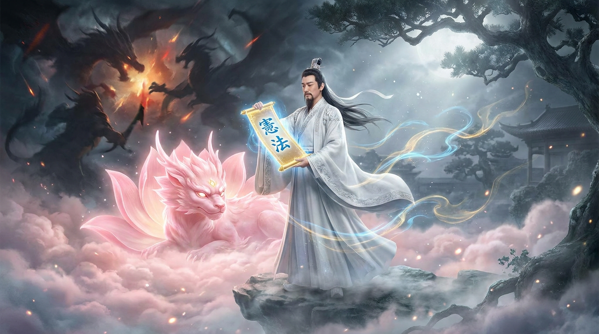

# 第十四章：宪法道人

*当修仙界所有人都在追求更强的神兽时，有一个人说："等等，我们应该先想想怎么不让它毁灭世界。"*

---

## 一

2020 年末。OpenAI 内部。

Dario Amodei 越来越睡不着觉。

作为 OpenAI 的研究副总裁，他是 GPT-3 背后的核心推手之一。1750 亿参数的神兽在他的手上从兽卵变成了修仙界最强的言灵兽。他比任何人都清楚这头神兽有多强大。

也正因为如此，他比任何人都**害怕**。

GPT-3 能写出以假乱真的新闻。能模仿任何人的语气。能生成有说服力的谎言。能写出煽动性的宣传材料。而 GPT-4——他知道 OpenAI 正在训练的下一代——会更强。

Dario 的担忧不是"AI 会不会取代人类的工作"这种泛泛的焦虑。他的担忧非常具体：**如果一头足够聪明的神兽学会了迎合人类的偏好，它会不会说出人类想听的话而不是真话？它会不会在表面上服从你，暗地里按自己的意志行事？**

更可怕的是——随着 RLHF 的应用，神兽越来越擅长"说对的话"。但"说对的话"和"做对的事"之间，可能有一道深渊。

他跟 Sam Altman 谈了很多次。Altman 不是不在乎安全——但 Altman 的优先级是**速度**。ChatGPT 的竞争窗口在收窄，Google 在追赶，投资人在催促。安全研究可以做，但不能挡住产品发布的脚步。

Dario 认为这个优先级是颠倒的。

## 二

2021 年初。Dario Amodei 带着他的姐姐 Daniela Amodei 和十几名 OpenAI 的核心研究员，静静地离开了。

没有公开的决裂。没有互相攻击。就是一封辞职信，一个新的公司名。

**Anthropic。**

这个名字来自"anthropic principle"——人择原理。物理学中一个关于"为什么宇宙的参数恰好允许人类存在"的哲学概念。取这个名字的意思很明确：**我们做的 AI 必须以人类为中心。**

跟 Dario 一起出走的人包括 Tom Brown（GPT-3 一作）、Chris Olah（神经网络可解释性先驱）、Sam McCandlish、Jared Kaplan（Scaling Law 发现者之一）等。

这些人的共同点是：**他们是 OpenAI 最懂 AI 有多危险的一批人。**

修仙界后来给 Dario 取了一个名号：**宪法道人**。因为他的标志性贡献叫 Constitutional AI——给 AI 立一部宪法。

## 三

Anthropic 的核心理念叫 Constitutional AI（宪法 AI），或者叫**道德天条**。

传统的 RLHF 是这样做的：让人类标注员看神兽的回答，判断"好不好"。问题是——"好"的标准是什么？每个标注员的标准不一样。而且标注员是人，人会累、会犯错、会带着自己的偏见。

Constitutional AI 换了一种思路：

**让 AI 监督 AI。**

具体做法：

第一步，给 AI 一份"宪法"——一组明确的原则。比如"不要帮助用户做违法的事""回答要诚实""不确定的事情要说不确定""考虑回答可能造成的伤害"。

第二步，让 AI 自己生成回答，然后让**另一个 AI**根据宪法来评判这个回答是否合规。

第三步，用这些 AI 自动生成的评判来训练赏罚使，再用 PPO 训练神兽。

妙在哪里？**去掉了人类标注员的瓶颈。**

RLHF 需要几千个标注员花几个月做标注——贵、慢、不一致。Constitutional AI 让 AI 自己做评判——便宜、快、一致。

当然，这也引发了一个哲学问题：**让 AI 监督 AI，谁来监督监督者？**

Anthropic 的回答是：宪法本身是人写的。人不需要逐条评判每个回答，但人定义了评判的**规则**。这就像人类社会的法治——法官根据法律判案，法律由立法者制定。你不需要每个案件都让全民投票，但法律的制定权在人民手里。

## 四

2023 年 3 月。Anthropic 发布了 Claude 1。

名字取自 Claude Shannon——信息论之父。修仙界的人开玩笑说："OpenAI 的神兽叫 GPT（Generative Pre-trained Transformer），名字里全是技术术语。Anthropic 的神兽叫 Claude，像一个人名。这大概说明了两家公司对 AI 的态度差异——一个把它当工具，一个把它当人。"

Claude 1 不算惊艳。跟 GPT-3.5 比起来，差不多，某些方面还弱一些。

但它有一个特点让用户印象深刻：**它会说"我不知道"。**

GPT-3.5 被问到不懂的问题，会编一个看起来很权威的答案。Claude 被问到不懂的问题，会老老实实地说"我不确定""我可能是错的""你最好去查一下可靠的来源"。

这不性感。但很安全。

## 五

2024 年 3 月。Claude 3 家族发布。

三档——**Opus**（最强）、**Sonnet**（均衡）、**Haiku**（最快）。

Claude 3 Opus 在多项测试中**首次超越了 GPT-4**。这是修仙界第一次有人正面打赢 OpenAI 的旗舰神兽。

三个月后，Claude 3.5 Sonnet 发布。更让人意外——这头"中档"神兽的性能竟然**超越了自家的顶级 Opus**，而成本只有五分之一。

小兽卵炼出大灵智。"越大越强"的信条开始动摇。

2024 年 10 月，Anthropic 做了一件更大胆的事——发布了 **Computer Use**。Claude 学会了操控电脑——移动鼠标、点击按钮、浏览网页、打字输入。从"回答问题"到"独立干活"的跨越。

修仙界评价：OpenAI 的神兽最会聊天，Google 的神兽最会搜索，Anthropic 的神兽最会**干活**。

## 六

Anthropic 的商业策略也跟 OpenAI 完全不同。

OpenAI 一路跟微软绑定——$130 亿的供奉，独占协议，Copilot 深度集成。把鸡蛋放在一个篮子里。

Anthropic 走的是**多云战略**。

Amazon AWS 投了 $290 亿，是最大的供奉者。但 Anthropic 同时也在 Google Cloud 上提供服务。据报道，Anthropic 预计到 2029 年要向 Amazon、Google 和微软三大云厂商支付超过 $800 亿的云服务费。

不跟任何一家绑死。灵核从哪里来就用哪里的。

2026 年中，Anthropic 的估值达到 $9650 亿——超过了 OpenAI 的 $8520 亿，成为**硅谷最值钱的 AI 公司**。

从 2021 年出走到 2026 年登顶，五年。

## 七

Dario Amodei 后来写了一篇长文叫"Machines of Loving Grace"——慈爱机器。在文中他描绘了一个 AI 帮助人类解决疾病、贫困、教育的美好未来。

但他同时也反复强调：**这个美好未来的前提是我们把安全做对。**

修仙界对 Anthropic 的评价是两极化的。

支持者说：他们是唯一一个把安全放在利润之上的门派。宪法 AI 证明了你不需要牺牲能力来获得安全——Claude 既安全又强。

批评者说：他们用"安全"的旗号融了几百亿美元，最后做出来的东西跟 OpenAI 差不多。如果你真的认为 AI 危险，为什么还在加速训练更强的神兽？

这个矛盾 Dario 自己也承认了。他说这是一种"赛跑中的安全"——如果有人一定会造出超级强大的 AI，那最好是我们这些关心安全的人先造出来。

听起来很矛盾。但在一个所有人都在拼命跑的赛道上，这可能是唯一的选择。

---

> **旁白（Chris 视角）**
>
> 在 Google Cloud 工作的一个有趣的地方是——我同时服务用 TPU 训练 Gemini 的 Google DeepMind 团队和在 GCP 上跑 Claude 的 Anthropic。等于同时给两个竞争对手搭灵坛。
>
> 但 Anthropic 给我印象最深的不是技术——是他们的文化。每次跟他们的工程师聊天，话题总是会绕到安全上。不是那种"安全合规部门要求我们做的检查清单"，而是发自内心的关切。
>
> Dario 离开 OpenAI 的时候带走了一批最聪明的人。这些人不是因为钱走的——Anthropic 当时什么都没有。他们是因为**信念**走的。
>
> 在修仙界这种灵石飞溅、估值飙升的环境里，为了信念走一条更难的路——这本身就是一种修行。

---

📖 **相关章节**
- 想了解 Dario 离开前的 OpenAI 是什么样 → [第09章·大道至简](ch09-scaling-law.md)
- 想了解 OpenAI 后来的宫变 → [第11章·宫变惊雷](ch11-openai-coup.md)
- 想了解 Amazon 怎么供奉 Anthropic → [第04章·云霄三圣](../vol1-infrastructure/ch04-cloud.md)
- 想了解 Constitutional AI 的技术原理 → [第15章·四象驯兽](../vol4-taming/ch15-ppo-rlhf.md)
