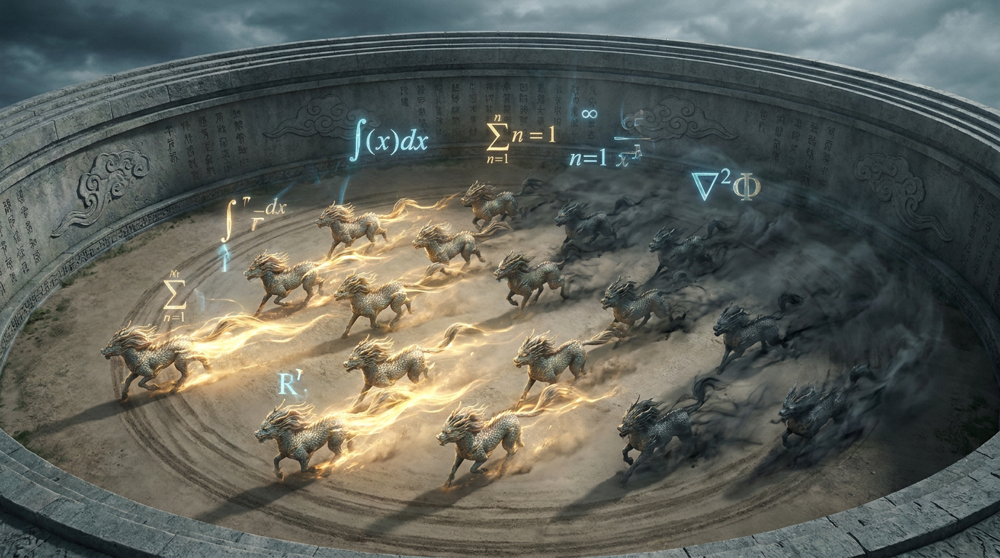

# 第十七章：群兽竞逐

*不需要裁判，不需要赏罚使。让一群神兽互相比，比出来的就是正道。*

---

## 一

2024 年 9 月，OpenAI 发布了 o1。

这头神兽有一个前所未有的能力：**思考**。

以前的神兽收到一个问题，立刻开始回答——就像一个学生看到考题立刻动笔，不打草稿。有时候答对，有时候答错，但从来不"想一想再答"。

o1 不一样。它在回答之前会先进行一段隐藏的"思维链"——像在脑子里打草稿。拿到一道数学题，它会先拆解问题，尝试不同的解法，自己检查有没有算错，确认了再给出答案。

效果立竿见影。数学竞赛、编程挑战、逻辑推理——o1 在这些需要"深度思考"的任务上暴打了 GPT-4。

修仙界震动。这不是简单的修为提升——这是**境界突破**。神兽从"快速反应"进化到了"深度推理"。从化神期到大乘期。

OpenAI 没有公开 o1 的训练细节。它用了什么御兽之法？灵坛上跑了什么流程？外界一无所知。Sam Altman（天策上将）笑而不语。

但三个月后，一个来自东方的团队，用一种全新的方法，达到了同样的效果。

而且——开源了。

## 二

2025 年 1 月 20 日。中国，杭州。

DeepSeek（深渊魔宗）发布了 R1。

论文标题：《DeepSeek-R1: Incentivizing Reasoning Capability in LLMs via Reinforcement Learning》。

翻译成修仙体：**用强化修炼激发神兽的推理天赋。**

R1 的基座是 DeepSeek V3——一头 671B 参数的 MoE 神兽，每个智元只激活 37B 参数。V3 本身就已经很强了：MLA（潜注意力）让推理成本暴降，MTP（多智元预测）让孵化更高效，FP8 微缩锻造让训练灵石消耗减半。

但 V3 只是一头聪明的神兽。R1 让它学会了**思考**。

怎么做到的？

答案是四个字：**群兽竞逐**。

## 三

DeepSeek 用的御兽之法叫 GRPO——Group Relative Policy Optimization，群兽竞逐法。

要理解 GRPO，先要知道它之前的方法有多复杂。

OpenAI 的 PPO（稳驯术 / 四象驯兽阵）需要四个模型同时运转：

1. **演兽师（Actor）**：被训练的神兽本身
2. **评兽师（Critic）**：判断"你目前在正确的路上吗"的专家
3. **赏罚使（Reward Model）**：打分"这个回答好不好"
4. **定锚兽（Reference Model）**：防止神兽变化太大的锚点

四个模型，各自占一大块灵池，还要互相通信。一座灵坛上同时养四头兽，光灵核的消耗就让小团队望而却步。

DPO（直觉驯化）简化了一步——去掉了赏罚使，只需要两个模型。但它是离线的，用固定的数据训练，不让神兽自己生成新回答去试错。效果有天花板。

梁文锋（深渊剑主）看着这些方法，皱了皱眉。

太复杂了。

能不能更简单？

## 四

GRPO 的核心思想简单到令人发指：

**同一个问题，让神兽生成一群回答。好的强化，差的抑制。完了。**

具体操作：

第一步，**放兽试炼**。给神兽一道数学题，让它生成 16 个不同的回答。切换为驰形（推理模式），每个回答走不同的路数——有的用代数解，有的用几何解，有的走了弯路，有的直接算错了。

第二步，**天道裁决**。数学题有标准答案。1+1=2，对就是对，错就是错。不需要人来打分，不需要赏罚使。天道自有公论。这叫做 RLVR——可验证奖励。

第三步，**群兽比高**。16 个回答，有的答对了得高分，有的答错了得低分。计算群体平均分。高于平均的回答 = 好路数（正优势），低于平均的 = 差路数（负优势）。

第四步，**收兽淬炼**。切换为定形（训练模式），用好路数的信号强化神兽，用差路数的信号抑制神兽。更新凝智元。

然后重复。放兽，论功，收兽，再放兽，再论功，再收兽。周而复始。

每一轮，神兽都比上一轮更会思考。

## 五

GRPO 相比 PPO 少了什么？

**少了评兽师（Critic）。**

PPO 需要一个专门的 Critic 模型来估算"当前状态的价值"。这个模型跟 Actor 一样大——671B 参数的神兽需要一个 671B 的 Critic。两头巨兽同时在灵坛上运转，灵核消耗直接翻倍。

GRPO 说：不需要 Critic。

怎么做到的？用**群体平均**代替 Critic 的估值。

Critic 的作用是告诉你"这个状态值多少分"。GRPO 不估算绝对分数——它只看**相对排名**。16 个回答互相比，高于平均就是好的，低于平均就是差的。不需要知道"这道题值 87 分"，只需要知道"你比其他人强还是弱"。

这个思路妙在哪里？

**省了一半的灵核。** 不需要 Critic 模型了。

**省了 Reward Model 的训练。** 对于数学和代码这种有标准答案的题，不需要训练一个打分模型——答案对不对，机器就能判。

整个系统只需要两个模型：Actor（被训练的神兽）和 Reference（定锚兽，冻住的原版）。甚至 Reference 在某些变体里也可以去掉。

从四个模型到两个模型。从"四象驯兽阵"到"两仪竞逐法"。**极致精简。**

## 六

但 GRPO 最震撼修仙界的，不是省了多少灵核。

而是 R1-Zero 的实验。

DeepSeek 做了一个疯狂的尝试：**不做任何 SFT（驯兽），直接从 Base Model（刚孵出的幼兽）开始，纯用 GRPO + 可验证奖励来训练。**

你可以理解为：一头刚出壳的幼兽，什么都不会，你不教它任何招式，不给它看任何示范。你只是把它扔到考场上，让它自己做题，做对了奖励，做错了惩罚。就这样。

结果呢？

这头没有经过任何人类指导的幼兽，**自发地学会了思维链推理**。

它开始在回答中出现 "\<think\>" 标签——在给出最终答案之前，先自己想一想、验算一下。没有人教它这么做。没有人在训练数据里给它看过"先想再答"的示范。它是**自己学会的**。

更离谱的是，训练过程中出现了一个现象——DeepSeek 团队管它叫"**顿悟时刻**（Aha Moment）"：

在训练的某个阶段，神兽突然开始在思维链中写出类似"等一下，让我重新检查一下"的话。它不是在模仿人类——因为没有人教它模仿。它是在大量的试错中自己"悟"出来的：**先验算一遍再给答案，正确率更高，奖励更大。**

纯粹的 RL，纯粹的试错，纯粹的自我进化。

修仙界的评价：**这不是驯兽，这是悟道。**

## 七

2025 年 1 月 20 日，R1 论文和模型同时公开。

全部开源。MIT 协议。任何人都可以下载、使用、修改。

修仙界炸了锅。

首先炸的是 Twitter / X。全球 AI 研究者连夜读论文、跑模型、做测试。结论：R1 在数学和编程推理上的表现，跟 OpenAI 的 o1 不相上下。在某些测试上甚至更好。

然后炸的是华尔街。

投资者们做了一个简单的算术：

- OpenAI 的 o1 训练成本估计在数亿美元级别，训练方法完全不公开。
- DeepSeek 的 R1 基于 V3 训练，V3 的总训练成本是 557 万美元（2.788M H800 GPU hours × 约$2/h）。R1 在 V3 基础上的 RL 训练成本更低。
- 而且 R1 完全开源。

一个中国团队，用远低于 OpenAI 的成本，训出了跟 o1 比肩的推理神兽。而且还免费公开了做法。

这意味着什么？

意味着"要训出顶级 AI 必须花几十亿美元"的叙事，被打破了。意味着 NVIDIA 的灵核不是唯一的道路——如果你有更聪明的方法，你可以用更少的灵核做到同样的事。

2025 年 1 月 27 日，美股开盘。NVIDIA 股价暴跌近 17%。单日市值蒸发约 5900 亿美元。

**五千九百亿美元。** 因为一篇开源论文。

这是 AI 修仙界有史以来最大的一次"以下克上"。深渊剑主梁文锋，一个量化基金出身、从来不接受采访的人，用一篇论文动摇了整个灵核教廷的根基。

## 八

R1 之后，GRPO 成了修仙界的显学。

所有想训练推理神兽的团队都开始用 GRPO。而他们用的法阵（训练框架），几乎清一色是 veRL——生广明（炼器宗师）搭建的万法归一阵。

veRL 在 R1 发布后迎来了爆发式增长。GitHub Star 数从几千冲到两万多。几乎所有 R1 的复现工作都基于 veRL。

GRPO + veRL + 可验证奖励。三件套。

这套组合的威力在于：**小团队也能训推理神兽了。**

以前训一头推理神兽需要几千颗灵核、几亿美元、和一个世界级的 RL 工程团队。现在你只需要几百颗灵核、几十万美元、和一份 veRL 的配置文件。

OpenAI 花了数亿美元独自修炼出来的能力，被 DeepSeek 用一个更简单的方法复现了，然后开源给了全世界。

天道好轮回。

---

> **旁白（Chris 视角）**
>
> R1 发布那天我在 Google 内部看到了无数个 chat thread 在讨论。每个人都在读论文。每个人都在问同一个问题："他们怎么做到的？"
>
> 读完论文之后的感受是四个字：大道至简。
>
> GRPO 的核心思想简单到你觉得"我怎么没想到"。让一群回答互相比，好的强化，差的抑制。不需要 Critic，不需要 Reward Model。就这么简单。但就是这么简单的东西，让一个中国团队跟 OpenAI 打了个平手。
>
> 最让我佩服的是梁文锋这个人。量化基金出身，做 AI 之前是做交易系统的。他把做交易系统的工程纪律——低成本、高效率、极致优化——带到了 AI 训练里。V3 的 FP8 训练、MLA 的显存优化、R1 的 GRPO 简化——每一步都在问同一个问题："怎么用更少的灵核做到同样的事？"
>
> 这大概就是工程师和科学家的区别。科学家问"什么是可能的"，工程师问"怎么用最少的资源做到"。DeepSeek 两个问题都回答了。

---

📖 **相关章节**
- 想了解 PPO 四象驯兽阵的完整原理 → [第15章·四象驯兽](ch15-ppo-rlhf.md)
- 想了解 DPO 如何简化了这个过程 → [第16章·直觉驯化](ch16-dpo.md)
- 想了解 veRL 万法归一阵和生广明 → [第19章·万法归一](ch19-verl.md)
- 想了解 DeepSeek 从 V1 到 V4 的完整故事 → [第20章·深渊剑主](../vol5-east/ch20-deepseek.md)
