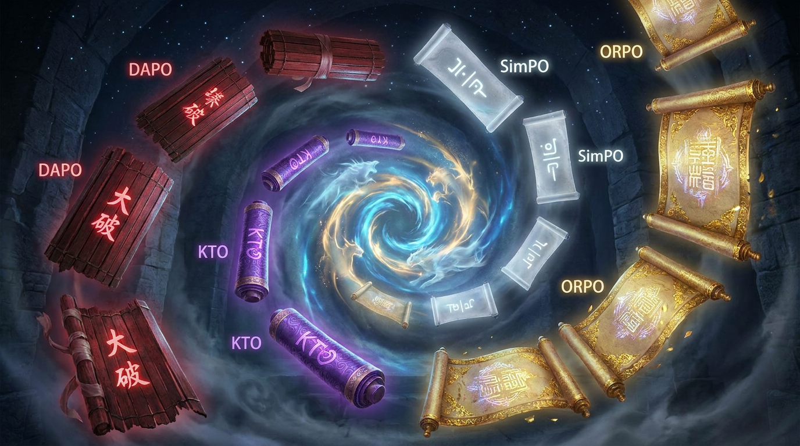

# 第十八章：诸法争鸣

*GRPO 之后，修仙界的御兽师们不再满足。每个门派都想在群兽竞逐法的基础上加上自己的独门改良。百花齐放，各有千秋。*

---

## 一

GRPO 证明了一件事：**御兽之法可以比 PPO 简单得多。**

从四个模型到两个模型。从需要赏罚使到不需要赏罚使。从几万块灵石到几千块灵石。

但 GRPO 本身也有问题。2025 年初 R1 发布之后，全世界的团队开始用 GRPO 训推理神兽，各种问题逐渐浮出水面。

最常见的抱怨有三个：

**第一，神兽变无聊了。** 训着训着，神兽的回答越来越"安全"——总是挑最保险的路数回答，不愿意冒险尝试新的推理路径。修仙界管这个叫**熵坍缩（Entropy Collapse）**——神兽的"创造力"在训练过程中被慢慢挤干了。

**第二，太简单和太难的题白费功夫。** 如果一道题 16 个回答全答对了——GRPO 算出来的优势全是零，没有任何训练信号。全答错了也一样。只有"有对有错"的题才有训练信号。但实际训练中，太简单和太难的题占了不少比例，灵核在这些题上白白空转。

**第三，KL 惩罚太保守。** 定锚索（KL 散度惩罚）限制了神兽偏离原版的程度。但如果你训练的目标本身就是要让神兽学会全新的推理能力——你限制它偏离太多，它怎么学得会？

2025-2026 年，各门各派针对这些问题提出了自己的改良方案。

## 二

**DAPO — 解耦对齐优化（ByteDance / 字节跳动 Seed 团队）**

DAPO 是 GRPO 最重要的改良版。2026 年发在 NeurIPS 上，被引超过 2200 次——比 GRPO 原论文还火。

四项改进：

**1. 解耦 Clip。** GRPO 的 clip 是对称的——概率比 r 太高或太低都截断。DAPO 说：不对称！把上限 clip 去掉（允许概率大幅增加），但保留下限 clip（不允许概率降到零）。

为什么？因为概率增加意味着"强化好路数"——你应该鼓励这件事，不要限制。但概率降到零意味着"彻底忘掉某种回答"——这太危险了，一旦忘了就再也想不起来了。

比喻：允许神兽学新招式（概率增加不设上限），但不允许它彻底忘掉旧招式（概率降低有下限）。

**2. 动态过滤。** 如果一道题 16 个回答全对或全错——直接跳过，不浪费灵核。只训那些"有对有错"的题。

这一步简单但效果惊人——实测减少了大约 30% 的无效计算。

**3. 去掉 KL 惩罚。** 直接把定锚索砍了。不再限制神兽偏离原版的距离。让它自由探索。

听起来很危险？是的。但 DAPO 用解耦 clip 的下限来防止完全失控——神兽不会忘掉旧技能，但可以学习跟原版截然不同的新技能。

**4. Token 级归一化。** 不同长度的回答贡献的 loss 不同——长回答的 loss 被稀释了。DAPO 在 token 级做归一化，让每个智元的贡献平等。

效果：在 AIME 2024 数学竞赛上，DAPO 打败了 DeepSeek R1-Zero。

## 三

**RLOO — 留一竞逐法（REINFORCE Leave-One-Out）**

RLOO 是 GRPO 的"近亲"。核心思想几乎一样——一群回答互相比。区别在于**基准线的计算方式**。

GRPO：16 个回答的平均分作为基准线。每个回答的优势 = 自己的分数 - 平均分。

RLOO：计算每个回答的基准线时，**把它自己排除在外**。第 i 个回答的优势 = 自己的分数 - 其他 15 个的平均分。

数学上，RLOO 是更"无偏"的估计——因为基准线里不包含自己，避免了自我引用的偏差。

实际效果呢？跟 GRPO 差距不大。有些实验 RLOO 好一点，有些 GRPO 好一点。修仙界的共识是"**差不多，选哪个都行**"。

## 四

**KTO — 前景驯化法（Kahneman-Tversky Optimization）**

KTO 走了一条完全不同的路——它从**行为经济学**里找灵感。

Daniel Kahneman 和 Amos Tversky 的前景理论（Prospect Theory）有一个核心发现：人类对"失去"的痛感比"获得"的快感更强。丢 100 块钱的难受程度，大于捡 100 块钱的开心程度。

KTO 把这个原理应用到驯兽中：**惩罚坏回答的力度比奖励好回答的力度大。**

而且 KTO 有一个巨大的实践优势——它不需要**成对的偏好数据**。DPO 需要（好回答，坏回答）的配对。KTO 只需要每个回答单独标一个"好"或"坏"就行。

标注成本直接砍半。在标注数据稀缺的场景下特别有用。

## 五

**SimPO — 至简驯化法（Simple Preference Optimization）**

SimPO 问了一个更激进的问题：**连定锚兽（Reference Model）也能去掉吗？**

答案是：能。

SimPO 用回答本身的**长度归一化对数概率**作为隐式奖励——一个回答如果每个智元的概率都很高（很"流畅"），那它大概是一个好回答。

没有赏罚使，没有评兽师，没有定锚兽。只有一个模型——待训练的神兽本身。

是目前修仙界参数最少、代码最简的对齐方法之一。

## 六

**ORPO — 一阵双修法（Odds Ratio Preference Optimization）**

ORPO 做了一件更极端的事——把 SFT（驯兽）和偏好优化（结灵契）**合并成一步**。

以前是：先做 SFT 教神兽基本功 → 再做 DPO/PPO 教它分辨好坏。两步。

ORPO 说：一步搞定。在 SFT 的 loss 里直接加入一个偏好项，让神兽在学基本功的同时就学会了分辨好坏。

省了一个训练阶段。时间和灵核消耗都少了。

## 七

回过头来看这些方法的演化，一条清晰的主线浮现出来：

| 方法 | 需要的模型数 | 需要的额外组件 | 核心简化 |
|------|-----------|-------------|---------|
| PPO | 4 | Reward Model + Critic | — |
| DPO | 2 | 成对偏好数据 | 去掉 RM 和 Critic |
| GRPO | 2 | 群组采样 | 去掉 Critic，用群体相对 |
| DAPO | 2 | 解耦 clip | 去掉 KL，动态过滤 |
| KTO | 1-2 | 单标签数据 | 不需要成对数据 |
| SimPO | 1 | — | 去掉 Reference Model |
| ORPO | 1 | — | 合并 SFT 和偏好优化 |

从 4 个模型到 1 个模型。从需要所有组件到什么都不需要。

**大道至简**——不只是 Scaling Law 的哲学，也是御兽之法的哲学。

## 八

但简单不等于更好。

修仙界 2025-2026 年的大量实验表明：**没有一种方法在所有任务上都是最优的。**

- 需要深度推理（数学/代码）→ GRPO / DAPO + 可验证奖励最强
- 需要通用对齐（聊天/写作）→ PPO 仍然有优势
- 标注数据少 → KTO 最实际
- 算力极度有限 → SimPO / ORPO 最经济
- 需要快速迭代 → DPO 最方便

**没有银弹。只有在你的场景、你的资源、你的需求下的最优选择。**

这也许就是"诸法争鸣"的真正意义——不是为了分出一个唯一的胜者，而是让每个修炼者都能找到适合自己的那条路。

---

> **旁白（Chris 视角）**
>
> 在 Google Cloud 帮客户选御兽之法的时候，我最常说的一句话是"取决于你的情况"。
>
> 有预算有数据有标注？上 PPO。想快速试验？上 DPO。训推理模型？上 GRPO。连 Reference Model 都不想存？SimPO。
>
> 没有万能的方法，只有合适的方法。修仙界的道理跟做工程一样——trade-off everywhere。

---

📖 **相关章节**
- 想了解 PPO 四象阵的完整原理 → [第15章·四象驯兽]
- 想了解 DPO 如何开启简化之路 → [第16章·直觉驯化]
- 想了解 GRPO + DAPO 的实战效果 → [第17章·群兽竞逐]
- 想了解 veRL 如何让这些方法都能高效运行 → [第19章·万法归一]
