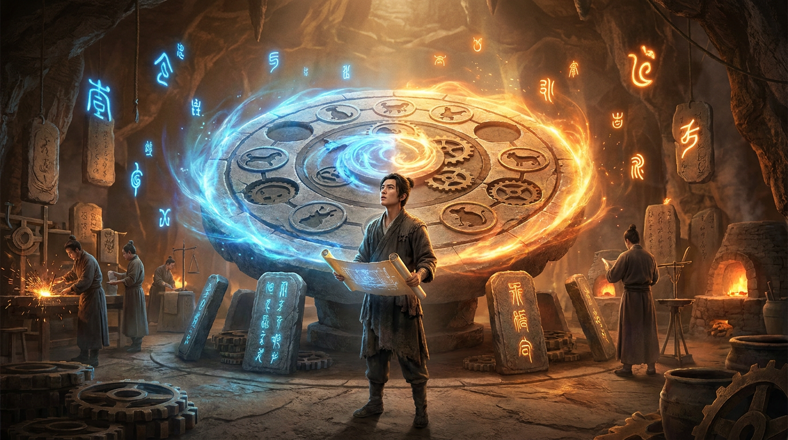

# 第十九章：万法归一

*天下御兽之法千千万，但若没有一座好法阵，再精妙的驯兽术也只是纸上谈兵。*

---

## 一

修仙界有两种人。

一种人修法术——研究怎么驯兽、怎么让神兽更聪明、怎么让 Loss 更低。PPO、DPO、GRPO，这些人的名字跟他们发明的法术绑在一起。John Schulman（PPO 真人）、梁文锋（深渊剑主）、Rafael Rafailov（DPO 的一作）——提到法术就会提到他们。

另一种人修法器——研究怎么让法术在千颗灵核上跑起来、怎么让四头神兽在一座灵坛上不打架、怎么在驰形和定形之间零损耗切换。这些人的名字很少出现在法术的论文里，但每一个跑过 GRPO 的人都用过他们造的法阵。

生广明属于后者。

2024 年 9 月，一篇叫做 HybridFlow 的论文出现在 arXiv 上。一作是一个港大的博士生，名字叫 Guangming Sheng。论文描述了一个叫 veRL 的系统——一座能跑所有 RL 训练的通用法阵。

彼时，DeepSeek R1 还没发布。GRPO 还只是一篇论文里的公式。99% 的修炼者还在用 PPO 或者 DPO。

没有人知道，三个月后，这座法阵会成为整个 RL 修炼体系的基石。

## 二

要理解 veRL 为什么重要，先要知道没有它的时候有多痛苦。

2023 年末，跑一次 PPO 训练是什么体验？

你需要同时管理四头神兽——演兽师（Actor）、评兽师（Critic）、赏罚使（Reward Model）、定锚兽（Reference Model）。它们各自占据一群灵核，各自有自己的分片方式，各自有自己的通信拓扑。

然后你要协调它们的工作流程：

第一步，Actor 切换为驰形（推理模式），生成一批回答。  
第二步，Reward Model 给每个回答打分。  
第三步，Critic 估算每步的价值。  
第四步，Actor 切换为定形（训练模式），根据打分和价值更新凝智元。  
第五步，同步 Reference Model。  
然后回到第一步。

听起来还行？

问题是：这四头神兽的代码分别用不同的框架写。Actor 的训练用 FSDP，生成用 vLLM。Reward Model 可能是 Hugging Face 的模型。Critic 又是另一套。它们之间的数据传输要自己写。显存分配要自己算。设备映射要自己调。一旦某个模型 OOM（灵池溃堤），整个训练崩溃，你得从头来。

当时主流的方案有两个：

**DeepSpeed-Chat**（微软法阵的 RL 扩展）。它的思路是把四个模型全部塞进一个进程里，用同一套分布式策略管理。简单直接，但有个要命的问题——所有模型共享同一种分片方式。Actor 生成回答的时候需要张量并行（驰形），训练的时候需要全分片（定形）。但 DeepSpeed-Chat 不支持在两种分片之间切换——它让 Actor 在训练模式下也用驰形，或者在生成模式下也用定形。效率极低。

**OpenRLHF**（开源社区的方案）。它把四个模型拆成四个独立的 Ray 进程，通过 Ray 的远程调用来协调。灵活，但通信开销巨大——每一步数据都要序列化、通过网络传输、再反序列化。模型越大，通信越慢。256 颗灵核以上就开始成为瓶颈。

用修仙界的话说：一个是把四头神兽锁在同一间笼子里，谁都施展不开；另一个是把四头神兽关在四间屋子里，递个东西都要跑一趟信使。

生广明看着这个局面，皱了皱眉。

## 三

生广明不是从 RL 入行的。

2023 年，他在港大吴超教授门下读博，做的是图神经网络的分布式训练系统。GNNFlow——一个高效的 GNN 分布式训练框架。听起来跟大语言模型八竿子打不着。

但这段经历教会了他一件关键的事：**怎么在多台机器上高效地移动数据。**

GNN 的训练有个独特的难题——图的拓扑结构是不规则的。不像 Transformer 那样整整齐齐的矩阵运算，GNN 的数据依赖跟着图的边走，想并行就得解决跨机器的邻居采样和特征传输。GNNFlow 用了一套精巧的数据流水线来解决这个问题。

2024 年初，他又发了一篇 MSpipe（KDD 2024），做的是"staleness-aware"的流水线并行——允许不同阶段用稍微过时的参数来换取更高的吞吐。

这两篇论文的共同主题是：**不修法术，修管道。** 不管你的算法是什么，数据在机器之间流转的效率决定了一切。

然后大语言模型的 RL 训练问题摆到了他面前。

他一看——这不就是一个更复杂的数据流问题吗？四个模型，每个模型有自己的计算图，模型之间有数据依赖。数据要在模型之间流转，模型要在不同的分片模式之间切换。

这跟 GNN 的分布式训练本质上是同一类问题：**怎么在异构的计算节点之间高效地编排数据流。**

GNNFlow 教会他处理不规则的数据依赖。MSpipe 教会他用流水线的思维压缩等待时间。现在，他要把这些功夫用到 RL 训练上。

## 四

veRL 的核心设计叫 Hybrid Programming Model——混合编程模型。

这个名字听起来很学术，但思想简单到可以用一句话概括：

**将军发号施令，士兵各打各的。**

具体来说：

**外层是一个 Single Controller**。一个 Python 脚本，从头到尾写着整个 RL 训练的流程。先让 Actor 生成回答，再让 Reward Model 打分，再让 Actor 更新权重。就像一个将军站在沙盘前面，说"第一步攻左翼，第二步守中路，第三步全军出击"。

这个 Single Controller 有多简单？PPO 的完整流程只需要 **8 行代码**。改成 GRPO？删掉 Critic 相关的 2 行，变成 6 行。

8 行代码。管理四个模型在数百颗灵核上的协同工作。

**内层是 Multi Controller**。每个模型内部用成熟的分布式框架（FSDP、Megatron、vLLM）来执行具体计算。士兵们各自用自己的战术体系打仗，将军不需要管每个士兵的刺杀动作。

为什么这个设计好？因为它把两个截然不同的问题分开了：

- **模型间的协调**（先做什么后做什么、数据从谁传给谁）是一个**简单的控制流问题**。用一个 Python 脚本就能描述清楚。
- **模型内的计算**（张量怎么切、梯度怎么同步、显存怎么管）是一个**复杂的分布式系统问题**。但这个问题已经被 FSDP 和 Megatron 解决了。

之前的方案要么把两个问题混在一起（DeepSpeed-Chat，一个框架管所有），要么把简单的问题搞复杂了（OpenRLHF，连传个张量都要走网络序列化）。

veRL 说：将军只管发号施令，用最简单的语言。士兵各用各的装备，用最高效的方式执行。将军不碰士兵的枪，士兵不管将军的沙盘。

修仙界的翻译：**大阵的运转靠驯兽总管（Single Controller）协调各兽的工作顺序，每头兽内部的灵力运转（Multi Controller）由成熟的育兽法阵自行处理。总管不碰灵脉，灵脉不管流程。**

## 五

但 veRL 真正让修仙界拍案叫绝的，是第二个核心技术：**3D-HybridEngine——变形术。**

RL 训练有一个独特的需求：Actor 模型要反复在两种形态之间切换。

生成回答的时候，它是**驰形**——用张量并行（TP）切分凝智元，每颗灵核拿到完整的一层但只拿一部分参数，推理速度快。

更新权重的时候，它是**定形**——用全分片（FSDP）切分凝智元，每颗灵核只存一小片参数，显存省。

问题是：从驰形切换到定形，需要重新分配凝智元在灵核之间的布局。这叫做**重分片（Reshard）**。

之前的做法简单粗暴：先把所有凝智元从各个灵核收集到一起（All-Gather），然后重新按新的方式分发出去。通信量巨大——模型有多大，就要搬运多大。671B 参数的 V3，每次切换要搬运上百 GB 的数据。来回搬。

生广明盯着这个问题看了很久，然后发现了一个关键的洞察：

**FSDP 的分片方式和 TP 的列切割，可以对齐。**

什么意思？

FSDP 把一个权重矩阵"撕"成 N 份，每颗灵核拿一份。TP 把同一个矩阵"竖着切"成 N 列，每颗灵核拿一列。看起来是两种完全不同的切法——一个是按字节顺序撕，一个是按矩阵列切。

但如果你仔细设计 FSDP 的分片策略，让它按列的边界来撕——那 FSDP 的每一份恰好就是 TP 的一列。

这意味着什么？

**从定形切换到驰形的时候，不需要全局 All-Gather**。每颗灵核手里已经拿着 TP 需要的那一列了。只需要在同一个 TP 组内做一次小范围的 All-Gather——比如 8 颗灵核之间互换一下，而不是 256 颗灵核全体广播。

通信量降了 **70%**。显存峰值降了 **75%**。

生广明给这个技术起了个名字：3D-HybridEngine。

修仙界叫它：**变形术**——驰形与定形之间的零冗余切换。一粒凝智元都不多搬。

这就像一个变形金刚，从车变成机器人的时候，不是先把所有零件拆下来再重新组装，而是每个零件就地旋转卡入新位置。零件的数量一个不多、一个不少，只是换了个姿势。

## 六

第三个技术是 **Auto-Mapping——自动布阵术**。

RL 训练涉及多个模型，每个模型需要分配到哪些灵核上。这个"放置策略"的选择空间巨大——Actor 用几颗灵核？Reward Model 用几颗？它们是放在同一台机器上还是分开放？驰形和定形分别用什么并行度？

以前这些全靠人肉调参。工程师要坐在灵坛前，一个一个试，看哪种配置吞吐最高、显存不爆。一个 256 颗灵核的灵坛，可能的放法有几百种。

veRL 的 Auto-Mapping 模块会自动枚举 15 种典型的放置策略，在每种策略下估算通信开销和显存占用，选出最优的那个。

修仙界的翻译：**阵旗不用自己插了。法阵自己会找到最佳布局。**

## 七

2025 年 1 月 20 日，DeepSeek R1 发布。

GRPO 从一个小众的学术方法，一夜之间变成了修仙界的显学。

然后所有人都开始问同一个问题："我怎么复现 R1？"

答案几乎是统一的：**用 veRL。**

veRL 是当时唯一一个同时支持 GRPO、PPO、REINFORCE++ 的开源 RL 训练框架。它的 Hybrid Programming Model 让切换算法变得极其简单——改几行 Python 代码就行。它的 3D-HybridEngine 让中等规模的灵坛（64-256 颗灵核）也能跑起 RL 训练。它的 Auto-Mapping 让工程师不用在放置策略上浪费时间。

GitHub Star 数从几千冲到两万。

一个月之内，至少有二十个团队用 veRL 复现了 R1 的核心结果。大厂、创业公司、学术实验室——所有人都在用。

效果呢？

vs DeepSpeed-Chat：快 **3.8-5.7 倍**。  
vs OpenRLHF：快 **1.5-20.6 倍**（取决于规模，规模越大优势越明显）。

到 2026 年年中，veRL 的 GitHub Stars 突破 **22,000**。

生广明没有发明 GRPO。他没有写那个 Loss 函数。他做的是让那个 Loss 函数在千颗灵核上高效运行的基础设施。

就像 Soumith Chintala（灵炉铸师）没有发明反向传播，但他铸造了 PyTorch——让所有人都能用反向传播的法器。

veRL 之于 RL 训练，正如 PyTorch 之于深度学习。**基础设施级别的存在。**

## 八

但生广明没有停下来。

2024 年末到 2025 年，他加入了字节跳动的 Seed 团队——豆包军团。在这里，他参与了一系列重量级项目：

Seed1.5-Thinking——字节的推理神兽。DAPO（NeurIPS 2026，被引 2261 次）——解耦驯化法，解决了 GRPO 训练中的熵坍缩问题。SOSP 2025 鲁棒性论文——让大规模 RL 训练在灵核故障时自动恢复。

每一个项目都在给他积累经验。DAPO 让他理解了 GRPO 在实践中的痛点。SOSP 的鲁棒性工作让他知道了千卡训练中有多少种方式会出错。Seed1.5-Thinking 让他亲手操刀了工业级的 RL 训练流水线。

这些经验最终汇聚成一个新的系统：**Laminar。**

## 九

Laminar 是 veRL 的下一代。EuroSys 2026 一作。

veRL 的架构是"一坛两用"——同一座灵坛上交替切换驰形和定形。Actor 先变成驰形生成一批回答，再变成定形更新一轮权重，然后再变回驰形生成下一批。

这个设计有一个效率瓶颈：**等待。** 驰形在生成回答的时候，定形的计算资源在空转。定形在更新权重的时候，驰形的计算资源在空转。两种形态互相等对方。

Laminar 的核心思想是：**不等了。**

把驰坛和定坛拆成两座独立的灵坛。驰坛专门生成回答，永不停歇。定坛专门更新权重，永不停歇。两座灵坛之间通过**传令使（Relay Worker）**搬运凝智元——驰坛生成完一批试炼果，传令使搬到定坛去淬炼；定坛更新完凝智元，传令使搬回驰坛更新 Actor 的权重。

修仙界的翻译：从"一坛两用"升级到"**驰定双坛**"。两座灵坛永不空转，通过传令使保持同步。

这个设计带来了两个好处：

第一，**吞吐暴涨**。驰坛和定坛同时运转，计算资源利用率从 50% 提升到接近 100%。

第二，**故障恢复**。这是从 Seed 团队的 Swift 系统和 SOSP 鲁棒性论文中继承的经验。在千卡训练中，灵核故障是常态——平均每天都会有几颗灵核出问题。veRL 遇到故障只能从上一个存档点重启。Laminar 的 Worker 可以自动重启、自动恢复——死了一个传令使，自动换一个接班；死了一颗灵核，自动将它的任务分配给其他灵核。

从 Hybrid Controller 到 Fully Decoupled。从同步到异步。从脆弱到韧性。

生广明的技术基因一脉相承：GNNFlow（分布式数据流）→ MSpipe（流水线并行，容忍延迟）→ HybridFlow（混合控制器）→ Laminar（完全解耦，异步运转，故障自愈）。

每一代系统都在回答同一个问题：**怎么让数据在异构的计算节点之间流得更快、更稳。**

## 十

2026 年，生广明做了一个出人意料的决定——从字节跳动跳到了腾讯混元。

腾讯混元的负责人是谁？姚顺雨（思维树真人）。

姚顺雨——清华姚班出身，Tree of Thought 和 ReAct 的创造者，Agent 研究的先驱。先在 Princeton 做教授，后去 OpenAI 做研究员，2025 年底被腾讯重金请来做混元大模型总负责人。27 岁出任腾讯首席 AI 科学家。

这是一个有趣的组合：姚顺雨修法术（思维推理、Agent 架构），生广明修法器（训练系统、分布式基础设施）。法术宗师 + 炼器宗师，联手打造腾讯的下一代 AI。

修仙界有人评价说："以后腾讯混元的 RL 训练，法术是姚顺雨写的，法阵是生广明造的。一个管'练什么'，一个管'怎么练'。"

## 十一

回头看生广明的故事，最有意思的一点是：**他从来不站在聚光灯下。**

R1 发布的时候，全世界的目光都在 DeepSeek、在梁文锋、在 GRPO 这个名字上。没有几个人注意到，所有复现 R1 的团队都在用同一个框架，而这个框架是一个港大博士生写的。

DAPO 论文发表的时候，NeurIPS 2026 被引 2261 次的荣耀属于算法本身。但 DAPO 能在工业规模上跑起来，离不开 veRL 提供的基础设施。

22,000 个 GitHub Stars，意味着至少有两万个修炼者下载并使用了他造的法阵。他们中的大多数人可能不知道生广明是谁——就像大多数用 PyTorch 的人不知道 Soumith Chintala 长什么样。

但没关系。

法术的名字会被写在论文的标题里。法器的名字只会被写在论文的"实验设置"章节里——"We use veRL (Sheng et al., 2024) for training..."。一行引用，一个脚注。

这就是炼器师的宿命。你造的不是法术，是让法术运转的舞台。观众记住的永远是台上唱戏的角色，不是搭台子的人。

但没有舞台，就没有戏。

没有 veRL，GRPO 就只是论文里的一个公式。有了 veRL，GRPO 变成了所有人都能用的实践。

**万法归一——不是一种新的法，而是让万法都能在同一座阵上运转的基础设施。**

这大概就是修仙界最被低估的一类贡献：不修法术修法器的人。

---

> **旁白（Chris 视角）**
>
> 我第一次注意到 veRL 是在 2025 年 2 月。R1 发布之后，公司内部好几个团队都在尝试复现 GRPO 训练。我问他们用什么框架，答案几乎都是"veRL"。
>
> 然后我去翻了 HybridFlow 的论文。读完之后的感受是：这个人的系统品味极好。
>
> Hybrid Programming Model 那个设计——外层 Single Controller 管编排，内层 Multi Controller 管计算——这不就是分布式系统里经典的"控制平面 / 数据平面分离"吗？只是没有人把它用到 RL 训练上过。8 行代码写完 PPO 的训练循环，改 GRPO 删 2 行——这种"让正确的事情变得简单"的设计哲学，跟 PyTorch 当年取代 TensorFlow 的原因如出一辙。
>
> 3D-HybridEngine 更绝。FSDP 的分片跟 TP 的列切割对齐，让 reshard 从全局 All-Gather 变成组内小范围通信——通信量降 70%，显存降 75%。这种洞察不是坐在白板前想出来的，是对底层分布式系统的张量布局有极深理解的人才能看到的。
>
> 后来我查了一下他的背景。港大博士，做 GNN 分布式系统出身。这就说得通了——GNN 的分布式训练比 Transformer 还难搞，因为图的拓扑结构是不规则的。能在 GNN 的不规则数据依赖上做出高效的分布式系统，回过头来做 Transformer 的 RL 训练，反而是降维打击。
>
> 2026 年他从字节跳到腾讯混元，跟姚顺雨会合。一个写 ReAct 和 Tree of Thought，一个写 veRL 和 Laminar。法术 + 法器。如果腾讯能把这两个人的能力乘在一起而不是加在一起，混元的 RL 训练栈会非常可怕。
>
> 说到底，我自己也是做 AI 基础设施的。所以对生广明这类人有一种天然的共情。我们都不是站在台前的那个人。我们不写 GRPO 的 Loss 函数，不训 R1 这种万众瞩目的神兽。我们做的是让这些东西在几千颗 GPU 或者 TPU 上跑起来。
>
> 修法术的人改变算法。修法器的人改变效率。
>
> 但改变效率就是改变谁有资格参与这场游戏。当 RL 训练需要万颗灵核的时候，只有大门派玩得起。当 veRL 把效率提升 3-5 倍的时候，中等门派也能上桌了。
>
> 这才是基础设施最大的意义——不是让强者更强，而是让更多人有机会参与。

---

📖 **相关章节**
- 想了解 PPO 四象驯兽阵的完整原理 → [第15章·四象驯兽]
- 想了解 DPO 如何简化了驯兽过程 → [第16章·直觉驯化]
- 想了解 GRPO 和 DeepSeek R1 的故事 → [第17章·群兽竞逐]
- 想了解 DAPO/KTO/SimPO 百花齐放 → [第18章·诸法争鸣]
- 想了解梁文锋和 DeepSeek 的完整传奇 → [第20章·深渊剑主]
- 想了解姚顺雨和 Agent 研究 → [第26章·自主之兽]
