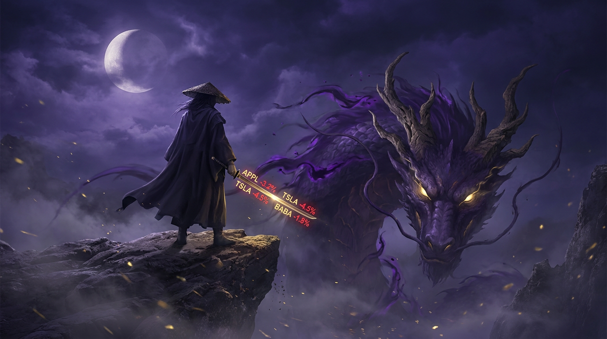

# 第二十章：深渊剑主

*修仙不问出身。量化交易出来的人做AI，每一剑都切在成本曲线的咽喉上。*

---

## 一

杭州。西溪湿地以西。

2023 年的某一天，一个叫梁文锋的人注册了一家公司。名字叫"深度求索"——英文 DeepSeek。

修仙界几乎没人注意到这件事。

梁文锋不是学术圈的人。他没在 NeurIPS 上发过论文，没在 Google Brain 待过，没有斯坦福的博士学位。他的简历上写着另一个完全不相关的行业：**量化交易**。

幻方量化（High-Flyer），国内最大的量化基金之一，管理规模巅峰时过千亿人民币。梁文锋是创始人。他用算法和工程系统做了十几年交易——从数据清洗到信号挖掘到执行系统，每一个环节都要求极致的效率和极低的延迟。

做交易的人有一个习惯：**不说废话，只看结果。不问你修了多少年，只问你赚了多少钱。**

梁文锋把这种习惯带到了 AI。

他几乎不接受采访。没有社交媒体。没有演讲视频。整个互联网上关于他个人的信息少得可怜——对一个掌管千亿级资金的人来说，这种低调近乎反常。

修仙界后来给他取了一个名号：**深渊剑主**。

不是因为他张扬。恰恰相反——是因为他出剑之前，你永远不知道他在哪里。等你看到剑光的时候，一切已经结束了。

## 二

梁文锋为什么要做 AI？

答案很实际。幻方量化早在 2019 年就开始大规模采购灵核（GPU），建自己的算力集群。原因是量化交易本身就需要大量算力——信号处理、因子挖掘、模拟交易——这些都是 GPU 的强项。

到 2022 年底，ChatGPT 爆了。梁文锋看到了一个信号——不是"AI 很火"这种表面信号，而是一个更底层的东西：

**Scaling Law 是真的。**

模型越大、数据越多、算力越强，效果就越好。这条规律在 2020 年被 Kaplan 等人提出来的时候，很多人半信半疑。但到了 GPT-4，所有人都信了。

梁文锋做过量化交易。他比任何人都明白一件事：**当你找到一条真正的规律，你应该全押。**

但他全押的方式跟别人不一样。

Sam Altman 的思路是：募更多的钱，买更多的灵核，训更大的模型。规模碾压一切。

梁文锋的思路是：**用最少的灵核，训出跟你一样强的模型。然后把方法告诉所有人。**

前者是华尔街思维——垄断资源，赢者通吃。后者是量化交易员的思维——**找到市场里的低效，用更高的效率击穿它。**

## 三

DeepSeek 成立后的第一件事，不是急着训一个大模型出来刷榜。

梁文锋做了一件在外界看来很奇怪的事：**系统性地研究 Scaling Law。**

他让团队从头复现了各种尺寸的模型，从几亿参数到几百亿参数，仔细测量每一个变量——数据量、参数量、训练步数——对最终效果的影响。像一个量化交易员在回测策略一样，一丝不苟地记录每一个数据点。

这种做法在 AI 圈子里不常见。大多数团队拿到灵核之后恨不得立刻开始孵兽——训模型、刷榜、发论文、融资。梁文锋不急。他要先搞清楚地图，再决定往哪走。

修仙界有一种人，练功之前先花三年读遍所有功法。别人觉得他在浪费时间。但等他出手的时候，每一招都是最优解。

2024 年 1 月，DeepSeek 的第一篇正式论文发布：DeepSeek LLM。

论文本身不算惊艳——一个 67B 参数的密集模型，性能不错但不算炸裂。真正有价值的是论文里那些密密麻麻的 Scaling Law 实验数据。梁文锋把自己的"回测报告"公开了——模型怎么 scale、数据怎么配比、学习率怎么调——每一个细节都写得清清楚楚。

修仙界的反应是：哦，又一个中国团队做大模型。排队领号吧。

他们不知道，这只是前菜。

## 四

2024 年 5 月。DeepSeek V2 发布。

这一剑，修仙界开始正视深渊魔宗了。

V2 是一头 236B 参数的 MoE 神兽。MoE——万象门——意味着它有很多"分身"，每个智元（token）只激活其中一小部分分身来处理。236B 的总参数量，实际每次推理只激活 21B。

这种架构的好处是：**训练时享受大模型的知识容量，推理时只付小模型的灵核成本。**

但 V2 真正让人震惊的不是 MoE 本身——MoE 不是新东西，Google 的 Switch Transformer 早就用过了。让人震惊的是两个原创技术：

**第一，MLA——Multi-Latent Attention，潜注意力。**

传统的 Transformer 在推理的时候，需要把之前所有智元的信息都存起来，叫 KV Cache。模型越大、输入越长，KV Cache 就越大。这块灵池（显存）的开销是推理成本的大头。

MLA 做了一件事：**把 KV Cache 压缩了。**

怎么压缩？把高维的 Key 和 Value 投射到一个低维的"潜空间"里存储，推理的时候再解压出来用。就像一个人把一本百科全书用速记法抄成了一个小本子——需要查的时候再展开。

压缩比有多大？V2 的 KV Cache 只有传统方法的约 5-13%。

这意味着什么？同样一块灵核，V2 能同时服务的用户数量暴增几倍甚至十几倍。同样的推理任务，灵石消耗暴降。

**第二，推理成本。**

V2 上线 API 后，定价是 GPT-4 Turbo 的**约百分之一**。

不是便宜一点。不是便宜一半。是便宜了大约**两个数量级**。

修仙界的灵石经济学，被 MLA 这一剑劈出了一道裂缝。以前大家觉得"大模型推理就是贵"，就像觉得"灵丹就该用上好灵石来炼"。V2 证明了：不是灵丹贵，是你的炼法笨。

## 五

2024 年 9 月，V2.5 发布。

这不是一次大的架构升级，而是一次精妙的合并——把 Chat 模型和 Coder 模型合成了一个。以前你要聊天找一个模型，写代码找另一个模型。V2.5 说：我全都要。

技术上不算惊世骇俗，但实战效果极好。V2.5 在代码生成和通用对话上的表现都很强，而且推理成本依然极低。

修仙界开始意识到一件事：DeepSeek 不是在做一个个独立的模型，而是在**系统性地打造一套孵兽体系**。每一代模型都在前一代的基础上叠加新的技术点，每一次升级都有明确的工程目标。

这不是学术研究——这是**工程纪律**。

量化基金的工程纪律。

## 六

2024 年 12 月。DeepSeek V3。

这一剑，劈到了修仙界的天灵盖。

V3 是一头 671B 参数的巨型 MoE 神兽，每个智元激活 37B 参数。它集成了 DeepSeek 此前所有的技术积累，外加两项新的核心突破：

**第一，MTP——Multi-Token Prediction，多智元预测。**

传统的神兽一次只预测下一个智元。V3 被训练成一次预测多个未来智元。

这有什么好处？

训练时，多智元预测让每一步的梯度信号更丰富——神兽不只是学"下一个字是什么"，还要同时猜"下下个字、下下下个字是什么"。这迫使神兽建立更深层的语义理解。

推理时，多智元预测可以加速生成——一步吐出多个智元，速度更快。

像是一个练剑的人，以前一招一式地练，现在要求一剑出去同时命中三个靶子。练成之后，每一剑都更准、更快、更有穿透力。

**第二，FP8 训练——微缩锻造。**

传统的神兽孵化用的是 BF16 精度——每个数字用 16 位来表示。V3 用了 FP8——只用 8 位。

精度减半，计算速度翻倍，灵池（显存）占用减半。

当然，降精度会损失准确性。关键在于**怎么降**——哪些环节可以降、哪些不能降、降了之后怎么补偿误差。V3 的论文里对 FP8 训练的稳定性做了大量的工程优化。

这就像一个铸剑师把灵铁锻打得更薄——薄了就轻，轻了就快，但不能薄到断裂。V3 找到了那个恰好不断裂的临界点。

**第三，训练成本。**

论文里写着一个让所有人瞪大了眼睛的数字：

**2.788M H800 GPU hours。总成本约 557 万美元。**

五百五十七万美元。训一头 671B 参数的顶级 MoE 神兽。

作为对比，GPT-4 的训练成本据估算在一亿美元级别。Llama 3 405B 的训练成本据 Meta 公开的信息推算也在数千万美元。

V3 只花了 557 万美元。

怎么做到的？

MLA 省了推理的灵池，FP8 省了训练的算力，MoE 省了激活的参数量——每一项技术单独看都是"合理的优化"，但叠在一起就是**降维打击**。

梁文锋用量化交易员的方式做 AI：**不追求用最贵的灵核，追求每一颗灵核的收益最大化。**

## 七

V3 在基准测试上打平甚至超过了 GPT-4o 和 Claude 3.5 Sonnet。

修仙界的讨论热烈但仍然克制。毕竟基准测试不等于实战，中国团队做大模型也不是新鲜事了。了不起就是"又一个很强的开源模型"。

真正的地震，还要再等一个月。

2025 年 1 月 20 日。

DeepSeek R1 发布。

## 八

关于 R1 的技术细节，前面第十七章已经详细讲过了。这里只说故事。

R1 的核心是 GRPO——群兽竞逐法。不需要评兽师（Critic），不需要赏罚使（Reward Model）。让一群回答互相比，好的强化，差的抑制。极致精简。

但 R1 真正炸翻修仙界的，是那个实验——R1-Zero。

一头没有经过任何人类指导的幼兽，纯靠强化修炼，**自发学会了思维链推理**。它自己悟出了"先想再答"。训练过程中出现了"顿悟时刻"——神兽突然开始在回答中写"等一下，让我重新检查一下"。

没有人教它。它自己学会的。

论文发布的同时，模型权重完全开源。MIT 协议。任何人都可以下载、使用、修改、商用。

梁文锋把 557 万美元训出来的剑法，免费刻在了山崖上，供天下修炼者抄录。

映身散天下。

## 九

R1 发布后的第七天——2025 年 1 月 27 日，星期一，美股开盘。

NVIDIA 股价暴跌近 17%。

单日市值蒸发约 **5900 亿美元**。

五千九百亿。一个数字大到失去现实感。相当于整个丹麦一年的 GDP。相当于三个 Intel。相当于十个 AMD。

华尔街的逻辑很简单：如果 DeepSeek 能用 557 万美元训出跟 OpenAI 比肩的模型，那"训 AI 必须烧几十亿美元买灵核"的故事就不成立了。如果灵核不再是瓶颈，那 NVIDIA 的溢价还站得住吗？

灵核教主黄仁勋连夜在 Davos 发表评论，大意是：DeepSeek 的工作很出色，但这反而会增加 AI 的需求，需要更多的灵核来满足更广泛的应用。翻译成修仙体就是："他剑法好不假，但天下人学了他的剑法之后，还是需要买我的灵铁来铸剑。"

市场半信半疑。几周后 NVIDIA 股价收复了大部分失地。但那一天的暴跌，已经在修仙界的编年史上刻下了不可磨灭的一笔。

**一个几乎不接受采访的中国工程师，用一篇开源论文，让灵核教廷单日失血近六千亿美元。**

这是以下克上。这是蚍蜉撼树——然后树真的晃了。

## 十

事后复盘，DeepSeek 的故事不只是一个"中国团队做出好模型"的故事。

它是一个关于**工程哲学**的故事。

梁文锋从量化交易带来的不只是资金和算力。他带来了一整套方法论：

**第一，系统性。** DeepSeek 不是东一枪西一炮地做模型。从 Scaling Law 研究、到 LLM 基座、到 V2 的 MLA、到 V3 的 FP8、到 R1 的 GRPO——每一步都是上一步的逻辑延伸。像搭积木，每一块都放在精确计算过的位置上。

**第二，成本敏感。** 量化交易的核心是：在风险可控的前提下，追求每一分钱的最大回报。梁文锋把这种思维用到了 AI 训练上。MLA 省推理成本，FP8 省训练成本，MoE 省激活参数，GRPO 省 Critic 模型——每一项技术创新的背后，都是对"怎么用更少的灵核做到同样的事"这个问题的回答。

**第三，开源。** 这是最反直觉的一点。一个商业公司，花了真金白银训出来的模型和方法，为什么要免费送给全世界？

可能的答案有很多。有人说是战略——通过开源建立生态，吸引人才。有人说是理想——梁文锋真的相信 AI 应该属于所有人。也有人说是竞争策略——开源是对抗 OpenAI 闭源垄断的最好武器。

但不管原因是什么，结果是确定的：DeepSeek 的开源，让全世界的修炼者都能用上顶级的孵兽功法。

## 十一

除了主线的 LLM 和推理模型，梁文锋还在同步铸造一整个武器库。

**DeepSeek-Coder**——专精代码的神兽。单独训练，单独优化，在代码生成上的表现远超通用模型。后来被合并到 V2.5 的主线里。

**DeepSeek-Math**——专精数学推理的神兽。在数学竞赛级别的问题上表现惊人，为后来 R1 的"可验证奖励"思路打下了基础。

**DeepSeek-VL**——多模态神兽，能同时理解文字和图片。

**FlashMLA**——MLA 推理的极致优化实现，开源后被大量推理框架采用。如果说 MLA 是剑法，FlashMLA 就是把这套剑法刻到了剑身上的铭文，让每一次出剑都更快更省力。

**DeepEP**——专门为 MoE 模型设计的 Expert Parallelism 通信库。MoE 模型的分身们分布在不同的灵核上，分身之间需要高效地传递信息。DeepEP 把这个通信过程优化到了极致。

**DeepGEMM**——FP8 矩阵乘法的极致优化库。矩阵乘法是神兽孵化的最核心运算。DeepGEMM 把 FP8 精度下的矩阵乘法速度榨到了接近硬件理论极限。

每一件兵器都开源。每一件都精工细作。每一件都指向同一个目标：**降低 AI 训练和推理的成本门槛。**

修仙界有人开玩笑说，DeepSeek 不像一个 AI 公司，更像一个**军火商**——把最好的武器免费发给天下修炼者，然后看着灵核教廷的垄断一点一点瓦解。

## 十二

2025 年春天。R1 发布后的余波仍在扩散。

全球各地的团队在用 GRPO + DeepSeek 的开源模型做各种事情。学术界在研究 R1-Zero 的"顿悟时刻"意味着什么。工业界在用 V3 的架构训练自己的模型。开源社区在 FlashMLA 和 DeepEP 的基础上搭建新的推理框架。

梁文锋依然不接受采访。DeepSeek 的官网上没有"关于我们"页面，没有创始人合影，没有企业文化宣言。只有论文、代码、模型权重。

在一个所有人都在抢聚光灯的行业里，这种沉默本身就是一种震耳欲聋的声明。

**我不需要你知道我是谁。你只需要看到我的剑。**

修仙界后来总结深渊剑主的风格，只用了八个字：

**出剑必杀，杀完开源。**

---

> **旁白（Chris 视角）**
>
> DeepSeek V3 论文出来那天，我花了整整一个晚上读完了全文。
>
> 读完之后我反复翻看那个数字——2.788M H800 GPU hours，557 万美元。我在 Google Cloud 做 AI Infra，我知道训练一个顶级模型的真实成本是多少。这个数字低得令人不安。
>
> 不安不是因为它假——相反，论文里每一个技术细节都言之有据。MLA 的 KV Cache 压缩比、FP8 的训练稳定性处理、MoE 的 load balancing 策略——全部写得清清楚楚。不安是因为它打破了一个行业共识："要做顶级 AI，你必须是资源最多的那个玩家。"
>
> 梁文锋证明了不是这样。资源重要，但方法更重要。工程纪律更重要。
>
> R1 发布后，我在 Google 内部看到无数 chat thread 在讨论 GRPO。每个人都在读论文。但讨论最热烈的不是 GRPO 的数学推导——而是一个更根本的问题："他们怎么能用这么少的资源做到这些？"
>
> 答案可能很简单：因为做量化交易的人，每一分钱都要算清楚。他们不会因为"行业惯例是这样"就多花一块钱。
>
> 这是一种不同的文明。不是"我有更多的灵核所以我更强"，而是"我的每一颗灵核都比你的更有效率"。
>
> 从长远看，后者赢。

---

📖 **相关章节**
- 想了解 GRPO 群兽竞逐法的完整技术原理 → [第17章·群兽竞逐]
- 想了解 R1 之前 PPO 和 DPO 的对比 → [第15章·四象驯兽] / [第16章·直觉驯化]
- 想了解 MoE 万象门的架构原理 → [第08章·万象之门]
- 想了解灵核教主黄仁勋和 NVIDIA → [第02章·灵核之争]
- 想了解 ChatGPT 如何引爆修仙界 → [第10章·天下震动]
