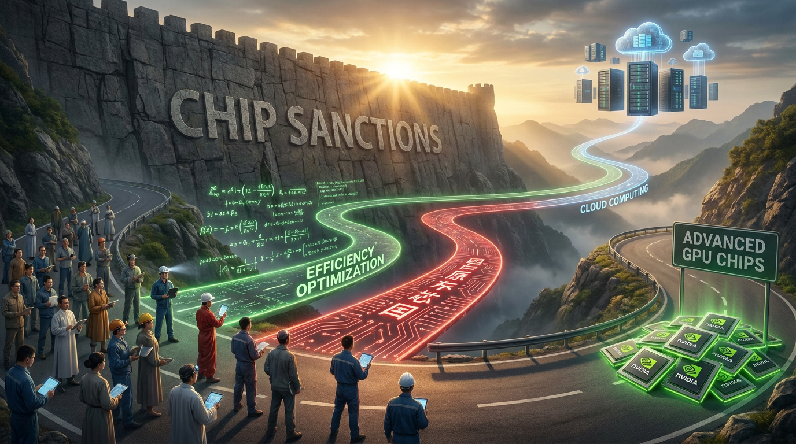

# 第二十二章：芯片之困

*灵核教廷一声令下，东方修仙界的灵石供应一夜断绝。没有灵核，你拿什么封坛孵兽？*

---

## 一

2022 年 10 月 7 日。

这一天，美国商务部发布了一份出口管制新规。

新规的核心内容翻译成修仙体就是：**禁止向中国出售高阶灵核。**

具体来说——NVIDIA 的 A100 和 H100，不准卖给中国了。AMD 的 MI250，也不准。任何性能超过一定阈值的 AI 芯片，通通禁运。

这不是第一次对中国搞芯片限制。但这一次的打击范围之广、精准度之高，前所未有。以前限的是军工用途的芯片——这次直接瞄准了 AI 训练用的灵核。

修仙界的东方势力一夜之间发现：**灵核供应链断了。**

## 二

为什么这个打击如此致命？

因为训练大模型需要的灵核数量是天文数字。

DeepSeek V3 用了 2048 块 H800 训练两个月。GPT-4 据估计用了上万块 A100 训练几个月。Google 训 Gemini 用的是自家的 TPU Pod——几千颗道核。

这些灵核的来源都指向一个地方：**台积电。**

NVIDIA 设计灵核，台积电制造灵核。AMD 设计灵核，台积电制造灵核。连苹果的 M 系列芯片，也是台积电造的。台积电拥有全球最先进的芯片制造工艺——5nm、3nm——没有替代品。

美国的制裁逻辑很清楚：我不需要禁止中国自己设计芯片。我只需要让台积电不给你造。没有最先进的制造工艺，你设计出来也只是一张图纸。

## 三

中国 AI 界的第一反应是：**囤货。**

制裁正式生效前有一个缓冲期。各大公司和云厂商疯狂抢购 A100。价格飙升到正常价格的两三倍，有些渠道甚至翻了五倍。黑市上，一块 A100 被炒到天价。

据报道，一些中国科技公司在制裁生效前囤积了数万块 A100。这些灵核成了比黄金还珍贵的战略物资。

但囤货只是缓兵之计。灵核会老化、会损坏、会被更新的型号淘汰。你囤了一万块 A100，用完了呢？

## 四

NVIDIA 的 Jensen Huang（灵核教主）做了一件"聪明"的事：他推出了中国特供版灵核。

A100 被禁了？没关系，我给你出一款 A800——性能阉割到刚好卡在管制线以下。互联带宽从 600GB/s 砍到 400GB/s。单卡性能还行，但多卡训练的效率打了折扣。

H100 被禁了？我再出一款 H800——同样阉割互联带宽。

翻译成修仙体：灵核教主把高阶灵核的经脉掐窄了一截，让它刚好不触碰制裁的红线。灵核的核心算力还在，但灵核之间的经脉变窄了——合阵修炼的效率下降。

这是一个非常"灵核教主"式的操作——既不得罪美国政府，又不完全丢掉中国市场。两边通吃。

## 五

但 2023 年 10 月，美国更新了管制规则。

这次直接把 A800 和 H800 也禁了。阉割版也不行了。

门彻底关上了。

从此，中国 AI 公司**理论上**买不到任何 NVIDIA 的高阶灵核。

"理论上"——因为实际操作中，各种灰色渠道并没有完全断绝。有人通过第三国转口，有人通过云服务间接使用。但大规模、稳定的灵核供应确实中断了。

## 六

绝境之中，三条路出现了。

**第一条：用有限的灵核做更多的事。**

这条路的代表是 DeepSeek。

梁文锋（深渊剑主）的工程哲学是"**在限制中寻找最优解**"。你有一万块 H800？好，我用 MLA 把推理的灵池占用砍到原来的 5% 到 13%。用 FP8 微缩锻造让训练效率翻倍。用 MoE 让 671B 的巨型神兽只激活 37B 的参数——用六分之一的算力做六倍大的模型。

DeepSeek V3 的训练成本只有 557 万美元。这个数字让西方修仙界震惊——他们花几亿美元训的神兽，DeepSeek 用零头就训出来了。

不是因为 DeepSeek 有更多的灵核——恰恰相反，是因为灵核不够，所以被逼出了更高效的方法。

**制裁逼出了创新。**

**第二条：自研灵核。**

华为的昇腾（Ascend）系列是这条路的代表。

华为从 2018 年就开始被制裁——比 AI 芯片制裁更早。手机芯片断供、操作系统被封、Google 服务被切。华为被逼到了墙角，开始全面自研。

昇腾 910B 是华为的 AI 训练灵核。性能跟 A100 有差距，但能用。据报道，一些中国公司已经开始用昇腾集群训练大模型。

问题在于——生态。NVIDIA 的 CUDA 驭核术有几十年的积累，几百万开发者的社区。华为的 CANN 生态刚起步，软件栈不成熟，很多框架适配不完善。

**有灵核但没有驭核术，就像有一把好剑但不会剑法。**

**第三条：另辟蹊径——用道核代替灵核。**

Google 的 TPU（道核）走的是一条完全独立于 NVIDIA 的路线。TPU 不受美国对 NVIDIA 灵核的出口管制——因为 TPU 只在 Google Cloud 上以服务形式提供，不单独出售芯片。

一些中国团队选择了在 Google Cloud 上租 TPU 来训练。这是一条灰色地带——你没有"购买"灵核，你是在"租用"云服务。法律上的界定模糊。

## 七

制裁还产生了一个意想不到的效果：**加速了中国的开源运动。**

逻辑是这样的：如果灵核越来越贵、越来越难得，那每一次封坛孵兽都必须物尽其用。训出来的神兽如果藏着不放——只有你自己用了一个，几百万美元的灵石就白费了。但如果你把映身散天下——成千上万人在你的神兽基础上做微调、做应用——你的投入就被放大了几万倍。

DeepSeek 选择了全面开源。Qwen 选择了全面开源。GLM 选择了开源。MiniCPM 选择了开源。

**不是因为他们慷慨——是因为在灵核匮乏的条件下，开源是效率最高的策略。**

西方的闭源门派（OpenAI、Anthropic、Google）可以"独享"神兽——因为他们有足够的灵核来服务用户。东方的门派在灵核有限的情况下，选择"散播"神兽——让整个生态来分担推理的灵核消耗。

制裁逼出了一条跟西方完全不同的发展路径。

---

> **旁白（Chris 视角）**
>
> 作为一个在 Google Cloud 做 AI Infra 的人，芯片制裁是我工作中绕不开的话题。
>
> 我的很多中国客户在制裁后转向了 TPU。Google 的道核不受 NVIDIA 灵核的出口管制限制，至少目前是这样。这让 TPU 在中国市场获得了一个意想不到的竞争优势。
>
> 但说实话，制裁最深远的影响不是"中国少了几万块 GPU"——而是它改变了中国 AI 界的**心态**。以前大家的策略是"跟着美国走，他们用什么我们用什么"。现在是"必须走自己的路"。
>
> DeepSeek 的成功证明了一件事：灵核的数量不等于创新的质量。被卡脖子的时候，反而可能逼出更高效的方法。
>
> 当然，这不意味着制裁是好事。它增加了成本，减慢了速度，阻碍了正常的技术交流。但它也意外地证明了——修仙界的大道，不只有一条。

---

📖 **相关章节**
- 想了解 DeepSeek 怎么在灵核限制下逆天改命 → [第20章·深渊剑主](ch20-deepseek.md)
- 想了解 NVIDIA 灵核教廷的完整故事 → [第02章·灵核之争](../vol1-infrastructure/ch02-chips.md)
- 想了解中国 AI 六小龙怎么各走各的路 → [第24章·百家论道](ch24-six-dragons.md)
