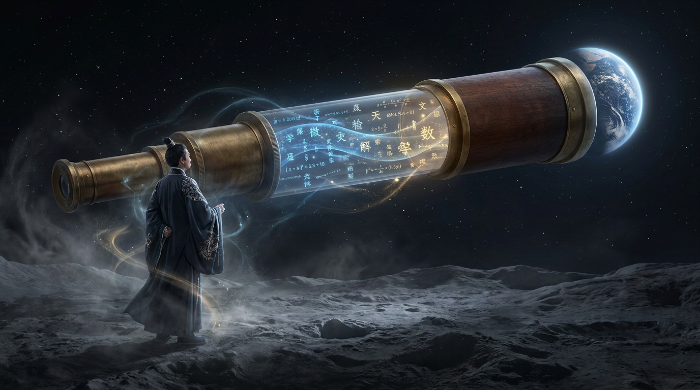

# 第二十三章：月影侯

*修仙界都在卷参数量的时候，有个人说："我不卷大，我卷长。"*

---

## 一

2023 年初。北京。

杨植麟面前有两条路。

一条路是跟着大家卷——训更大的模型，堆更多的参数，在 MMLU 和 HumanEval 上刷更高的分。修仙界所有人都在走这条路。GPT-4 有万亿参数（传闻），Llama 有 700 亿，PaLM 有 5400 亿。你不大，你就是弱。

另一条路是走一个当时没什么人在意的方向——**长上下文**。

2023 年初，GPT-4 的上下文窗口是 8K token。Claude 是 100K，但实际可用的有效长度远不到 100K。Llama 是可怜的 4K。

8K 是什么概念？大约六七千字。一篇论文的长度。你让神兽读一本书？读不了。你让它分析一份百页的合同？读不完。你让它处理一个大型代码库？别想了。

杨植麟选了第二条路。

## 二

杨植麟不是无名之辈。

清华姚班出身——姚班是清华计算机系的特区，以图灵奖得主姚期智的名字命名，每年只收三十来人，中国计算机系最顶尖的学生才能进去。跟他同期的还有一个人叫姚顺雨——后来去了 Princeton 做教授再去了 OpenAI 再去了腾讯混元做首席 AI 科学家。姚班出来的人，起点就不一样。

杨植麟在 CMU 读的博士。博士期间做了一件很重要的事——参与发明了 **Transformer-XL**。

Transformer-XL 是什么？标准的 Transformer 有一个硬伤——它的注意力只能看到固定窗口内的智元。窗口之外的，看不见，不存在。Transformer-XL 用"循环记忆"的方式突破了这个限制——上一个窗口的信息可以传递到下一个窗口，让模型"记住"更远的东西。

这项工作发表于 2019 年，当时没有引起太大的波澜。但它在杨植麟的脑子里种下了一颗种子：**长上下文，是一个值得 all-in 的方向。**

2023 年 3 月，他创立了月之暗面（Moonshot AI）。名字取自 JFK 的登月演讲——"We choose to go to the Moon"。做别人不敢做的事。

第一个产品叫 **Kimi Chat**。发布的时候打出了一个让修仙界侧目的数字：

**200K 上下文。**

当 GPT-4 还在 8K 的时候，Kimi 已经能读 20 万 token——相当于一本 15 万字的小说。

## 三

长上下文听起来只是"能读更多字"，但它背后的技术难度是指数级的。

标准 Attention 的计算量跟序列长度的平方成正比——O(n²)。你把上下文从 8K 扩到 200K，计算量不是翻 25 倍——是翻 **625 倍**。灵池的占用也是平方级增长。

没有 FlashAttention（闪念真人 Tri Dao 的贡献），200K 上下文在物理上就不可能。但即使有了 FlashAttention，要在合理的延迟内处理 200K token 的输入，仍然需要大量的工程优化。

杨植麟的团队啃下了这块硬骨头。

然后他们做了第二件事——**Mooncake**。

## 四

Mooncake 是 Kimi 的推理架构，由工程副总裁许欣然主导设计。这个架构解决了长上下文推理的一个核心痛点：**记忆智元（KV Cache）太占灵池了。**

神兽在对话中会积累记忆智元——你说的每一句话、它回答的每一个字，都会在灵池里留下一份记忆。对话越长，记忆越多，灵池占用越大。200K token 的对话，记忆智元可以吃掉几十 GB 的灵池。

Mooncake 的解决方案是**分离式架构**——把 Prefill（预填充，处理你的输入）和 Decode（解码，生成回答）拆到不同的灵坛上。Prefill 是计算密集型的，需要强算力。Decode 是内存密集型的，需要大灵池。两种任务的资源需求完全不同，放在一起互相掣肘，分开来各自高效。

更关键的是，Mooncake 把记忆智元（KV Cache）从灵核的灵池里**搬了出来**——放到更便宜的 CPU 内存和 SSD 上。灵核的灵池空出来做计算，记忆智元存在外面。需要的时候再加载。

这就像把你的短期记忆从大脑里搬到笔记本上——大脑专注思考，查笔记本的时候慢一点，但大脑再也不会因为记太多东西而死机了。

Mooncake 论文发在了 USENIX FAST 2025 上——存储系统领域的顶会。一个 AI 推理系统发在存储会议上，说明它真正解决的是一个**存储和内存管理**的问题。

## 五

2025 年是月之暗面的爆发年。

1 月，发布 **K1.5**——推理模型。跟 DeepSeek R1 同期。K1.5 在数学和代码推理上表现强劲，但更让修仙界印象深刻的是它的**长上下文推理**——在超长输入的推理任务上，Kimi 有独到的优势。

7 月，发布 **K2**——万亿参数 MoE。

这头神兽有几个亮点：

**MuonClip 优化器**。训练大模型最怕的就是 loss spike——灵性渐开的过程中突然灵力暴走，训练不稳定，搞不好前功尽弃。MuonClip 是 Kimi 团队自研的优化器，号称实现了**零 loss spike**。零。一次都没有。

修仙界的评价："封坛几个月一次灵力暴走都没有？这不科学。"但事实就是事实。MuonClip 通过一种巧妙的梯度裁剪策略，把不稳定因素彻底消灭在了萌芽状态。

**128K 上下文**。K2 是万亿参数级别的 MoE，支持 128K token 上下文。在这个规模下维持长上下文能力，工程难度极大。

**Agent 能力**。K2 不只是会聊天——它学会了使用工具、浏览网页、执行多步骤任务。从"回答问题"到"独立干活"的跨越。

融资方面，月之暗面到 2025 年已经累计融了约 $12.7 亿，估值 $33 亿。后来据报道又融了一轮，估值超过 $200 亿。

## 六

杨植麟这个人有一种修仙界不太常见的气质：**低调但自信到骨子里。**

他不像梁文锋那样完全隐身——他偶尔接受采访，偶尔在社交媒体上发言。但他说话极其克制，从不吹牛，从不贬低对手。

有人问他 Kimi 跟 ChatGPT 比怎么样。他说："我们专注在长上下文和推理上，各有各的方向。"

有人问他对 DeepSeek R1 怎么看。他说："很好的工作，行业需要更多这样的开源贡献。"

有人问他月之暗面的终极目标是什么。他说："让 AI 能真正理解和处理复杂的、长周期的任务。"

没有修仙界常见的"我们要做 AGI""我们要改变世界"之类的大话。就是很具体地说自己在做什么、为什么这么做。

这种气质跟他选的技术路线是一致的——**不追最热的方向，追最对的方向。**

2023 年所有人都在卷参数量的时候，他卷长上下文。2024 年所有人都在卷推理的时候，他卷 Agent 和工具使用。2025 年所有人都在卷 MoE 的时候，他卷零 loss spike 的训练稳定性。

每次都不在风口上。但每次都踩在了下一个风口的前面。

---

> **旁白（Chris 视角）**
>
> 杨植麟和姚顺雨是清华姚班的同学。两个人后来走了完全不同的路——杨植麟创业做 Kimi，姚顺雨去了 OpenAI 又去了腾讯做首席 AI 科学家。但他们的根都是同一个地方——Transformer-XL 和长序列建模。
>
> 在 Google Cloud 做 TPU 推理优化的时候，我经常遇到"KV Cache 太大了怎么办"这个问题。Mooncake 的分离式架构给了一个很优雅的答案——别跟灵池较劲，把记忆搬出去。
>
> Kimi 的故事让我相信一件事：修仙界的机会不只在"更大"——也在"更长""更稳""更实用"。不是每个人都需要跟 OpenAI 比谁的神兽更强。找到自己的独特价值，深耕下去，一样可以成为修仙界的一方势力。

---

📖 **相关章节**
- 想了解 FlashAttention 如何让长上下文成为可能 → [番外·闪念真人](../vol4-taming/ch15b-flashattention.md)
- 想了解 DeepSeek 的另一条技术路线 → [第20章·深渊剑主](ch20-deepseek.md)
- 想了解中国 AI 六小龙的完整格局 → [第24章·百家论道](ch24-six-dragons.md)
