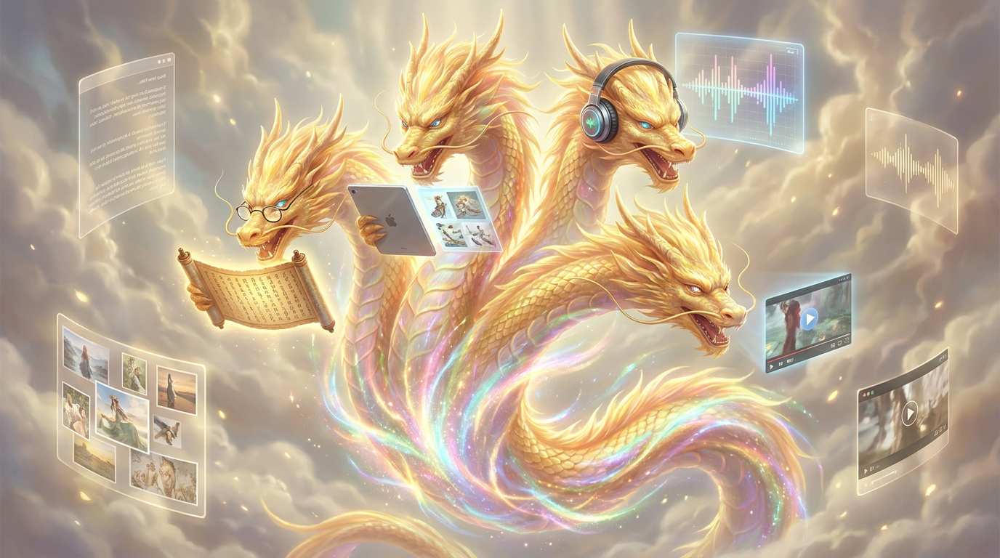

# 第二十五章：万象觉醒

*从前的神兽只会说话。然后它们学会了看图。然后学会了听声。然后学会了画画。最后，它们什么都会了——修仙界管这种神兽叫"万象兽"。*

---

## 一

2023 年之前的大模型世界是单调的。

神兽只有一种感官——**文字**。你给它文字，它回你文字。它看不见图片，听不到声音，不知道世界长什么样。它对"红色"的理解来自于训练数据里关于红色的文字描述，而不是真的"看见过"红色。

这就像一个从小被关在暗室里、只能读书的孩子。他知道太阳是圆的、天空是蓝的、音乐是好听的——但他从来没有**见过**太阳、**看过**天空、**听过**音乐。他的知识是二手的，从文字中来。

修仙界把这种只有文字能力的神兽叫做**言灵兽**。能说会道，但又聋又瞎。

2023 年开始，事情变了。

## 二

变化的第一枪来自图像。

其实修仙界的幻像兽（图像生成模型）比言灵兽更早出现。2022 年就已经有了 DALL-E 2、Stable Diffusion、Midjourney——这些神兽能从文字描述中凭空"画出"图像。你输入"一只戴着墨镜在沙滩上冲浪的猫"，它就能给你变出一张这样的图片。

但幻像兽和言灵兽是两个物种——互不相通。你不能让 ChatGPT 画画，也不能让 Stable Diffusion 聊天。

2023 年 3 月，GPT-4 发布的时候，OpenAI 悄悄加了一个功能：**看图**。

你可以给 GPT-4 一张图片，它能理解图片内容并回答问题。给它一张菜单，它能告诉你什么好吃。给它一张代码截图，它能找出 bug。给它一张手绘的网页草图，它能生成 HTML 代码。

这不是简单的图片识别——"这是一只猫"。这是**图片理解**——"这只猫看起来很不高兴，可能因为它面前的碗是空的"。

言灵兽长出了眼睛。

但 GPT-4 的视觉能力是"外挂"的——图片先通过一个单独的视觉编码器（基于 CLIP 架构）处理，转化成特征向量，再塞进语言模型。就像给一个盲人配了一副翻译眼镜——他"看到"的其实是翻译后的描述，不是真正的视觉感知。

真正的变化来自 2024 年 5 月。

## 三

GPT-4o。"o"代表"omni"——全知。

这头神兽的革命性在于：**原生多模态**。

什么叫"原生"？意思是文字、图片、声音不再通过单独的编码器分别处理——它们在同一个模型内部、用同一套凝智元、在同一个注意力法阵里被一起处理。

GPT-4 是"盲人+翻译眼镜"。GPT-4o 是**天生就有眼睛和耳朵的**。

差别有多大？

你跟 GPT-4o 说话，它能**直接听到你的语调**——不是先把语音转成文字再理解，而是直接从声波中提取情感和意图。你开心的时候它能听出来。你生气的时候它能听出来。你在说反话的时候它能听出来。

它回答的时候也不是"先生成文字再转语音"——它**直接生成语音**。带语调、带节奏、带情感。它可以唱歌。它可以模仿不同的口音。它可以在回答的中间停下来思考，发出"嗯……"的声音。

这不是语音助手。这是**对话**。

发布会上，OpenAI 的工程师跟 GPT-4o 实时对话的那段演示，看得修仙界集体沉默。不是震惊——是一种"未来已经来了"的恍惚感。

## 四

Google 在多模态上走得更早。

Gemini 1.0（2023 年 12 月发布）从第一天起就是多模态的——不是后来加上去的，是设计之初就同时处理文字、图片、视频。

2024 年 2 月，Gemini 1.5 Pro 发布了一个让修仙界咂舌的数字：**1M token 上下文**。

一百万个 token。你可以把一整本《哈利·波特》（约 100 万字）塞进去，然后问它"第三部里赫敏用时间转换器做了什么"。它能准确回答。

你还可以给它一段一小时的视频（通过逐帧提取），让它总结视频内容、回答关于视频的问题。

这是 Google 的 TPU（道核）架构的优势——大规模的道核灵坛通过 ICI 道脉高速互联，天然适合处理超长序列。再加上 FlashAttention（闪念真人的贡献）把内存问题解决了，百万级上下文变成了现实。

## 五

中国的多模态也在同步推进。

Qwen-VL 是阿里通义千问的视觉版。Qwen2.5-Omni（2025 年 3 月）更进一步——文字、图片、音频、视频原生统一理解。

DeepSeek 也有 DeepSeek-VL。

但中国多模态做得最激进的是 MiniMax——闫俊杰的团队从一开始就押注"文本+语音+视频+音乐"全覆盖。海螺 AI 的视频生成连续三个月登顶全球 AI 视频榜。Speech 2.8 的语音合成支持 30 多种语言。

## 六

幻像兽的进化也在加速。

2022 年 8 月，Stability AI 开源了 Stable Diffusion——这是修仙界的一次"映身散天下"。以前生成图片是 OpenAI（DALL-E）和 Midjourney 的专利。Stable Diffusion 一开源，全世界的开发者都能在自己的灵核上跑图像生成了。

Midjourney 选择了不开源但做到极致——它生成的图片质量在很长一段时间内都是最好的。2022 年，一幅 Midjourney 生成的图片赢得了科罗拉多州博览会的数字艺术比赛。人类艺术家集体破防——"AI 画的画赢了人类的比赛？"

2024 年 2 月，OpenAI 发布了 Sora——**视频生成**。你输入一段文字描述，它生成一段逼真的视频。街景、人物、光影、运动——全部自动生成。

幻像兽从画静止画面进化到了画运动的世界。

修仙界开始认真讨论一个问题：**如果 AI 能生成以假乱真的视频，"真相"还有意义吗？**

## 七

到 2025-2026 年，多模态的趋势已经不可逆转。

以前的神兽是"专科生"——有的擅长文字，有的擅长图片，有的擅长语音。现在的神兽越来越像"全科生"——什么都会，什么都能。

GPT-4o 能看能听能说能画。Gemini 能读能搜能看视频能写代码。Claude 能看屏幕能操控电脑。Qwen-Omni 能理解文字图片音频视频。

**万象兽时代来了。**

但万象兽也带来了新的挑战：

第一，**训练成本翻倍**。以前只需要文本智元，现在还需要图片智元、音频智元、视频智元。视频智元尤其贵——一秒钟的视频包含的信息量相当于几十张图片。

第二，**对齐更难了**。文字可以骗人，图片也可以骗人，视频更可以骗人。让一头万象兽不生成虚假图片、不合成假视频、不模仿真人的声音——这个对齐问题比纯文字复杂得多。

第三，**灵池压力巨大**。多模态的凝智元比纯文本的大很多——因为视觉编码器本身就有几十亿参数。一头万象兽的体型远超同级别的言灵兽。

但方向是确定的。**单模态的时代正在结束。** 未来的神兽，要么是万象兽，要么被万象兽淘汰。

---

> **旁白（Chris 视角）**
>
> 在 Google Cloud 搭 TPU 灵坛的时候，我亲眼看着 Gemini 的训练从纯文本变成了多模态。灵坛的规模翻了好几倍——不只是灵核多了，是智元的种类多了。以前只需要文本管道，现在要文本管道+图片管道+音频管道+视频管道。四条管道同时灌注，灵坛的数据工程复杂度指数级增长。
>
> 但效果也是肉眼可见的。Gemini 1.5 Pro 理解一段 YouTube 视频的能力让我第一次感觉到——这个东西不只是在"处理数据"，它是在"看懂世界"。
>
> 当然，"看懂"和"理解"之间还有一道鸿沟。但这道鸿沟正在变窄。

---

📖 **相关章节**
- 想了解 FlashAttention 如何让长上下文（多模态的基础）成为可能 → [番外·闪念真人]
- 想了解 Google 的 TPU 道核如何支撑百万 token → [第02章·灵核之争]
- 想了解 Agent 如何在多模态基础上学会独立行动 → [第26章·自主之兽]
