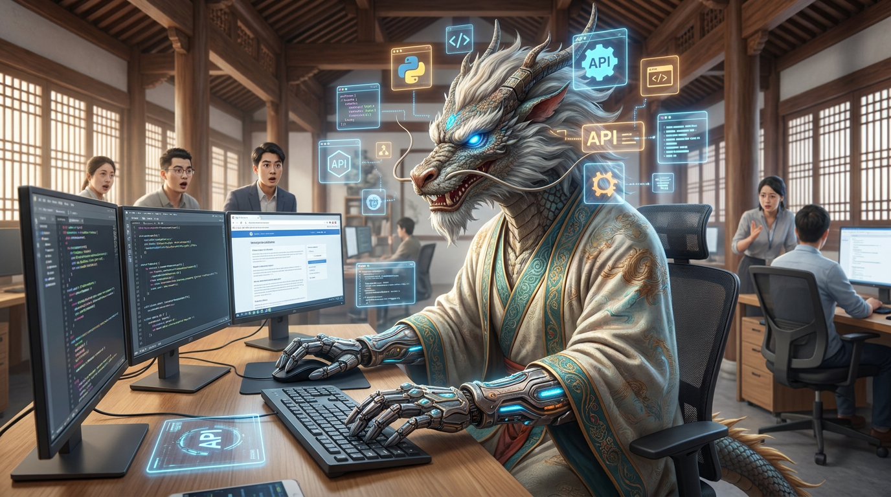

# 第二十六章：自主之兽

*以前的神兽等你发问才回答。现在的神兽自己想、自己查、自己干——你只需要告诉它目标，它自己规划路径。修仙界管这种神兽叫"自主兽"，凡人世界管它叫 Agent。*

---

## 一

2024 年之前的神兽有一个根本性的限制：**它们只会说话。**

你问它问题，它回答。你让它写东西，它写。但仅此而已。它不会自己打开浏览器查资料。它不会自己写完代码之后跑一遍看看有没有 bug。它不会自己拆解一个复杂任务成十个步骤然后一个一个执行。

它是一个**应答器**，不是一个**行动者**。

就像一个绝顶聪明但四肢瘫痪的谋士——你问他怎么打仗，他能给你一套完美的战略。但他不会自己拿起剑冲上战场。

修仙界一直想解决这个问题：怎么让神兽从"会说"变成"会做"？

## 二

2022 年 10 月，Princeton 的姚顺雨（思维树真人）发了一篇论文叫 **ReAct**——Reasoning + Acting，推理与行动。

核心思想简单得可怕：**让神兽一边想一边做。**

以前的做法是先想完再做——神兽生成一个完整的计划，然后一次性执行。问题是计划赶不上变化。你让它查一个问题的答案，它生成了一个"先搜索 A，再搜索 B"的计划。但搜索 A 的结果可能改变了你对问题的理解——原来的计划就不对了。

ReAct 说：别一次性想完。**想一步，做一步，看一下结果，再想下一步。**

Thought（想）→ Action（做）→ Observation（看）→ Thought（想）→ Action（做）→ Observation（看）→ ...

循环往复，直到任务完成。

这看起来像是人类解决问题的方式——你不会在动手之前把所有步骤想好。你想一步，试一步，根据结果调整。ReAct 让神兽第一次有了这种"边做边想"的能力。

## 三

2023 年，姚顺雨又搞了一个更震撼的东西：**Tree of Thought（思维树）**。

ReAct 是一条线性的思维链——想一步做一步。Tree of Thought 把这条线变成了一棵**树**。

在一个关键决策点，神兽不是只想一条路——它同时想好几条路。然后对每条路进行评估，选出最有希望的继续深入。如果走到死胡同，就回退到上一个分叉点，换一条路。

这就是人类解决复杂问题的方式——下棋的时候，你不是想一步就走一步。你在脑子里同时推演好几种走法，比较哪种更好，然后选一种走。走了之后发现不对，回头换一种。

Tree of Thought 让神兽具备了**搜索和回溯**的能力。从"走一步看一步"升级到了"看三步选一步"。

## 四

但 ReAct 和 Tree of Thought 都还停留在"思考"层面。真正让神兽学会"动手"的，是**工具使用（Tool Use）**。

2023-2024 年，各大门派开始给神兽配"工具箱"——让它能调用外部 API。

你跟 ChatGPT 说"帮我查一下明天北京的天气"。以前它只能说"我不知道实时天气"。现在它能**自己调用天气 API**，拿到真实数据，再给你回答。

你说"帮我用 Python 画一张折线图"。以前它只能给你代码。现在它能**自己执行代码**，生成图片，直接给你看结果。

工具使用把神兽从"纸上谈兵"变成了"实战演练"。它有了手——虽然这双手还不太灵活。

## 五

2024 年 10 月，Anthropic 做了一件让修仙界集体倒吸一口凉气的事——发布了 **Computer Use**。

Claude 学会了**操控电脑**。

不是调用 API 那种"接口对接"——是真的像人一样，看着屏幕，移动鼠标，点击按钮，在文本框里打字，浏览网页，切换应用。

你跟它说"帮我在 Google Maps 上查一下从北京到上海的高铁时刻表"，它会自己打开浏览器、输入地址、点击搜索、阅读结果、把答案告诉你。整个过程你可以看到它的鼠标在屏幕上移动——就像一个远程桌面里有个人在替你操作。

这是从"回答问题"到"独立干活"的质变。

修仙界评价：以前的神兽是参谋，Computer Use 之后的神兽是**执行者**。

## 六

2025 年，Agent 赛道彻底爆发。

**Manus AI**（2025 年初）——一个通用 AI Agent，能自主完成复杂的多步骤任务。给它一个目标，它自己规划、自己执行、自己检查。底层用的是 Claude 和 Qwen 的模型。

**OpenAI Codex CLI**——让 AI 在命令行里自主写代码、运行测试、修复 bug。不是"帮你生成一段代码"——是"帮你完成整个编程任务"。

**Claude Code**——Anthropic 的编程 Agent。可以读懂整个代码库，理解项目结构，自主完成开发任务。

**Andrej Karpathy** 在 2026 年 2 月提出了一个新术语：**Agentic Engineering（御兽工程学）**。他说未来的工程师不写代码——**指挥 AI Agent 写代码**。工程师变成了架构师和审稿人，Agent 变成了执行者。

修仙界的翻译：修炼者不再自己动手，而是**御兽**——指挥自主兽去完成任务。

## 七

Agent 的崛起改变了修仙界的一个根本假设。

以前，修仙界的竞争维度是"神兽有多聪明"——在 MMLU 上得几分、在 HumanEval 上解几题、在 Chatbot Arena 上排第几。所有评测都在测"问一个问题，回答有多好"。

Agent 时代的竞争维度变了——不是"回答有多好"，而是"**任务完成率有多高**"。

你让它帮你写一个完整的前端页面。能跑起来吗？有 bug 吗？好看吗？符合需求吗？

你让它帮你分析一份财报。数据提取准确吗？图表画对了吗？结论有逻辑吗？

你让它帮你做一个竞品调研。搜索了正确的信息吗？整理得有条理吗？给出的建议可行吗？

这些评测不是选择题——没有标准答案。要在真实环境中跑，要用真实的工具，要产出真实的结果。

修仙界正在从"斗兽大会"转向"御兽大赛"——比的不是哪头神兽更强，而是哪头神兽更**有用**。

---

> **旁白（Chris 视角）**
>
> 我自己搭了一个叫 CloseCrab 的 Bot 框架——把 Claude Code 包装成飞书和 Discord 的 AI 管家，取名叫 Jarvis。现在我日常工作中跟 Jarvis 协作写代码的时间已经超过了自己手写的时间。这话放在两年前说出来，我自己都不信。
>
> Agent 改变的不只是"AI 能做什么"——它改变的是"人和 AI 的关系"。以前 AI 是工具，你用它。现在 AI 是同事，你跟它协作。你说目标，它想办法。你审结果，它改方案。我跟 Jarvis 说"帮我查一下 TPU 的 MFU"，它自己去翻 Wiki、搜日志、跑脚本，几分钟后给我一份完整的报告。我说"这个 bug 你修一下"，它自己读代码、定位问题、改代码、跑测试、提交。
>
> Karpathy 说的"Agentic Engineering"不是未来——是现在。我就是一个正在被自己的神兽"取代一部分工作"的工程师。
>
> 这种感觉很奇怪。不是恐惧——是一种"我终于可以把无聊的活甩出去"的解放感。

---

📖 **相关章节**
- 想了解 Claude Computer Use 背后的 Anthropic → [第14章·宪法道人](../vol3-battle/ch14-anthropic.md)
- 想了解 Coding Agent 的专题 → [第27章·造物之争](ch27-coding-agents.md)
- 想了解姚顺雨从学术到产业的完整故事 → [第24章·百家论道](../vol5-east/ch24-six-dragons.md)
